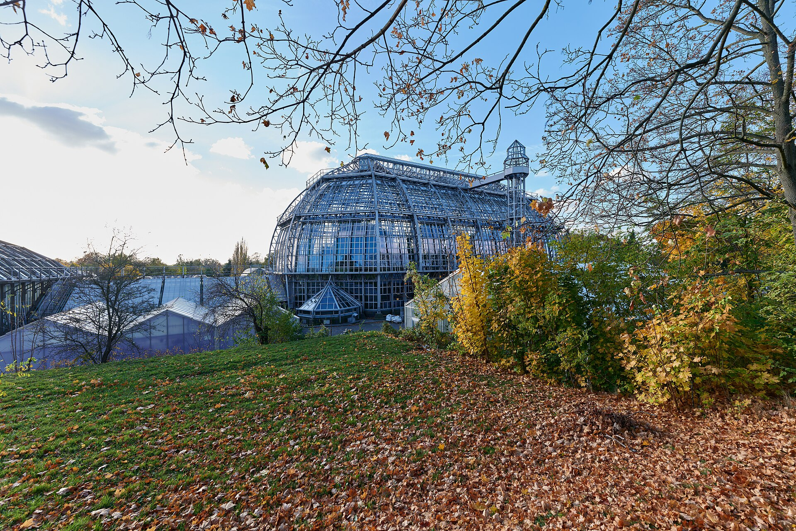
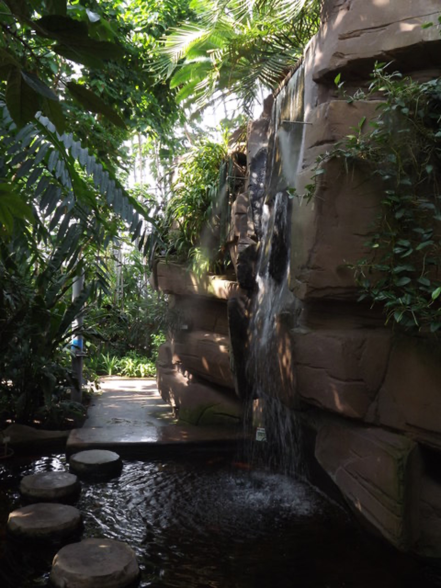
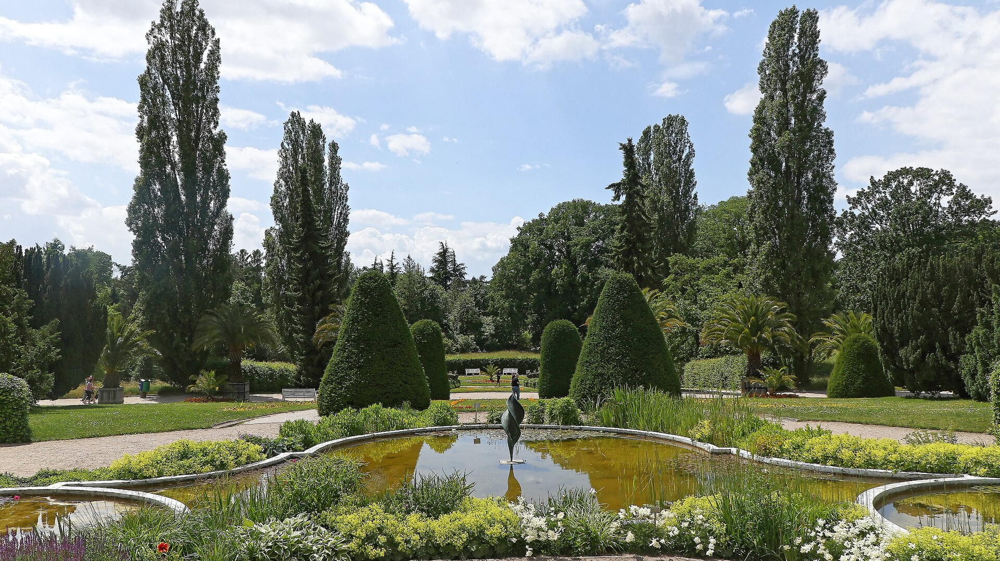
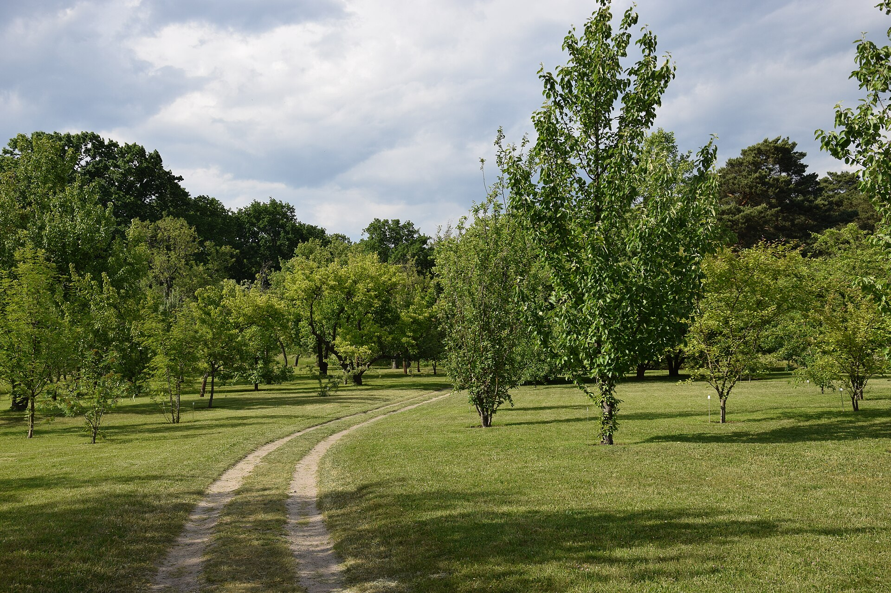

Dahlem is not a quick detour you squeeze between Museum Island and dinner. Berlin's Botanic Garden is a destination on the south-west edge of the city: a proper landscape, a serious plant collection and a glasshouse complex that can rescue a grey Berlin day without making you feel trapped indoors.

My advice: go when you want one place to slow the day down, not when you need another landmark ticked off before lunch. I like it most when I choose the glasshouses first, then let the weather decide how much of the outdoor garden earns my time.

{{quick-summary}}

_The Great Tropical House is not a small conservatory add-on; it is one of the reasons to make the Dahlem trip at all._

## Start with the glasshouses, not a vague plan to see everything

The [Botanic Garden](https://www.bgbm.org/en/welcome-garden) calls itself a scientific collection open to the public, and that is the useful way to approach it. You are not walking through a decorative city park with a few labelled beds. You are moving through a living collection of more than 20,000 plant types, with outdoor sections and a group of public glasshouses that let the visit work in different weather.

Make the Great Tropical House your first decision. Its restored Art Nouveau structure is visually strong, and the tropical rooms give the visit a clear centre even if rain starts or the afternoon turns cold. Do not promise yourself every path, every collection and every greenhouse on the same visit. That turns a calm place into another museum checklist.

_Inside the tropical house, the temperature and planting make Berlin outside feel temporarily irrelevant._

## Give it an honest half-day if you want the outside to matter

If the weather is dry, the outdoor garden is where the place becomes more than a greenhouse visit. The Italian Garden gives you a formal pause; the wider planted areas and arboretum reward the slower wander that a central sightseeing day rarely leaves room for.

For a short visit, I would choose one glasshouse anchor and one outdoor section instead of zig-zagging across the full site. For a longer visit, reverse the logic: walk outside while your energy is fresh, then end under glass. The Garden's [visitor page](https://www.bgbm.org/en/willkommen-im-garten/botanic-garden-short) describes 16 public greenhouses and a large outdoor collection, which is exactly why a strict plan beats a vague ambition here.

_The formal garden is a useful contrast to the damp, dense feeling of the tropical rooms._

## Use the weather as the filter, not as a reason to cancel

Berlin rain does not automatically mean a day indoors. It means choosing your cover deliberately. Start with the glasshouses, take one short outside loop when the weather eases, and leave the open-air sections for another day if they are fighting the forecast. My broader [Berlin-in-the-rain guide](https://www.berlinwalk.com/post/berlin-in-the-rain) can help you keep the rest of the day realistic rather than overfilled.

On a bright day, do the opposite. Treat the indoor rooms as a destination with a finish line, not a place to hide in for three hours. The outdoor paths are where you get the scale, changing light and quiet that the central city cannot offer. If you are travelling with children, this is one of the easier places to let the pace loosen after a busy central morning; my [Berlin with kids guide](https://www.berlinwalk.com/post/berlin-with-kids) helps with the rest of that kind of day.

_The garden works best when you leave room for a path that was not on your original list._

{{widget:berlin-plant-passport}}

## Check three practical things before you leave Mitte

First, check the [official opening-hours page](https://www.bgbm.org/en/visit-us/opening-hours-and-box-office?language=de) on the day. The current summer pattern lists ticket desks and glasshouses until 19:00, with garden exits later, but the Garden also publishes short-notice exceptions. Second, the current [ticket page](https://www.bgbm.org/en/entrance-fees) lists an adult admission of €10 and strongly recommends buying online when queues are likely; treat the live page as the final word. Third, do not plan the closed Botanical Museum as part of the visit: the Garden says its exhibition areas are being modernised until approximately 2027.

The easiest transport mistake is treating Dahlem as if it sits beside the central sights. It does not. Give the journey its own space in the day, use the [Berlin public transport guide](https://www.berlinwalk.com/post/berlin-public-transport-explained-for-tourists-u-bahn-s-bahn-tram-bus) to keep the ticket side simple, and avoid booking a tight central timed entry straight afterwards.

## Put this on a different day from the historic-centre rush

The Botanic Garden is worth the trip if you want plants, glass, shade and time to look properly. Skip it if your Berlin time is only one packed day and you still have the historic centre, Wall history and the essential sights ahead of you. In that case, keep Dahlem for a return visit rather than turning it into an anxious detour.

If you do have more than one day, I would put the historic centre first and the Garden on its own quieter day. My [Free Walking Tour](https://www.berlinwalk.com/book-berlin-walking-tour/berlin-free-walking-tour-tip-based) begins at the World Clock on Alexanderplatz and explores the historic centre of former East Berlin in about 2 hours; check the live booking page for the date and meeting details. It gives the central city context, then leaves you free to let a Dahlem garden day be exactly what it should be: slower.

{{faq}}
