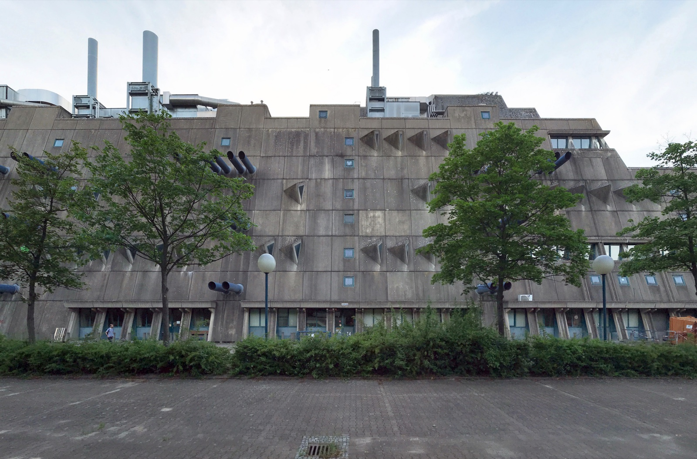
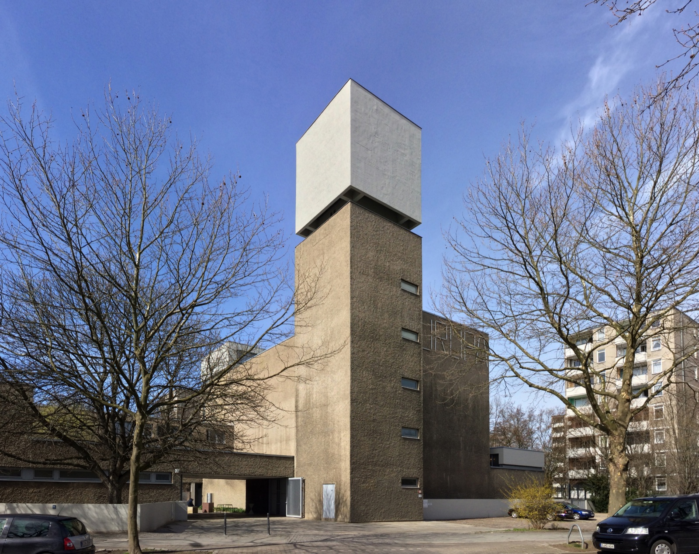
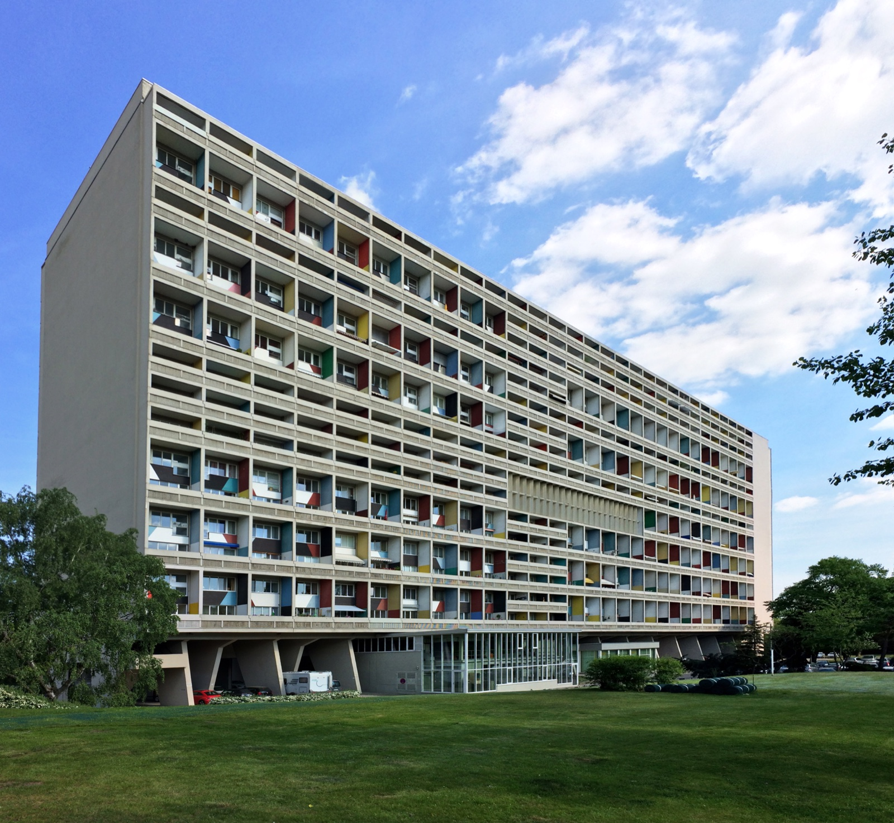
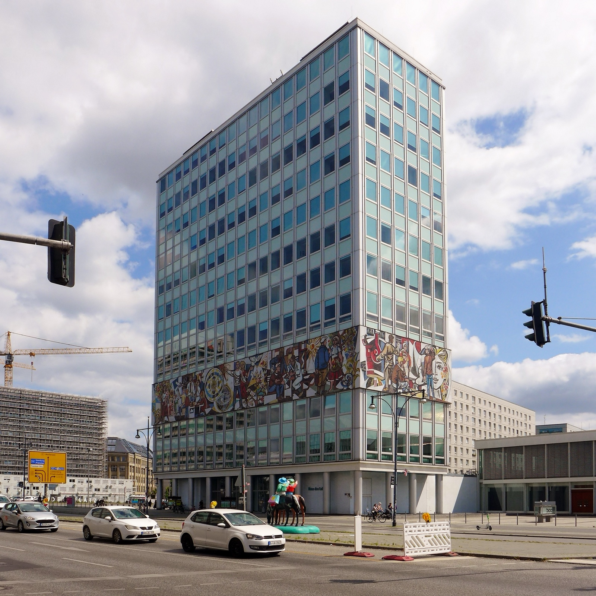

Berlin gets called a concrete city by people who have only looked up at Alexanderplatz on a grey day. That is too blunt. Some of its post-war buildings are strict, hard-edged and deliberately confrontational. Others are modernist in a lighter, more optimistic way. Once you can tell the difference, an architecture detour stops being a hunt for anything grey.

These four buildings make a good day of looking: two are real Brutalist stops, and two are useful counterpoints. Do not try to enter all of them. Start from the street, read the use and the shape, then decide whether the next stop is worth the journey.

{{quick-summary}}

## First, do not call every concrete building Brutalist

Brutalism is not just bare concrete. The name comes from _béton brut_, or raw concrete, but the useful visitor clue is more specific: the structure, service pipes, stairs and mass of the building are allowed to be the architecture. It can look severe because it does not hide how it works.

That matters in Berlin. A 1960s tower with clean proportions, colour or a formal mural may be important post-war modernism without being Brutalist. The distinction gives you a better question than “is it ugly?”: what does this building want you to notice first?

## 1. Mäusebunker: Berlin's most unapologetic concrete machine

If you only make one specialist architecture detour, make it the former central animal laboratories on Krahmerstraße in Lichterfelde. Berlin's heritage authority dates the building to 1971-82 and identifies Magdalena and Gerd Hänska as its architects; it was protected as a monument in 2023 as an outstanding example of Brutalism. The projecting blue-grey tubes, wedge-shaped body and window rhythm make it look more like a docked vessel than an ordinary research building.

The useful move is simple: treat it as an exterior stop. The district says the research use ended in 2019, so do not build your day around getting inside. Walk around the public edges, step back far enough to see the sloping sides, then look again at the service tubes. They are not decoration. They are the building telling you what sort of machine it once was. Read the [Berlin heritage authority's Mäusebunker note](https://www.berlin.de/landesdenkmalamt/aktivitaeten/kurzmeldungen/2023/maeusebunker-unter-denkmalschutz-1328090.php) before you go if you want the conservation context.

_Mäusebunker in Lichterfelde: the external pipes and sloping sides are the point of the stop, not a background detail._

## 2. St. Agnes: a church that now asks for a different kind of attention

St. Agnes on Alexandrinenstraße in Kreuzberg is the easier central stop. Werner Düttmann designed the former church between 1964 and 1967. It has been adapted for König Galerie, which makes the contrast especially clear: a heavy, almost closed concrete mass now holds contemporary art.

From the street, take in the tall rectangular volume before looking for details. The building does not need ornament to hold its ground. If you want to see the interior, check [the gallery's current visitor information](https://www.koeniggalerie.com/pages/about) on the day rather than assuming an exhibition or a tour is running. This is the better stop when you want one architecture detour that can fit into a Kreuzberg afternoon, not a mission across the city.

_St. Agnes, designed as a church by Werner Düttmann, is now used by König Galerie. Check current access before making an interior plan._

## Two counterpoints that sharpen the idea

The next two places belong in the same conversation, but I would not label them Brutalist. That is exactly why they are worth seeing after the first two.

### Corbusierhaus: colour, repetition and a very different kind of concrete ambition

At Flatowallee 16 in Westend, Le Corbusier's Corbusierhaus was built for Interbau 1957. It is a residential building, not a museum. Its long body, repeated balcony pattern and coloured loggias turn housing into a big public statement, but the effect is more measured than Mäusebunker's aggressive machinery. The [Berlin monument database entry](https://denkmaldatenbank.berlin.de/daobj.php?obj_dok_nr=09040533) is a good factual anchor before you visit.

Keep the visit respectful. Look from public space, do not treat residents' entrances as a viewing platform, and use it to notice what concrete can do when it is paired with colour and repetition rather than pipes and shadows. For a different earlier chapter of modernism, compare it with my guide to [Bauhaus places in Berlin](https://www.berlinwalk.com/post/bauhaus-in-berlin-modernism).

_Corbusierhaus is a lived-in residential building. View it from public space and leave the private entrances alone._

### Haus des Lehrers: the Alexanderplatz reset

Haus des Lehrers at Alexanderplatz is another contrast, not a fourth Brutalist claim. Hermann Henselmann and his team designed it in 1961-64, and the building is known for Walter Womacka's long mosaic frieze. The [Berlin history walk notes](https://www.berlin.de/ost-west-ost-kulturbahnhoefe/en/history-walk/artikel.1604336.en.php) describe the 13-storey, 54-metre tower and the roughly 800,000-piece mural wrapping its base.

That makes it a perfect finish if you are already near Alexanderplatz. Stand far enough back to read the thin tower and the colourful band as one composition. Then compare the public optimism of that image with the controlled, bunker-like attitude of Mäusebunker. If you want to connect the stop to a broader East Berlin walk, my [Karl-Marx-Allee guide](https://www.berlinwalk.com/post/karl-marx-allee-berlin) gives you the next useful stretch of city.

_Haus des Lehrers is a GDR modernist counterpoint at Alexanderplatz, not a shortcut label for Brutalism._

{{widget:berlin-concrete-clue-chain}}

## Pick the detour that matches your day

Choose Mäusebunker when you genuinely want the strongest concrete building on this list and are happy to make an exterior-first trip south-west of the centre. Choose St. Agnes when you are already in Kreuzberg and want an architecture stop that can sit naturally beside a gallery or lunch. Choose Corbusierhaus when you care about post-war housing and can respect the fact that people live there. Choose Haus des Lehrers when Alexanderplatz is already on your route and you want a fast visual comparison.

Berlin is better when you let one good building earn its journey instead of ticking off four names. If this is your first day and you want the historic centre before a specialist detour, [my Berlin landmarks guide](https://www.berlinwalk.com/post/berlin-landmarks-in-two-hours) will help you keep the day realistic.

## See the centre first, then take the detour

My [free Berlin walking tour](https://www.berlinwalk.com/free-walking-tour-berlin) starts at Alexanderplatz and explores the historic centre of former East Berlin in about two hours. It is not a Brutalist architecture route, and I would not pretend it is. It is the right first move if you want the city's big historical bearings before choosing a more specialised building for later in the day.

{{faq}}

{{article-image-credits}}
