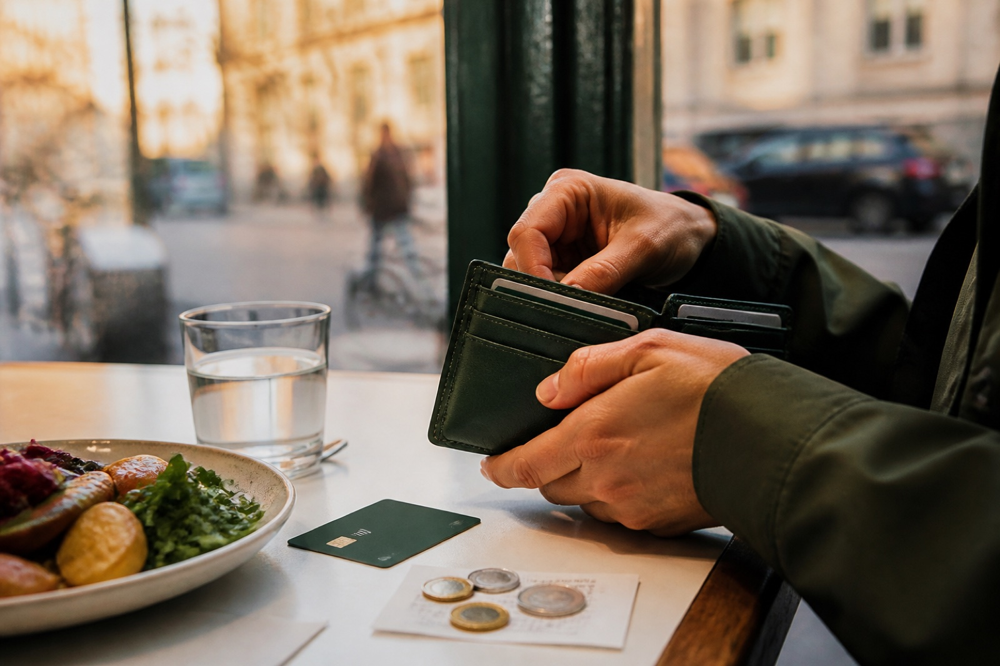
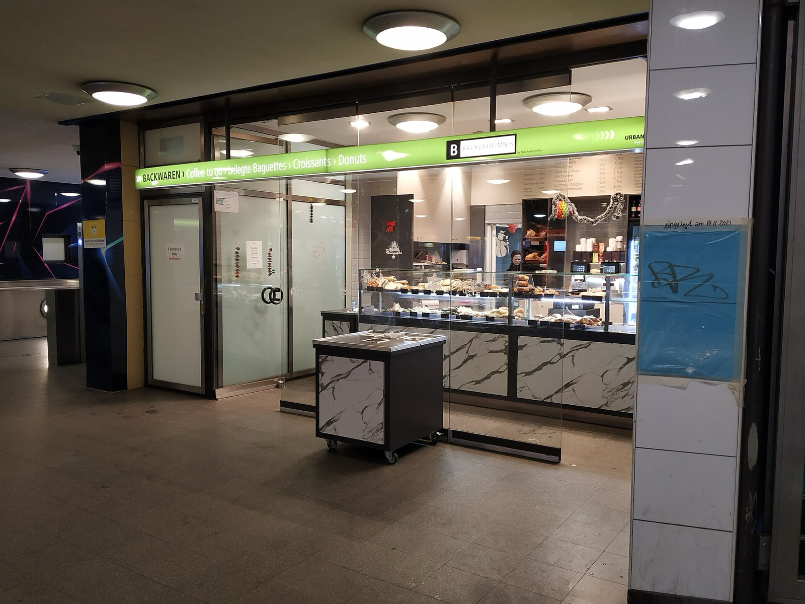
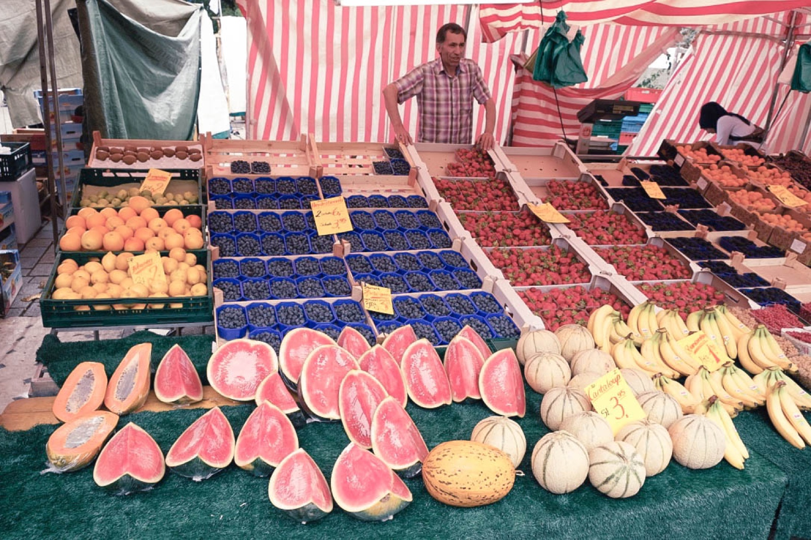
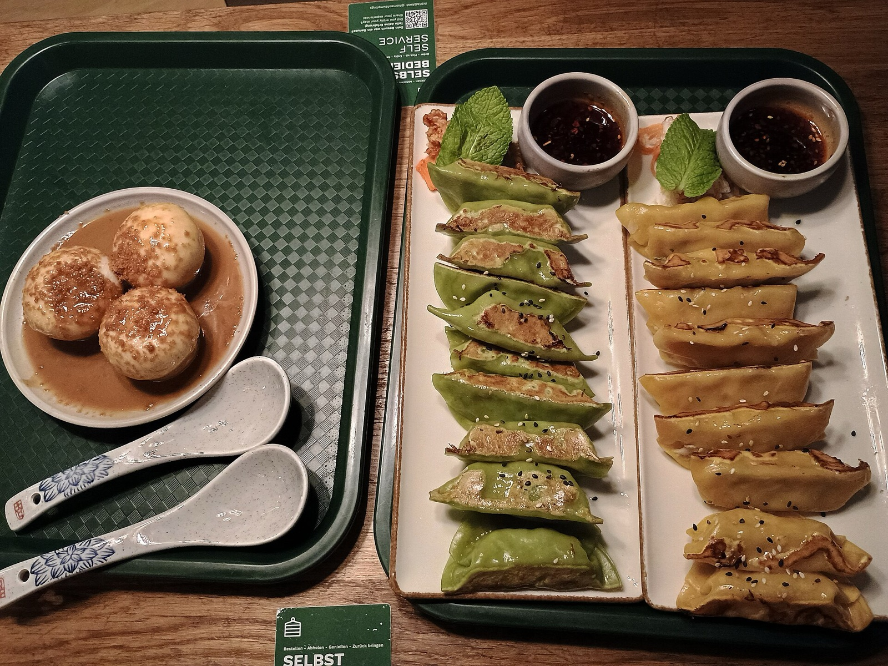

The cash question usually arrives when the food is already in front of you. You have found a small bakery near a station, ordered a coffee and a roll, then noticed that the card reader is nowhere obvious. Or you have sat down for dinner in Kreuzberg and realised that “cash-only” is not a city rule but it might be this restaurant’s rule today.

Do not turn Berlin into a hunt for cash-only places. Treat cash as a calm backup for a food day, then ask before you commit to an order. An informal counter is not a promise that the payment part will sort itself out. One direct question is faster than a rescue mission after the bill arrives.

{{quick-summary}}

_A meal break is the right time to make a payment decision before the bill becomes the awkward part._

## Is Berlin still cash-only at restaurants?

No. Card and contactless payments are common, and the [Deutsche Bundesbank's 2025 payment study](https://www.bundesbank.de/en/press/press-releases/payment-behaviour-in-germany-in-2025-964738) shows that cashless payments now account for more payments in Germany than cash. That does not mean every independent food business accepts every method. The useful visitor rule is more modest: payment acceptance can vary by venue, so ask early instead of treating a broad trend as a guarantee.

[visitBerlin's visitor FAQ](https://www.visitberlin.de/en/frequently-asked-questions) makes the practical split clear: card use is widespread in hotels, larger restaurants and supermarkets, while cash remains common in smaller shops, markets and some restaurants. That is why “Can I pay by card?” is a better travel skill than carrying a magic amount of cash.

This is also not a recommendation to carry a large wallet. Your food budget, group size and spending habits matter. Carrying a modest cash backup that feels sensible for you is different from trying to pre-pay an entire trip in notes.

## Four food moments where it helps to ask first

### 1. The bakery counter

At a bakery, the queue can move quickly and the total is usually small. Look for a card sign, but do not rely on seeing one from the door. Before pointing at the pastry, say: **“Kann ich mit Karte zahlen?”** It means “Can I pay by card?” and it is enough. If the answer is no, decide before the order is entered.

For the rest of the counter rhythm, my [Berlin bakery ordering guide](https://www.berlinwalk.com/post/how-to-order-at-a-berlin-bakery) helps with what to ask for and how the queue works. Payment is just one part of making that tiny stop feel easy.

_A bakery counter near Pankow station: decide how you will pay before the queue reaches you._

### 2. A market stall

At a street market, the seller, the weather and the day's setup can all affect how payment works. Do not assume every stall has the same arrangement because the stall beside it accepts a card. Ask while you are choosing, especially if you are buying several things for a picnic.

The move is simple: keep your card as the first option, keep a small cash fallback, and choose another stall or item without making it personal if the answer does not fit what you have. The price written on a board is not a promise about a payment method.

_A Berlin market is a good place to ask about payment while you are still deciding what to buy._

### 3. A sit-down dinner

The awkward version of this question is asking after the meal. The easy version is asking when you are shown the menu or when you order the first drink: **“Is card payment okay?”** If the answer is yes, you have clarity. If the answer is cash only, you can decide whether your cash backup covers the meal, whether an ATM is practical before ordering, or whether another restaurant is the better choice.

Do not promise yourself that a nearby cash machine will solve everything. It may be out of service, inconvenient, or simply make a relaxed dinner into a task. A one-sentence check at the start is the whole point.

_For a sit-down meal, ask about card payment when you settle in, not when the bill arrives._

### 4. The late snack

Late food is where tiredness makes small assumptions expensive. At a snack counter, takeaway window or Späti, look for the payment display and ask if you cannot see it. If you are heading out after dinner, separate the decision from the rest of the night: enough for one snack and one uncomplicated way home is more useful than trying to solve every possible expense.

If the plan is food after dark rather than a quick counter stop, my [late-night Berlin food guide](https://www.berlinwalk.com/post/where-to-eat-late-at-night-in-berlin) gives you neighbourhood ideas. It does not replace asking the individual venue how it takes payment.

{{widget:berlin-meal-wallet}}

## Build a food-day backup, not a cash ritual

I would keep the system deliberately boring:

- Use your normal card or phone payment where the venue accepts it.
- Keep an amount of cash that feels comfortable to lose and useful for a small unexpected food payment.
- Ask before a small counter order, before a market purchase and before settling into a restaurant.
- If you are planning to tip, read my [simple Berlin tipping guide](https://www.berlinwalk.com/post/how-much-should-you-tip-in-berlin-a-simple-guide-to-tipping-in-germany) before deciding whether to add it in cash or with the card.

That is enough. A flexible payment plan makes room for the actual day: a coffee on Karl-Marx-Straße, a market lunch by Maybachufer, or dinner after walking through Mitte. It is better travel than carrying a pile of notes because an old guide told you Berlin never takes cards.

## One historic-centre move after lunch

If you want a useful anchor for your first food day, begin around Alexanderplatz rather than trying to cross the whole city before lunch. The World Clock gives you a clear meeting point; Nikolaiviertel is close enough for a slower walk and a proper pause. My [Free Walking Tour](https://www.berlinwalk.com/book-berlin-walking-tour/berlin-free-walking-tour-tip-based) starts at Alexanderplatz and explores the historic centre of former East Berlin in about 2 hours. Check the live booking page for the date and meeting details instead of assuming a particular slot.

The payment plan still applies there. Let the tour be the structure, let a nearby food stop be one decision at a time, and ask the question before you order.

## The short version

Berlin is not simply cash-only or card-only. Cashless payment is widespread, but payment policies vary most where the food day gets informal: a small counter, market stall or independent restaurant. Carry a modest backup, ask early, and never make a restaurant meal depend on a payment method you have not checked.

{{article-image-credits}}

{{faq}}
