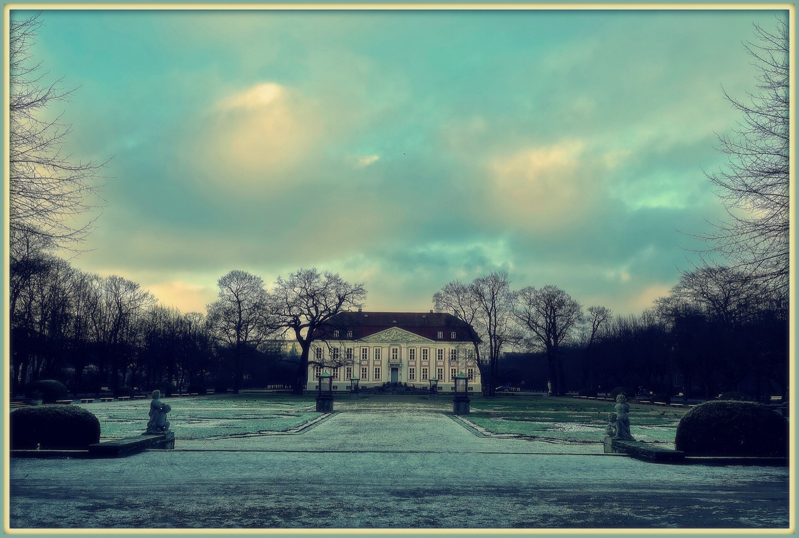
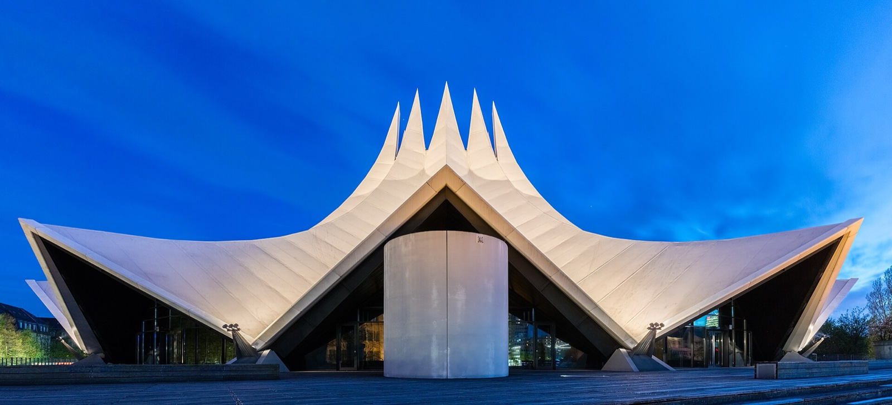
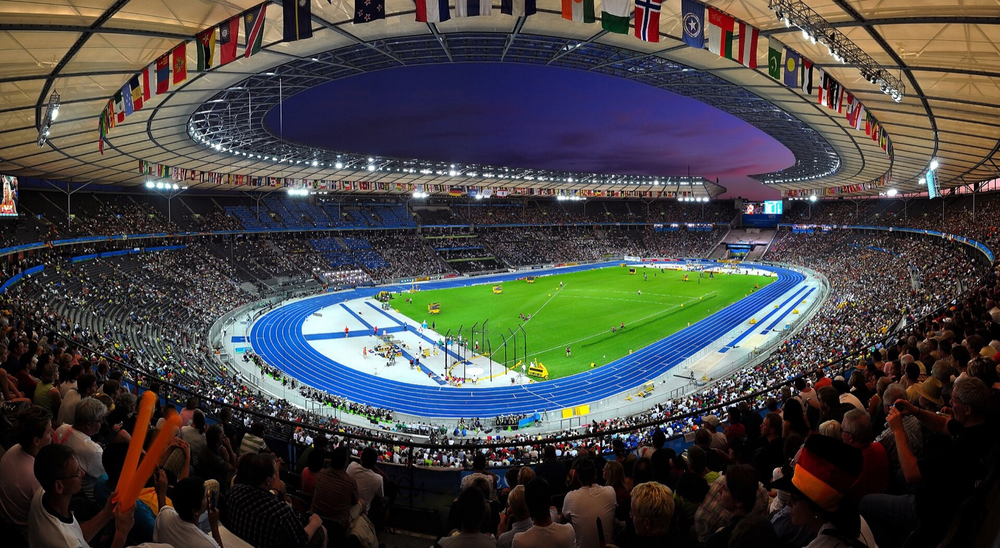
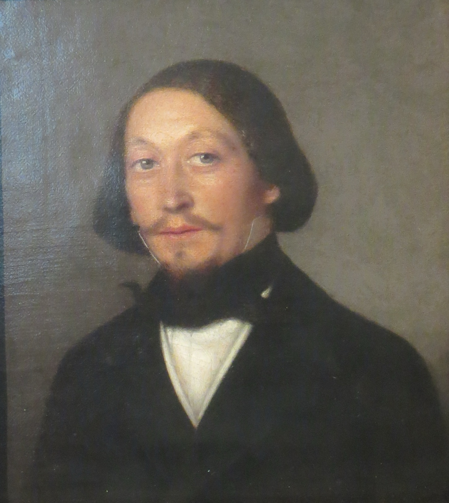

Berlin at Christmas can look like one long list of wooden stalls and hot drinks. That is only one version of the season. If you want a booked evening, a light walk or a concert with a clear date, it helps to look beyond the markets and choose one real event that fits the days you are actually in town.

My advice: start with the confirmed run dates, then choose one place. A Tierpark light walk, a circus at Olympiastadion, a circus at Tempodrom and a four-day winter-concert festival all ask for a different Berlin evening.

_Schloss Friedrichsfelde in winter; Tierpark venue context only, not a Christmas light-trail image._

{{quick-summary}}

## Berlin at Christmas beyond the markets: four confirmed runs

**Book the date that fits your trip.** This guide uses four verified non-market events. Its confirmed planning window runs from **20 November 2026 to 9 January 2027**.

- **Christmas at the Tierpark:** 20 November 2026 to 9 January 2027 at Tierpark Berlin in Lichtenberg. [Berlin.de](https://www.berlin.de/en/events/5909511-2842498-christmas-at-the-tierpark.en.html) describes a light route centred on Friedrichsfelde Palace.
- **Original Berliner Weihnachtscircus:** 11 December 2026 to 3 January 2027 at Am Olympiastadion. The [event listing](https://www.berlin.de/en/tickets/circus/31-original-berliner-weihnachtscircus-8cced94c-c75c-48f7-a792-8ecf61965261/) has the current performance dates and ticket details.
- **Roncalli Weihnachtscircus:** 17 December 2026 to 3 January 2027 at Tempodrom, Möckernstraße 10. Check the [current Roncalli listing](https://www.berlin.de/en/tickets/circus/roncalli-weihnachtscircus-2026-2027/2026-12-20-22-roncalli-weihnachtscircus-0416a954-0085-47bb-85d5-fc7b494714d4/) for the performance you want.
- **Louis Lewandowski Festival:** 17 to 20 December 2026. Check the [festival's own 2026 page](https://louis-lewandowski-festival.de/?lang=en) for individual concert locations, times and access conditions as they are published.

The four dates are useful because each event has a different final day. Check each organiser's own ticket before you buy, then compare it with your actual arrival and departure.

_Tempodrom at blue hour; venue context only, not a circus performance image._

## Choose the place before the poster

**Pick the kind of evening you want.** A clear choice makes the route and ticket check easier.

- **Tierpark Berlin, Lichtenberg:** choose it for an outdoor light walk. The closest major transport anchor is U Tierpark on the U5, and the night starts in the eastern part of the city.
- **Am Olympiastadion, Westend:** choose the Original Berliner Weihnachtscircus when a large circus show is the reason for the evening. Check the exact performance time before planning the westbound trip.
- **Tempodrom, Kreuzberg:** choose Roncalli when a circus evening near Anhalter Bahnhof and Möckernbrücke fits your day better.
- **Louis Lewandowski Festival:** choose it for its winter-concert programme. Its individual concert locations, times and access conditions need the organiser's live schedule.

This is why I would avoid treating all four as interchangeable. A light route at Tierpark needs outdoor clothing and a return journey from Lichtenberg. A Tempodrom performance has a different start time, ticket type and evening shape. The festival needs a venue-by-venue check.

_Olympiastadion Berlin at night; venue context only, not a circus performance image._

## The date overlaps that make the decision easier

**Use the calendar to narrow the choice quickly.** The confirmed run dates create five simple travel bands. They do not promise that every event has a session on every date.

- **20 November to 10 December:** Christmas at the Tierpark is the confirmed option in this guide.
- **11 to 16 December:** Christmas at the Tierpark and Original Berliner Weihnachtscircus overlap.
- **17 to 20 December:** all four listed run windows overlap.
- **21 December to 3 January:** Christmas at the Tierpark plus both circuses overlap.
- **4 to 9 January:** Christmas at the Tierpark remains in this guide's verified window.

That last band matters. Many Christmas plans stop at New Year, but this one remains useful through 9 January if a winter light walk is still part of your visit.

## Keep the rest of the day near the evening place

**Build the daytime around the actual venue.** If you have Tierpark tickets, use the day for eastern Berlin or keep the centre light before riding the U5. If you have a Tempodrom ticket, keep a flexible afternoon around Kreuzberg, Potsdamer Platz or the historic centre. If you are heading to Olympiastadion, plan for a westbound journey and do not make a precise museum exit the only way to reach your show.

For the transport basics, use my [Berlin public transport guide](https://www.berlinwalk.com/post/berlin-public-transport-explained-for-tourists-u-bahn-s-bahn-tram-bus), then put the actual venue and ticket time into [VBB](https://www.vbb.de/en/driving-information/apps/vbb-app-bus-bahn/) on the day. My [Berlin in December guide](https://www.berlinwalk.com/post/berlin-in-december-2026) is useful for the wider seasonal rhythm, and my [Berlin attractions guide](https://www.berlinwalk.com/post/berlin-attractions-worth-it) can help keep daytime choices selective.

## What needs a fresh check before purchase

**The run dates are confirmed; each ticket still needs its own check.** Events can have different performances, entry rules and venue instructions on different days.

Before you pay, check:

- the exact performance or concert date and start time;
- the named venue and entrance, especially for the festival;
- ticket category, seating or registration terms;
- accessibility, language and family information where it matters to your group;
- the live journey from your actual starting point and the route home.

This guide stays with the four verified non-market events above, so it can help with a different kind of winter plan.

## Use the Christmas-window overlap planner

**Use dates as a filter, not a promise.** The tool below compares your travel dates with the four confirmed run windows. It helps you see which events can fit your visit, then sends you to the responsible organiser for the exact session, ticket and access details.

{{widget:berlin-christmas-window-overlap}}

Use it for three questions:

- Which confirmed event still runs on my dates?
- Which evenings have more than one credible choice?
- Which options have already expired before I arrive?

_Historic portrait of composer Louis Lewandowski; biographical context only, not a 2026 festival performer image._

## The better Christmas plan

**Choose one real evening and leave room for Berlin.** A date at Tierpark, Tempodrom, Olympiastadion or a festival concert can give the trip a winter shape without making every night a booking. Pick the venue that fits your stay, recheck its own ticket page, then let the rest of the city stay flexible.

{{article-image-credits}}

{{faq}}
