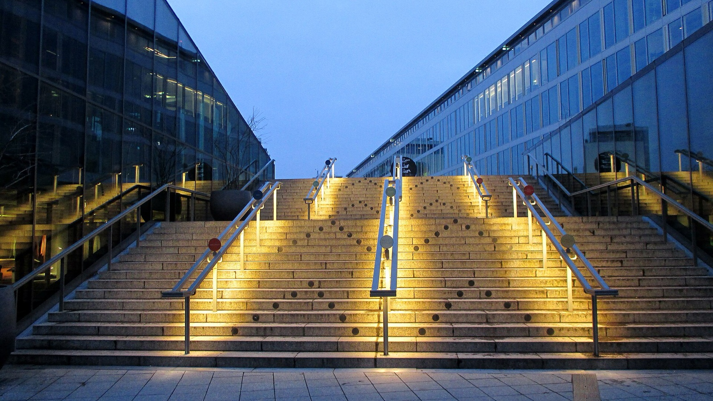
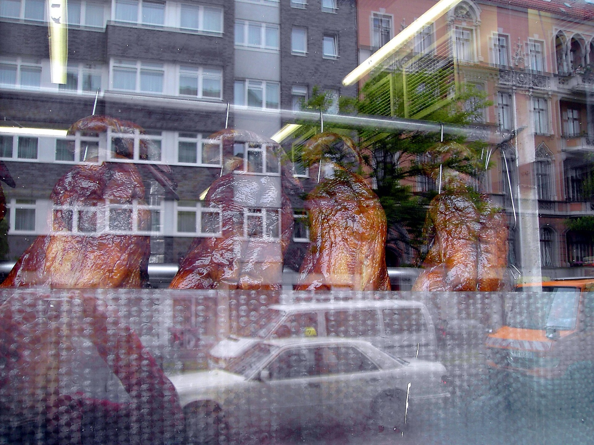
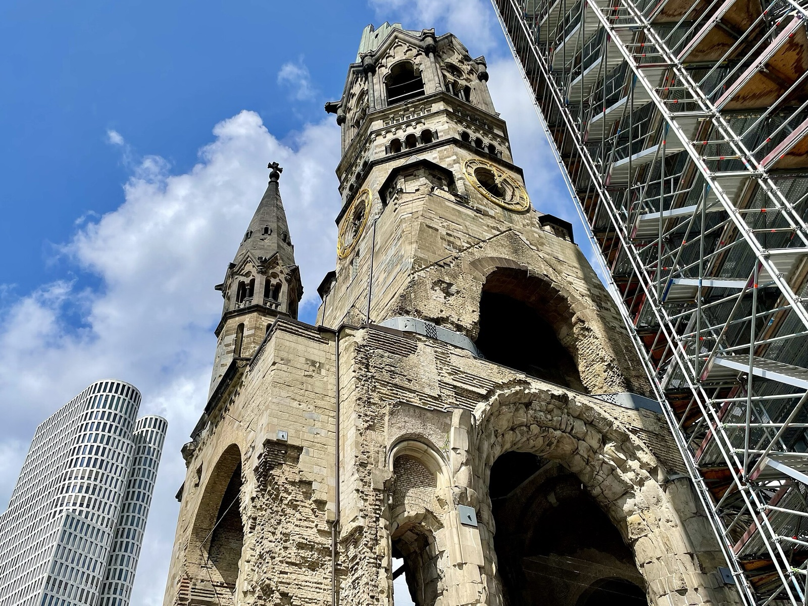
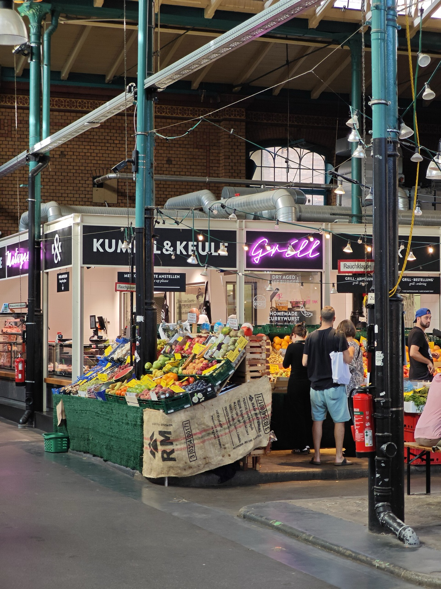

Food festivals are easy to over-plan. A programme can make every restaurant, talk and tasting look like one connected route, while Berlin still asks you to cross a large city between each booking. For Berlin Food Week 2026, the smarter move is to choose one event with a clear access route, then let the rest of the day stay flexible.

Berlin Food Week runs from 5 to 11 October 2026. The festival is a useful reason to look at Berlin's food scene, but it is not one single public venue or one single ticket. Each listing can have its own access conditions. Start from that fact and the week becomes much easier to enjoy.

_BIKINI BERLIN exterior; House of Food venue context only, not a Food Week scene._

{{quick-summary}}

## Use House of Food as the clearest public starting point

**Decision: if you want a simple festival stop, begin with House of Food.**

The named public anchor is [House of Food](https://www.berlinfoodweek.de/event/hof-event-1/) at BIKINI BERLIN on 9 and 10 October. The organiser lists it from 10:00 to 20:00 on both days, with free entry. It is presented as a market for discovering, tasting and buying food products, with producers and brands on site. Free entry identifies a public anchor; check the current official page for any entry condition attached to a particular activity.

That makes it a more straightforward visitor choice than a vague festival-wide search. It gives you a real place, a daytime window and a listed admission model before you leave the hotel.

For this stop, check:

- The current dates and opening times on the House of Food page
- The exhibitor list if a particular producer matters to you
- Whether tasting, shopping or a short look around is your actual aim
- Your live route to BIKINI BERLIN on the day

The festival's own [2026 overview](https://www.berlinfoodweek.de/) should remain your first source if new public listings are added.

_Peking ducks in a Kantstraße Chinese food-shop window; neighbourhood food context only, not a Food Week installation._

## Read the access label before you build a day around it

**Decision: treat access as part of the event, not a small detail below the headline.**

Berlin Food Week can contain different kinds of experiences. A title alone does not tell you if you can turn up, need a reservation, need a ticket, or need an invitation. Put the access line on the same level as the date and address when deciding what belongs in your itinerary.

Use this short filter for every event:

- **Free-entry public anchor:** confirm the listed opening window, venue and any current entry condition before going
- **Reservation:** secure the reservation directly through the named organiser or venue
- **Ticket:** read the current ticket page, conditions and exact venue information
- **Invitation:** do not plan it as a visitor event unless you hold the required invitation
- **Check details:** revisit the official listing close to the date, because access can change

This matters especially for [Berlin Food Night](https://www.berlinfoodweek.de/event/bfn2026/) on 5 October. The official page describes it as an invitation-only strategy dialogue at AchtBerlin. Its Longevity topic belongs to that one event. It does not define the full festival, and it should not be used as evidence that the whole week is for industry guests.

## Check whether you can actually go

**Use the access filter before arranging the rest of your day.** It separates a free-entry public anchor from a reservation, ticket or invitation situation, then points you back to the responsible event page for the live details.

{{widget:food-week-can-i-actually-go}}

_Kaiser Wilhelm Memorial Church in City West; orientation context only, not a Food Week scene._

## Make House of Food one City West afternoon

**Decision: pair the BIKINI BERLIN stop with one nearby Berlin plan.**

House of Food is at BIKINI BERLIN in City West. That makes it sensible to combine with a walk around Breitscheidplatz, Kurfürstendamm or the Kaiser Wilhelm Memorial Church, then stop for dinner in the same part of town. It is a real Berlin afternoon, not a food checklist stretched across several districts.

My [Kaiser Wilhelm Memorial Church guide](https://www.berlinwalk.com/post/kaiser-wilhelm-memorial-church-berlin) adds useful context to the memorial beside Breitscheidplatz. If transport is new to you, my [Berlin public transport guide](https://www.berlinwalk.com/post/berlin-public-transport-explained-for-tourists-u-bahn-s-bahn-tram-bus) covers the ticket and network basics. Use a live BVG or VBB route for the actual journey.

Leave some room after the market. A food product tasting can be a complete afternoon in itself, especially if you want to talk with producers or carry purchases back to your hotel.

## Keep the festival plan modest until each listing is confirmed

**Decision: make one confirmed event the centre of the day, then add only what still fits.**

The festival dates are confirmed, and House of Food has a clear public listing. Other events may have free entry, require a reservation, be ticketed or be invitation-only. That is not a weakness in the festival. It simply means access must guide the itinerary.

Do not assume:

- That a restaurant event has a spare table or the same access as a market
- That a food-business discussion is designed for general visitors
- That the entire festival shares Berlin Food Night's Longevity topic
- That a listing is public without reading its own access instructions

For the best Berlin Food Week day, choose the food experience you can genuinely enter, give it a neighbourhood, and let one good meal or market be enough.

_Markthalle IX in Kreuzberg, Berlin food-market context only and not a Berlin Food Week 2026 scene._

## The useful Berlin Food Week question

**Decision: ask “What can I access?” before asking “What is happening?”**

The answer may be a free afternoon at House of Food, a booked dinner, a ticketed talk, or simply a festival-linked stop that fits around the rest of your trip. Start from the official listing, confirm the access route, and keep the day local to the event you chose.

{{article-image-credits}}

{{faq}}
