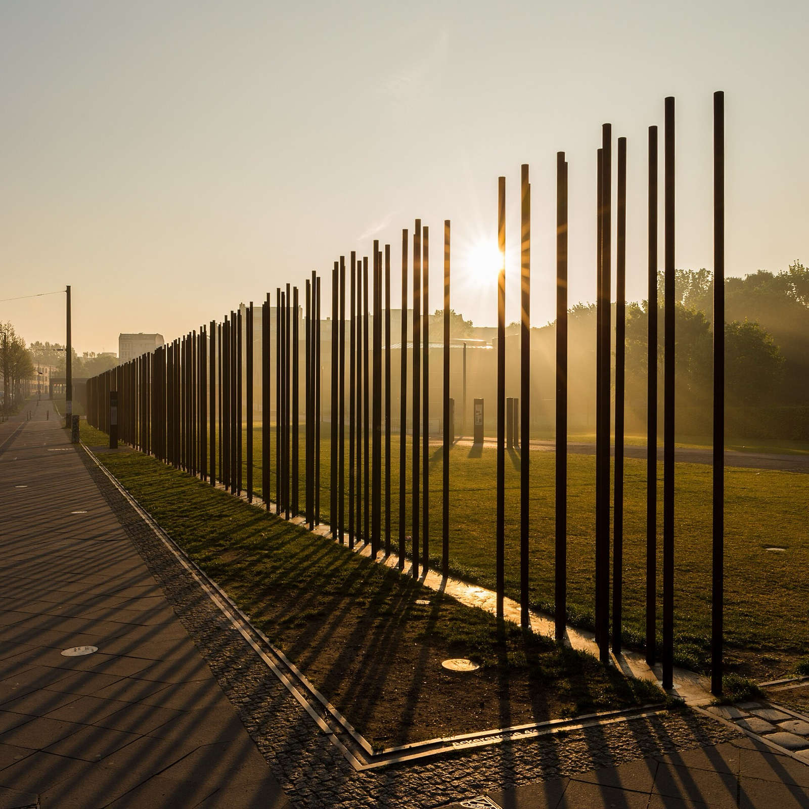
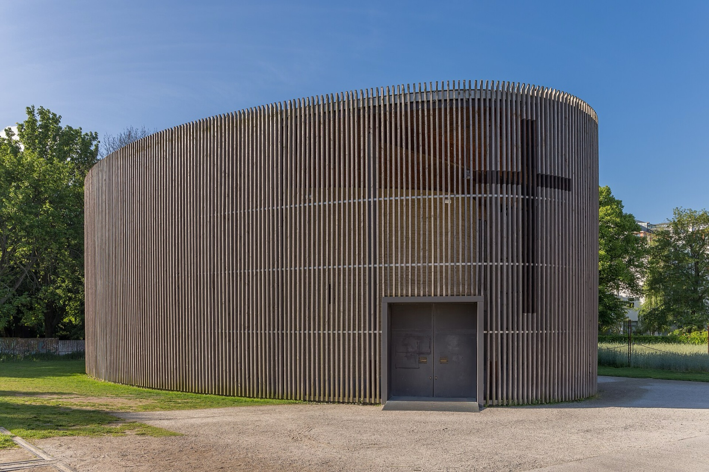
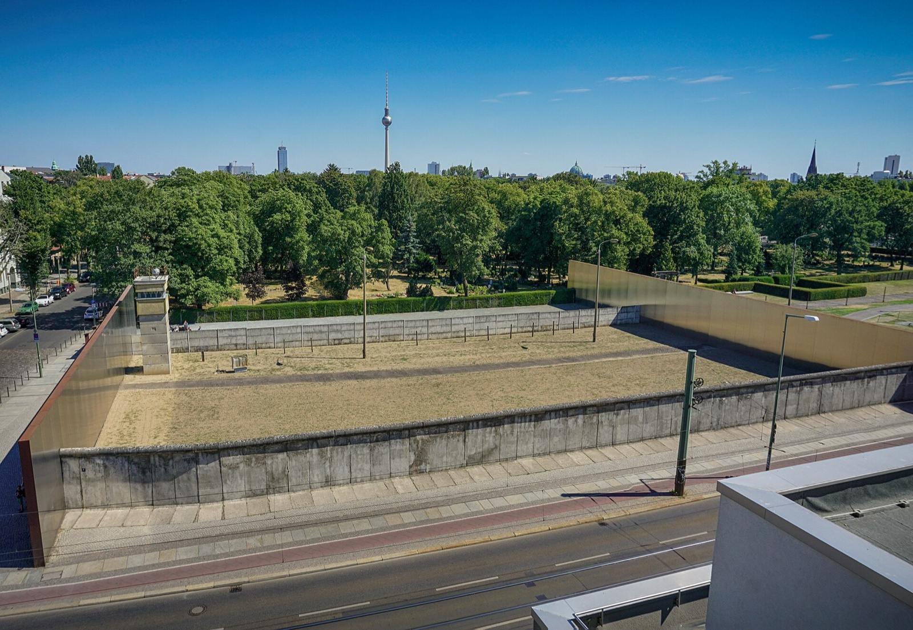
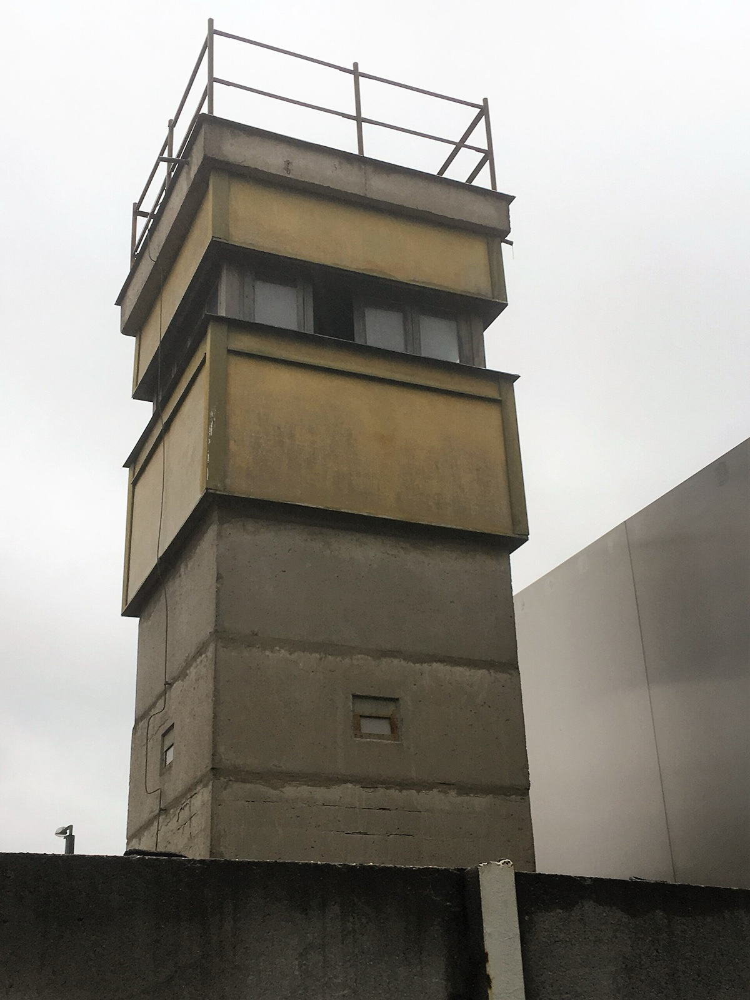

Berlin feels different on 9 November. A visitor can stand by the Brandenburg Gate, walk along Bernauer Straße, or cross Bornholmer Straße and feel the pull of the date without needing a loud event around it. The date carries several difficult chapters of German history, including the fall of the Berlin Wall in 1989, so it deserves more attention than a rushed evening plan.

My advice: use Berlin Freedom Week as a reason to choose one confirmed place and give it proper time. The citywide programme can add something valuable once its individual entries are current, but a meaningful day does not depend on guessing a timetable that has not been published yet.

_Berlin Wall Memorial at Bernauer Straße; site context only, not a 2026 ceremony image._

{{quick-summary}}

## Berlin Freedom Week 2026: what is confirmed now

**Start with the dates, then check the live programme.** [Berlin Freedom Week](https://www.berlin.de/en/events/9796393-2842498-berlin-freedom-week.en.html) is scheduled for **7 to 14 November 2026** at locations across Berlin. The city describes it as a week about freedom, democracy, historical memory and current debates, with admission conditions varying by event.

One central date is also confirmed: the City of Berlin has announced a [Freedom Conference on 10 November](https://www.berlin.de/en/news/10538992-5559700-world-liberty-congress-opens-european-he.en.html). Treat that as a real anchor if its final programme fits your trip, then check the organiser page for registration, location, access and the actual sessions.

- **7 to 14 November:** the confirmed Freedom Week window.
- **9 November:** a significant history day, best planned around a real site with time to reflect.
- **10 November:** the confirmed date for the central Freedom Conference, subject to its final visitor information.

If you are arriving in Berlin during the same week, my [Berlin in November guide](https://www.berlinwalk.com/post/berlin-in-november-2026) can help you keep the rest of the trip realistic around the weather, museum hours and transport.

_Chapel of Reconciliation at the Berlin Wall Memorial; site context only, not a 2026 programme image._

## Build 9 November around a place, not a programme card

**Choose the place that gives the day its meaning.** Berlin has several genuine ways to approach the history without inventing a route from provisional event listings.

- **Berlin Wall Memorial, Bernauer Straße:** use the memorial site when you want the physical geography of division and its consequences. Check the [memorial's own visitor information](https://www.stiftung-berliner-mauer.de/en/berlin-wall-memorial/) for normal opening hours and access on the day.
- **Bornholmer Straße:** use this former border crossing when the opening of the border is the part of the story you want to understand. Give yourself time to read the site, not only take a photograph.
- **Brandenburg Gate:** use the Gate when you want a public symbol of the changed city. It is a valid stop in a November history day, and my [Brandenburg Gate guide](https://www.berlinwalk.com/post/brandenburg-gate-berlin-visitors-guide) gives the setting more context.

The useful move is simple: choose one of these places before lunch, then let the rest of the day grow from the actual neighbourhood. Bernauer Straße, Prenzlauer Berg and the historic centre each ask for a different route. Trying to make all three into a two-hour dash turns an important date into a transport problem.

_A preserved Wall section and former border strip at Bernauer Straße; site context only, not a 2026 ceremony image._

## What has to wait for the final programme

**Do not book the missing details.** The citywide Freedom Week listing confirms the dates and themes, but the detailed programme is still developing. Use an individual event only after its responsible organiser has published a current entry with visitor information.

Keep these details open until the responsible organiser publishes them for 2026:

- exact start and finish times for a 9 November event;
- special memorial programming or access arrangements at Bernauer Straße;
- the language of talks, tours and discussion sessions;
- tickets, registration, accessibility and capacity;
- candles, ceremonial moments or an hourly sequence at any public site.

This is not a reason to skip the week. It is a reason to use the official programme as the final authority. A current entry with a named venue and access instruction is worth planning around. A vague listing or a social post without visitor details is not.

## Keep a Freedom Week day separate from my walking tour

**Give each history experience its own space.** My BerlinWalk tour starts at Alexanderplatz and explores the historic centre of former East Berlin on foot in about **2 hours**. It does not trace the Berlin Wall line or replace a visit to a Wall memorial.

If a live tour slot fits another morning, it can help you understand the historic centre before a separate November history visit. Check the [current tour page](https://www.berlinwalk.com/book-berlin-walking-tour/berlin-free-walking-tour-tip-based) for actual availability. For a self-directed Wall context, my [Berlin Wall Memorial guide](https://www.berlinwalk.com/post/berlin-wall-memorial-bernauer-strasse) is the better companion.

## Check what your November visit can actually include

**Choose the reason you are going before you add anything to your diary.** The guide below separates a confirmed Freedom Week date from a useful Wall-history visit and from details that still need a programme update.

{{widget:november-nine-hour-line}}

Use it to distinguish between:

- a confirmed citywide date or central conference event;
- a history site worth visiting without claiming a special 2026 event;
- a programme detail that needs a fresh check before you plan around it.

_A preserved watchtower at the Berlin Wall Memorial on Bernauer Straße; site context only, not a 2026 Freedom Week ceremony._

## The better Berlin Freedom Week plan

**Choose the evidence you can actually see.** Put 7 to 14 November in the diary, reserve 10 November only after the conference information matches your needs, and treat 9 November as a day for one real Berlin place. That leaves room for the programme to become more specific without turning uncertainty into a promise.

{{article-image-credits}}

{{faq}}
