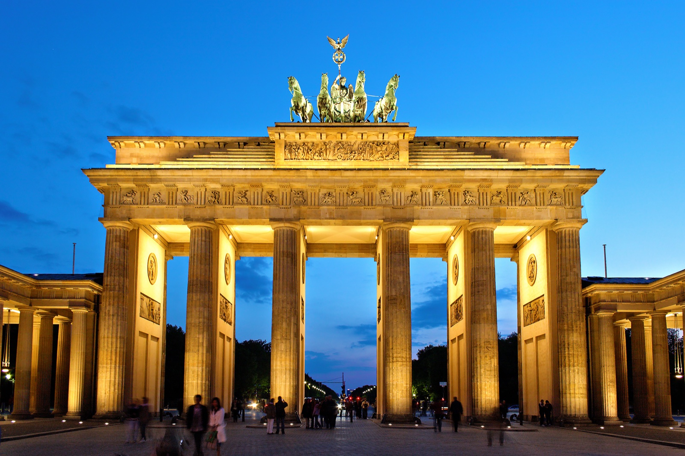
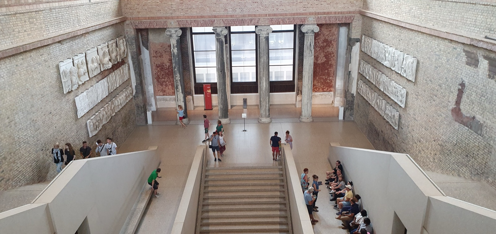
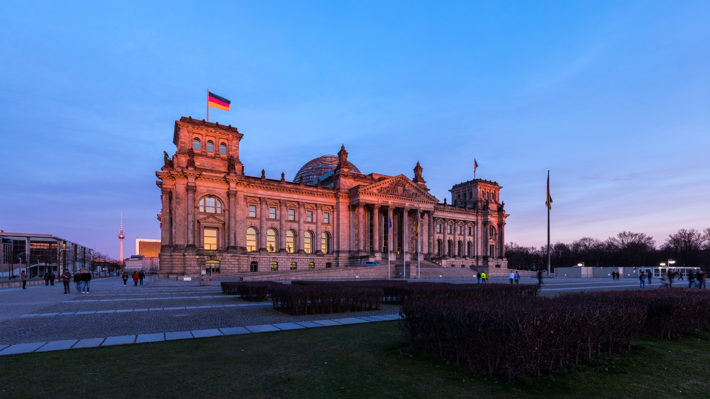
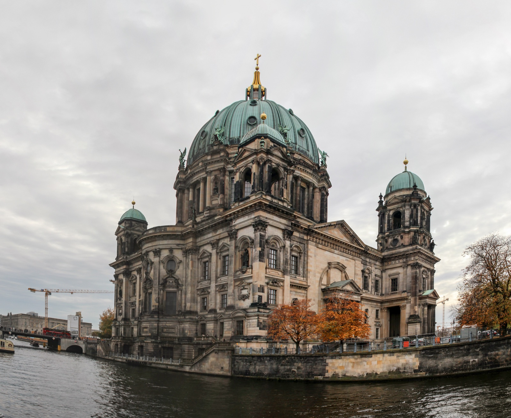

Two hours in central Berlin is enough for a real experience, but not for the version where every landmark becomes a stop, a ticket and a photograph. The useful question is simpler: do you start on the Museum Island side or at Brandenburg Gate?

I would choose the side closest to where you already are, then let one indoor visit be the exception rather than trying to make it the whole day. This is a city where the walk between famous buildings can be the point.

{{quick-summary}}

## The decision that saves the two hours

Start **east** when you are already at Alexanderplatz, Hackescher Markt or on Museum Island. That window is about river edges, the Berliner Dom and choosing one museum question instead of trying to consume an entire island. UNESCO lists Museum Island as a five-museum ensemble, which is exactly why it needs a limit rather than a checklist. [Read the official World Heritage description](https://whc.unesco.org/en/list/896) before you decide that an interior is worth the time.

Start **west** when you are around Pariser Platz, the government quarter or Hauptbahnhof. This is the cleanest way to understand the Brandenburg Gate, the Reichstag and the wide political spaces around them without doubling back across Mitte. The [official Brandenburg Gate page](https://www.berlin.de/en/attractions-and-sights/3560266-3104052-brandenburg-gate.en.html) is a useful current check for access details.

The point is not to crown one side the winner. It is to stop pretending that east and west are one quick loop.

_At the Brandenburg Gate, stay long enough to look through the columns toward the Tiergarten before you move on._

{{widget:berlin-landmark-window}}

## An east start: use Museum Island as a threshold, not a challenge

From Alexanderplatz, the first useful movement is toward Museum Island rather than straight into a line. The river, Lustgarten and the Berliner Dom give the area shape even if you never enter a museum. If you have an advance ticket and one specific reason to go inside, take it. If not, keep the exterior walk and save the museum for a day when it can be the main event.

This matters because the island is not one attraction. The Altes Museum, Neues Museum, Alte Nationalgalerie, Bode Museum and Pergamonmuseum are different visits with different practical limits. I have made the rushed version before: too much time reading ticket screens, not enough time noticing where the buildings sit beside the water.

_An interior can be the right choice, but one interior is enough for a two-hour landmark window._

If you choose the cathedral instead, use the [Berlin Cathedral visitor information](https://www.berlinerdom.de/en/visiting/service/visitors-service/?Itemid=123&cHash=f47b4c170d2a51f6f1166647880d18ad&option=com_content&task=view) on the day. Its access arrangements and services can affect a visit, so it is not a place to schedule from an old travel list.

## A west start: let the gate lead, not trap you

The Brandenburg Gate is easiest when you arrive with one next place in mind. Look at the gate from Pariser Platz, then decide whether the Reichstag is an exterior stop or a booked interior. Do not count the dome as a casual walk-in: the [Bundestag visitor service](https://visite.bundestag.de/BAPWeb/?lang=en) handles registration and current options.

_The Reichstag works as a strong exterior stop even when a dome visit is not practical that day._

With only two hours, I would keep the rest of the west window outside: the space around the Reichstag, the edge of the Tiergarten, then Unter den Linden toward Bebelplatz if your feet and time agree. That sequence gives you the change in scale from gate to parliament to boulevard without making a false promise about entry times.

## The inside rule: one commitment, then let Berlin stay outside

An indoor landmark can make the window memorable. Two usually make it anxious. Choose one of these reasons, not both:

- You want an object-led museum visit, so reserve the time for the Neues Museum and skip the cathedral interior.
- You want a dome, tower or sacred interior, so check the current visitor page and let the rest of the route remain outdoors.
- You have no booking and no strong reason to queue, so keep the whole window outside and spend the extra minutes around the river or the government quarter.

_The Berliner Dom is already a useful landmark from the riverside, even when you do not go inside._

The **Berlin Landmark Window** below the article is there to make that choice visible. Tap the landmark closest to you, keep or release the indoor commitment, and it will show a focused two-hour thread plus the thing I would not add.

If you want a self-paced reference for another landmark day, my [Berlin Landmarks Guide](https://www.berlinwalk.com/products/berlin-landmarks-guide) is the one optional companion here. For this short window, keep the tool's route narrow first.

## Before you leave

Check the official page for the one place where entry matters. Then open a walking map only after you have picked east or west. Two hours feels generous when you stop making it carry a whole first visit to Berlin.

{{faq}}

{{article-image-credits}}
