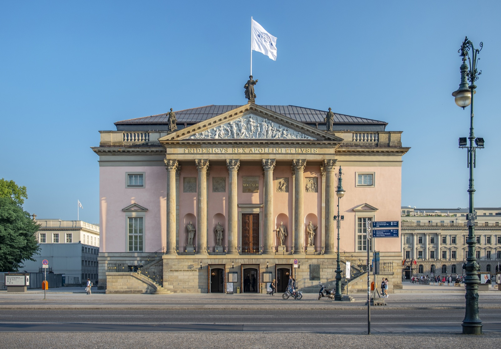
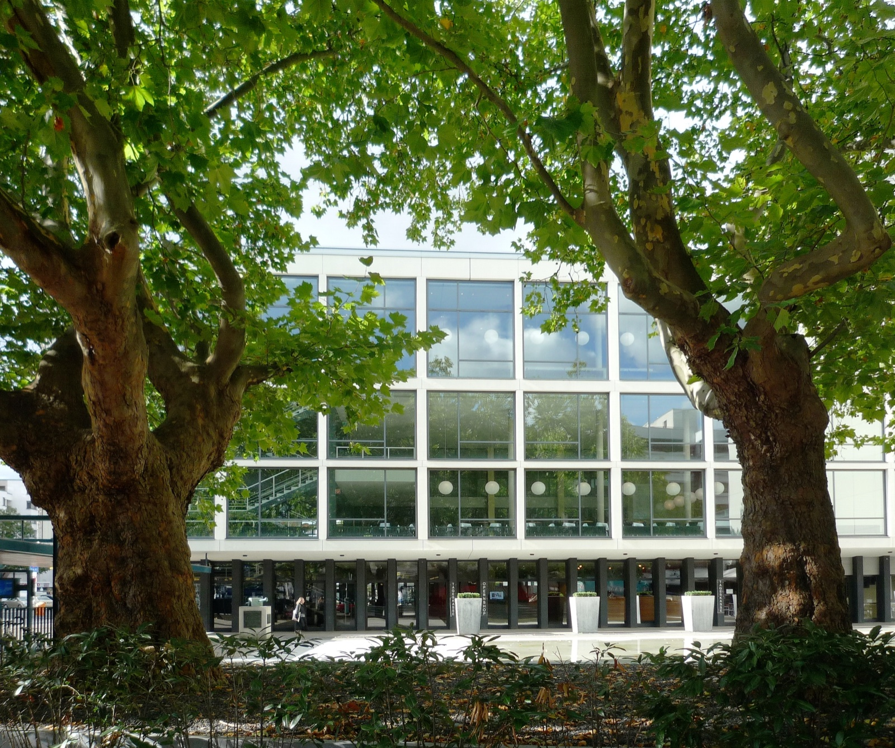
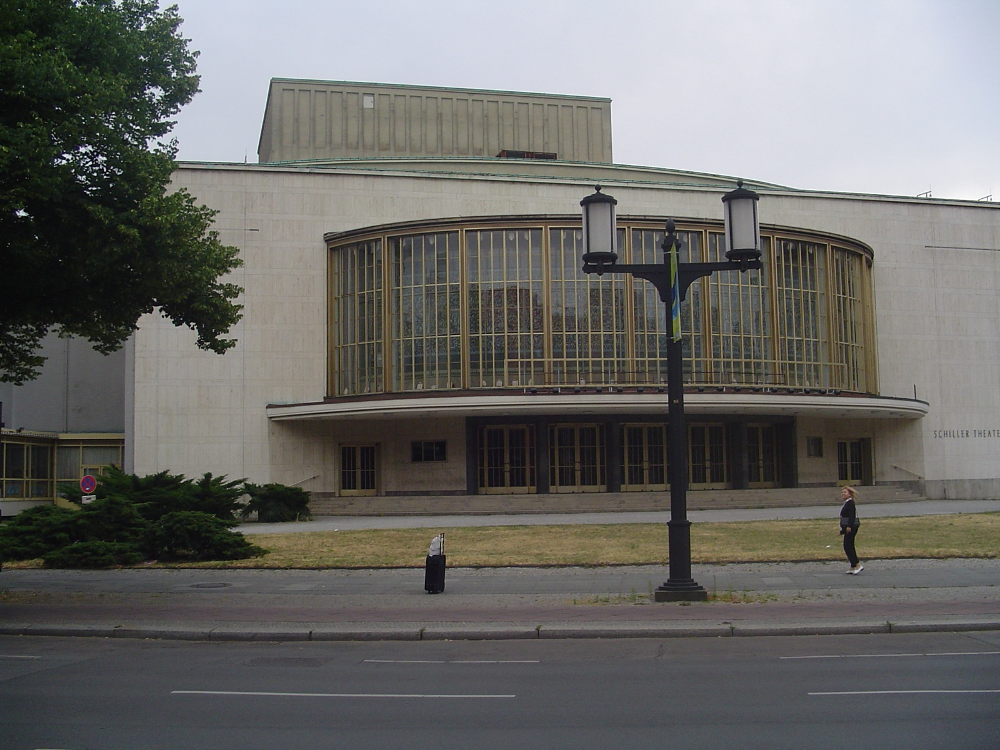
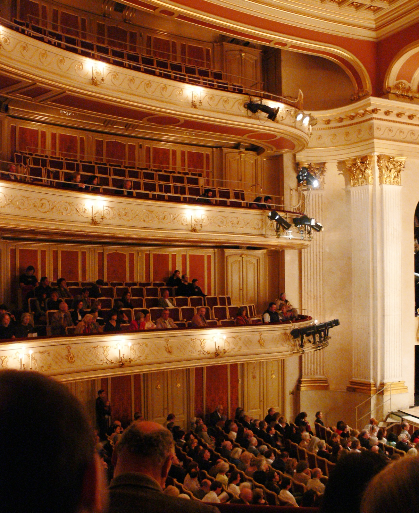

Berlin opera is easy to overcomplicate before you have even opened a programme. A first-time visitor sees three names, a long list of productions and ticket pages in German, then tries to choose the most famous building. That is usually the wrong first move.

The useful question is smaller: what kind of Berlin evening do you want to have? One house sits naturally inside a Mitte day around Unter den Linden. Two others put you in the western half of the city. One company currently performs at a different building from the address many older guides still name. Once you sort the physical place before the production, the choice gets much calmer.

{{quick-summary}}

_Staatsoper Unter den Linden on Unter den Linden, a practical fit for a Mitte evening._

## Choose the part of Berlin first

Berlin has three main opera houses: Staatsoper Unter den Linden, Deutsche Oper Berlin and Komische Oper Berlin. They do not make the same kind of evening simply because they all present opera. The location changes the day around it, the journey home and the places where you will be standing when you decide whether to have dinner before the curtain.

**Staatsoper Unter den Linden** is at Unter den Linden 7 in Mitte. It works well if your day already includes [Unter den Linden](/post/unter-den-linden-berlin), [Bebelplatz](/post/bebelplatz-berlin), Museum Island or the Brandenburg Gate. The official visitor page lists U5/U6 at Unter den Linden, U5 at Museumsinsel, U2 at Hausvogteiplatz and the Staatsoper bus stop as nearby options. This is the clean choice when you want a central walk, an unhurried meal and an opera in the same area rather than a cross-city dash.

**Deutsche Oper Berlin** is at Bismarckstraße 35 in Charlottenburg. Its own visitor information points visitors to U2 at Deutsche Oper, with accessible U2/U7 access at nearby Bismarckstraße. Choose it when the west side of Berlin is already your plan: Charlottenburg, the Kaiser Wilhelm Memorial Church area or an afternoon that ends around City West. Do not book it as if it were a short walk from Museum Island. It is a different Berlin evening, and that is part of its appeal.

**Komische Oper Berlin** needs one extra check before you leave the hotel. Its regular company has used the Schillertheater at Bismarckstraße 110 as a venue since the 2023/24 season. The official venue page lists Bismarckstraße as the visitor entrance and says Bismarckstraße station is the nearest accessible U-Bahn option. If an older search result sends you to Behrenstraße, stop and check the specific performance page instead of treating the historic address as tonight's door.

My advice: pick the house that matches the Berlin you are already in. You will enjoy the performance more if the trip there feels like the final part of the day, not a transport puzzle you start solving at the last minute.

## The three-house read in one glance

{{widget:berlin-opera-house-reader}}

The tool is deliberately not a ticket calculator or a verdict machine. Open the three programme folds, read the location and then make one practical choice. It gives you the kind of small distinction a search result usually misses: Mitte evening, Deutsche Oper evening, or Komische Oper at Schillertheater.

_Deutsche Oper Berlin in Charlottenburg, a west-Berlin choice rather than a Mitte add-on._

## Let the programme page make the final call

The house tells you where the evening happens. The individual production page tells you whether the performance actually suits you. Check these four things before buying a ticket:

- **Language and surtitles.** Do not assume an opera will be in English because the booking page has an English version. Staatsoper says it provides German and English surtitles, while warning that they are not readable from every side or rear seat. Deutsche Oper production pages also state the performance language and surtitles. Read the exact listing for your date.
- **Running time and interval.** A long evening has a different dinner and transport shape from a short one. The production page, not a general venue guide, is the source to trust.
- **The exact venue.** This matters most for Komische Oper. Its official Schillertheater page is the current visitor reference, but some productions can use other locations. Use the ticket page as the last address check.
- **Accessibility or seating needs.** Each house gives its own visitor information. If step-free access, a lift, audio description or subtitle sightline matters to you, choose the seat from the official information rather than from a generic seating chart.

This is also where I would resist the tourist instinct to make every culture night a grand test. You do not need to know the whole canon to have a good evening. Pick a production whose timing, language information and location make you relaxed enough to arrive early, find the entrance and look around.

_Schillertheater on Bismarckstraße, the current main venue named by Komische Oper Berlin._

## A simple first-visit choice

Choose **Staatsoper Unter den Linden** if you want the opera to finish a day in the historic centre. You can walk through the district before the performance, and the house sits in the middle of the boulevard rather than at the edge of a separate cultural campus. It is the most natural fit for a first Berlin evening when your daytime list already says Mitte.

Choose **Deutsche Oper Berlin** if you want a west-Berlin plan and a direct U-Bahn arrival. Treat it as its own destination. Build the afternoon around Charlottenburg or City West, then let the short ride or walk to the house feel straightforward. I would not try to squeeze it into a frantic line from Alexanderplatz, Museum Island and a 19:30 curtain.

Choose **Komische Oper Berlin at Schillertheater** if the specific production catches you and you have checked the current venue. The point is not to label one house more adventurous than another from a travel blog. The point is to read the production page, save Bismarckstraße 110 when it is the listed location, and arrive at the building the company actually names.

If you have a different morning free, my [Free Walking Tour](https://www.berlinwalk.com/book-berlin-walking-tour/berlin-free-walking-tour-tip-based) is a separate historic-centre plan from Alexanderplatz. It lasts 2 hours and gives you street-level context for a later Staatsoper evening, but it does not replace a visit to an opera house or claim to cover their programmes. Check the live booking page for the date and meeting details.

## The seat is part of the decision

For a first opera in Berlin, do not chase the cheapest line on a seating chart without looking at the notes. At Staatsoper, the official FAQ specifically says the German and English surtitles are not readable from all seats, especially some side parquet seats and rear lateral balcony rows. That does not make those seats bad. It means the subtitle question should be part of the booking decision if you rely on them.

The same principle applies everywhere: a less dramatic view with a clear sightline, an easy entry and a manageable journey can be better than a bargain seat that turns the whole evening into work. The official house and production pages are more useful than a blanket rule because the stage setup, language and accessibility details can differ.

_Inside Staatsoper Unter den Linden: check the official seat information if surtitles are important to you._

## The practical move before you go

Save the venue name and street address from the exact production page. Put the ticket and the address in the same place on your phone. Then decide whether your afternoon belongs in Mitte or Charlottenburg and leave enough time to arrive without turning the foyer into a navigation test.

Berlin opera works best when it is one good evening, not another item to race through. Choose the neighbourhood first, check the production facts second, and let the house you actually reach be the right one for the night.

{{faq}}
