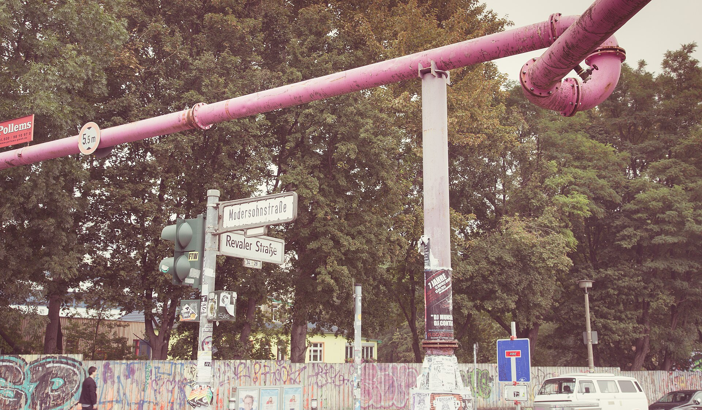
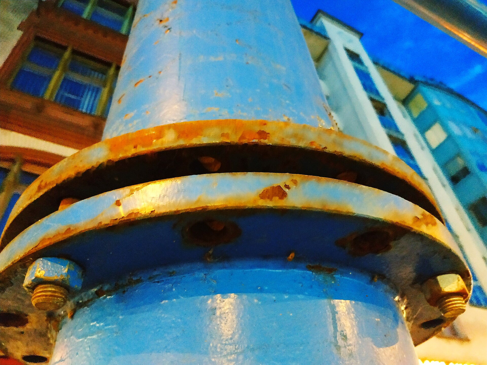
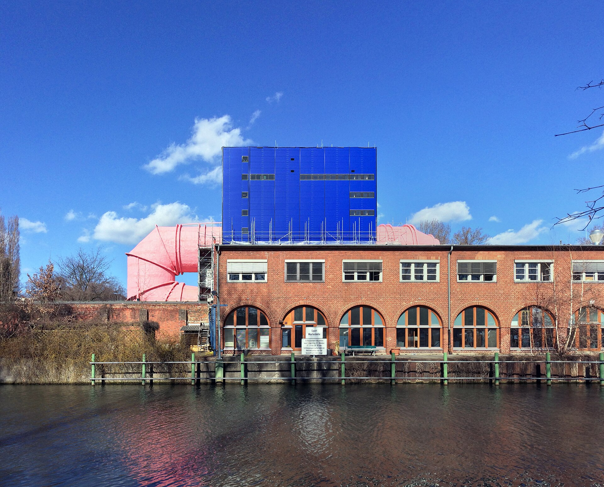
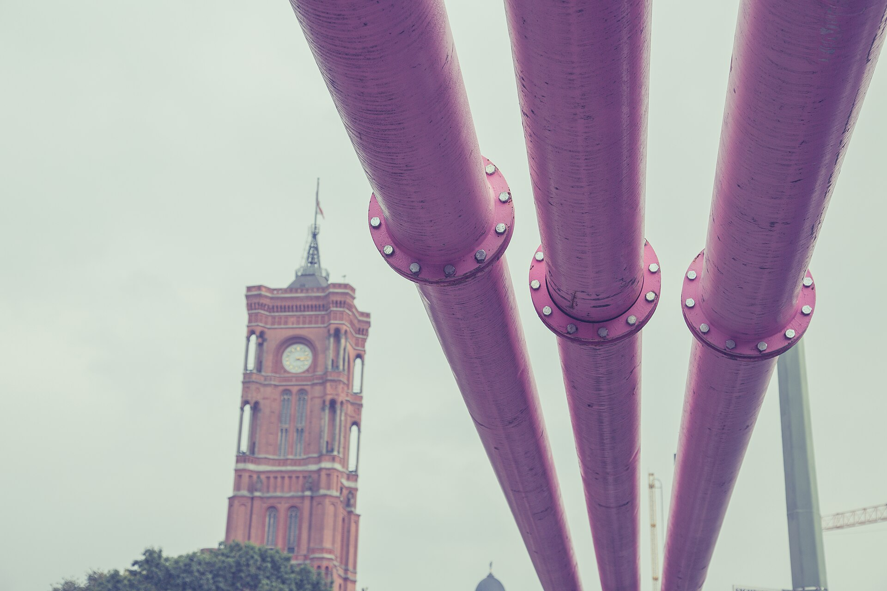

The first time you see one, it looks like Berlin has put a giant piece of bubble-gum plumbing on the pavement and forgotten to explain it. A pink pipe runs beside a building site, climbs over a crossing ramp and disappears round a corner. It is strange enough to photograph, but it is not a new tourist attraction and it is not a mystery once you know what the ground is doing underneath you.

My advice: do not make the colour into a code. Look at the setting. If the pipe is on temporary supports beside a dig, it is usually part of keeping that excavation dry. If it is fixed into a pink-and-blue building by the Landwehrkanal, you are looking at a very different Berlin landmark.

{{quick-summary}}

_A temporary pipe at Modersohnstraße in Friedrichshain. The colour is memorable; the job is practical._

## The short answer: they move groundwater away from a building site

The Berlin Water Works says the coloured pipes seen around the city carry groundwater pumped out during construction so crews can work dry at depth. The pipes can be pink, blue or yellow. That is the useful answer, and it is better than the familiar jokes about beer, sewage or a secret underground system.

Why is this so common in Berlin? The answer is not that every square metre is a swamp. Groundwater depth varies across the city. But the city administration says that in parts of the inner city in the Warsaw-Berlin glacial valley it is generally expected at less than three metres below ground. A deep basement, station work or foundation pit can therefore meet water quickly.

That is when a contractor may need groundwater management. The exact method and discharge route depend on the project and its permits, so do not assume that every pipe has the same destination. What you can safely read from the pavement is simpler: an excavation nearby needs to stay dry enough for people and machinery to work.

{{widget:berlin-pink-pipe-decoder}}

## Why are the pipes above ground instead of buried?

They are temporary site infrastructure. A route on supports can be assembled, checked, moved and removed as the works change without opening another long trench. You will often see it following a kerb, crossing a side street on a protected ramp or rising over an access point. That makes the pipe highly visible, but it also makes the path more predictable for the work crew.

For a visitor, the move is ordinary: use the ramp if one is provided, keep outside the barriers and do not climb or lean on it for a photo. The pipe is not an attraction, and a construction boundary is still a construction boundary.

_A connection in an above-ground groundwater line on Potsdamer Straße. The supports and site context tell you more than the paint colour._

## Pink does not always mean a construction pipe

Berlin has a second, permanent pink pipe that regularly confuses people. On Schleuseninsel by the Landwehrkanal, near Tiergarten, the bright pink tube of **Umlauftank 2** runs through a blue building. It belongs to the Technical University of Berlin's hydraulic-engineering and shipbuilding research facility, not to a temporary street excavation.

The local district describes the 120-metre tube as part of a water-circulation tank used for flow experiments with ship models. Architect Ludwig Leo designed the complex in the 1970s, and the pink tube was deliberately made impossible to ignore. If you see a fixed pink structure joined to that building, do not expect it to disappear when construction finishes. It is a piece of architecture.

_Umlauftank 2 near the Landwehrkanal is a permanent research building, not a temporary dewatering line._

## A quick way to read what is in front of you

Use three clues before you decide you know the story.

- **Look for the dig.** Hoarding, a foundation pit, pumps or temporary supports point to construction groundwater management.
- **Look for permanence.** A pipe that is integrated into a building, landscaped around or treated as architecture is not behaving like site plumbing.
- **Treat colour as a visual choice, not a universal label.** Berlin Water Works describes several colours. The work around the pipe matters more than whether it is pink today.

The Pink Pipe Decoder above makes that distinction without pretending to know where a live site begins or ends. It is deliberately not a construction map. Active works move, access changes and the official site notices are the authority for any route decision.

_A temporary pipe near Rotes Rathaus. The city landmark behind it is permanent; the pipe is not._

## Do not let one odd detail derail a first afternoon

Berlin is full of things that look as if they need decoding: a raised pipe, a tram platform in the road, a square that was rebuilt three times, a station entrance that does not point where your map expects. The useful habit is to make one grounded decision, not to turn every surprise into an unsolved logistics problem.

If your first hours are filling up with those practical questions, my [Berlin First-Day Rescue Plan](https://www.berlinwalk.com/products/berlin-first-day-rescue-plan) is a compact arrival help product for getting the basics straight. It will not tell you the location of an active pipe, because that would be a bad promise. It will help you keep the rest of the day from becoming one long series of small avoidable frictions.

## The short version

Most pink pipes you see on temporary supports beside Berlin building sites are moving pumped groundwater so the excavation can stay dry. Groundwater can be close to the surface in parts of the inner city, so above-ground temporary lines are a familiar sight. Their colour is memorable, but it is not a citywide code.

One exception is the permanent pink tube of Umlauftank 2 near the Landwehrkanal, a hydraulic research facility. Read the surroundings first, use ramps and barriers sensibly, and let the pipe be a small piece of Berlin you now understand rather than a problem you have to solve.

{{article-image-credits}}

{{faq}}
