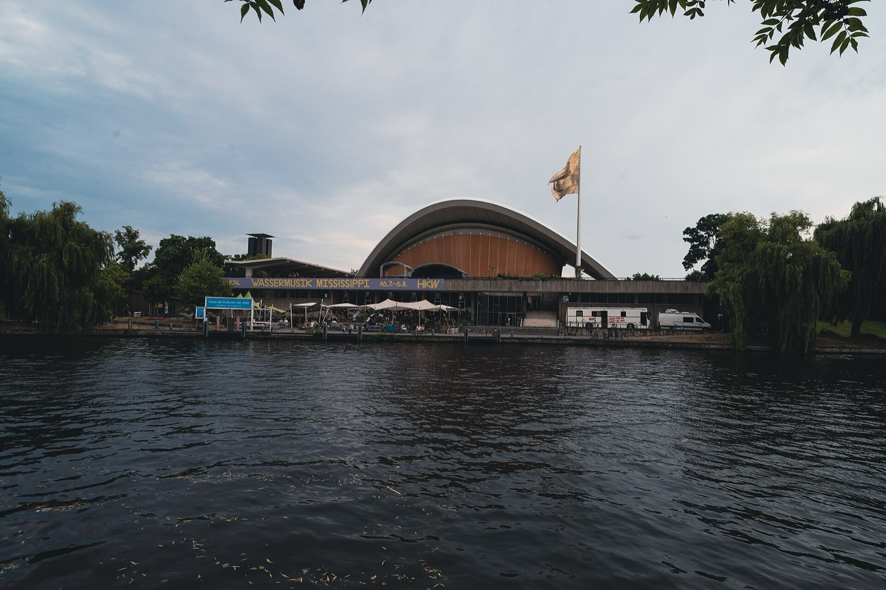
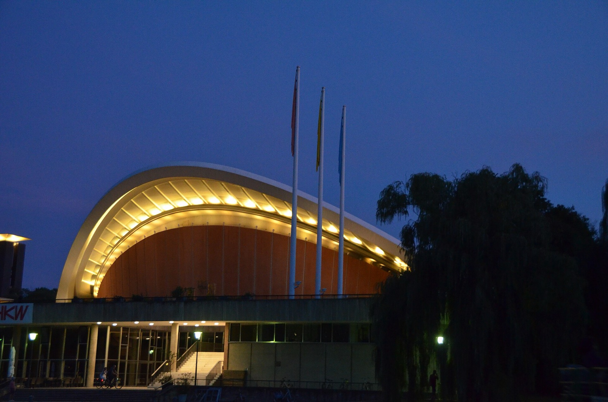
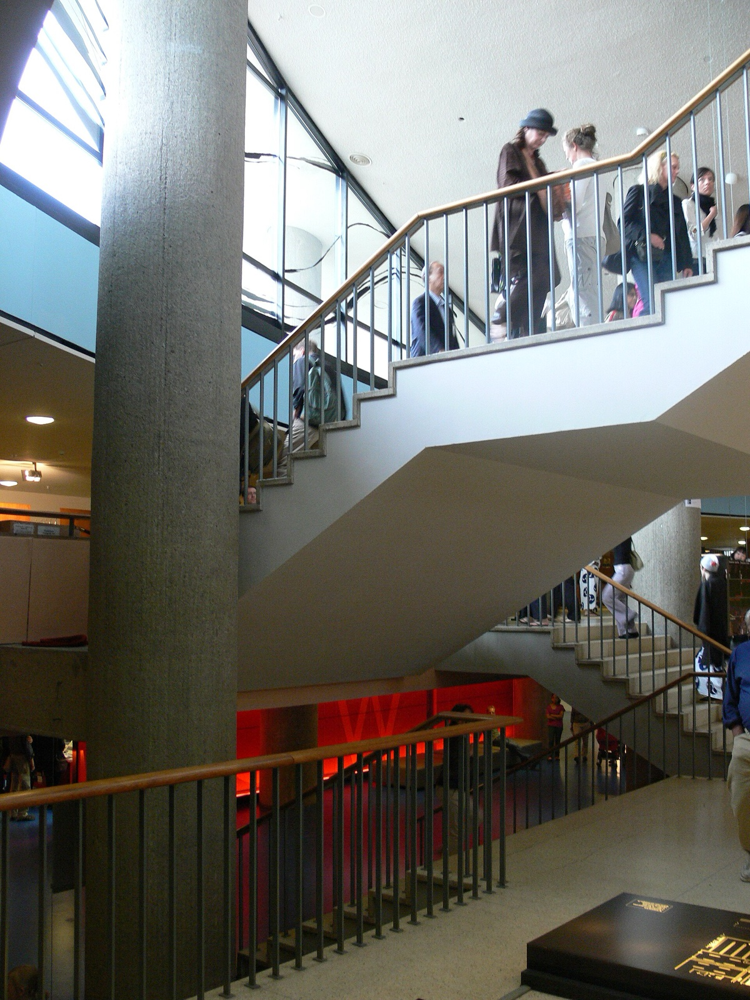
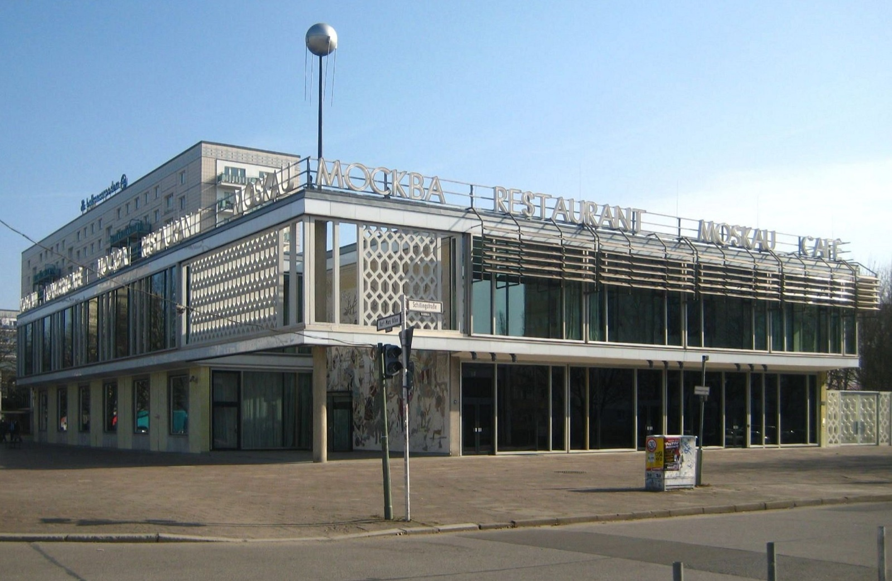

Berlin Science Week is most useful when you do not try to turn it into one giant diary. The programme moves across the city, and the best first choice usually begins with one real question: a field you care about, a conversation you want to hear, or a format that makes science feel less distant.

In 2026, Berlin Science Week runs from 1 to 10 November under the theme **In Touch**. More than 200 organisations and institutions take part, and the festival describes hundreds of free events across Berlin. Its new Festival Centre is the Haus der Kulturen der Welt, usually called HKW. That is a generous amount of possibility, not a reason to fill every hour.

_Haus der Kulturen der Welt in 2022; venue context only, not a Science Week programme image._

{{quick-summary}}

## Know the shape of the week before searching the programme

**Decision: see Berlin Science Week as a citywide festival with one central hub.**

The festival has a ten-day citywide programme and a 2026 Festival Centre at HKW. The official information frames In Touch around the personal side of science: how research affects lives, the people behind it, and the connections it creates. That gives you a useful lens without pretending that every event will be the same kind of experience.

Keep these confirmed points in mind:

- Berlin Science Week 2026 runs from 1 to 10 November
- The 2026 theme is **In Touch**
- More than 200 organisations and institutions take part
- The festival describes hundreds of free events across Berlin
- HKW is the 2026 Festival Centre

The [official visitor information](https://berlinscienceweek.com/visitor-information) is the source for the programme, event pages and visitor details.

_Haus der Kulturen der Welt illuminated at night; venue context only, not a Science Week programme image._

## Start from one question that matters to you

**Decision: choose a subject or format first, then compare the relevant listings.**

When the programme is live, do not begin by scanning every event in date order. Start with one subject you would happily cross Berlin for. It might be health, climate, technology, culture, research methods, a local issue or the meeting point between art and science.

Use the programme to look for:

- A talk or panel if you want a clear idea and discussion
- A workshop or hands-on format if you want to take part
- An exhibition, performance or art-and-science event if the format matters as much as the subject
- A family-suitable listing only when the page explicitly says it fits your group

That leaves you with a short list that has a real purpose. It also leaves room for the rest of Berlin, which is exactly what makes a November visit feel manageable.

## Read the individual event page for access and language

**Decision: let the event page answer the practical questions.**

The festival describes hundreds of free events, but an individual event can still have its own format, language, location, registration or ticket requirement. The programme page is the place to learn the facts of the exact event, not a signal to assume every listing works the same way.

Before adding an event to your day, check:

- The exact venue, date and start information
- Whether entry is free, requires registration, uses tickets or has another access condition
- The listed event language and any accessibility information
- Whether the page identifies the event as suitable for your group

At the time of writing, the organiser says event sign-ups will open with the September programme launch. Recheck the official listing close to the date instead of relying on an early plan.

_Kongresshalle steps; architecture context only, not event-day access guidance._

## Wait for published density before choosing three days

**Use the science-week guide as a programme check, not a promise.** Until the official schedule supports a useful density comparison, it should say so. Once the listings are live, begin with your interest and still confirm the individual event page.

{{widget:science-week-three-day-window}}

## Keep Falling Walls separate in your calendar

**Decision: do not assume a Falling Walls item belongs to Berlin Science Week.**

Falling Walls has its own Science Summit from 6 to 9 November. The dates overlap with Berlin Science Week, but that does not make every Falling Walls session an event in the Berlin Science Week programme. Check the organiser and access page for each item you want to attend.

This is a small distinction with a practical payoff. It prevents you from expecting one registration, venue or listing system to cover two separate programmes. The [Falling Walls information page](https://falling-walls.com/frequently-asked-questions) and the Berlin Science Week event page should be read independently.

_Café Moskau on Karl-Marx-Allee; building context only, not a Falling Walls Summit photo._

## Build one confirmed venue into a normal Berlin day

**Decision: add the science event to a neighbourhood you can actually enjoy.**

If your chosen event is at HKW, use the confirmed listing and exact route on the day, then keep the nearby hours flexible. HKW sits beside the Spree and Tiergarten, so it can fit naturally with a walk near the Reichstag area, a museum visit or dinner in Mitte. Let the event's published time decide which of those is realistic.

My [Berlin public transport guide](https://www.berlinwalk.com/post/berlin-public-transport-explained-for-tourists-u-bahn-s-bahn-tram-bus) makes tickets and lines easier to understand. A live BVG or VBB route planner should make the final journey decision.

For an event elsewhere, make the same move: use the actual address, choose one nearby stop, and do not force a citywide science chase into a single day.

## A calm Berlin Science Week plan

**Decision: choose one confirmed event, then leave space for the city around it.**

Berlin Science Week can be a talk at HKW, a workshop in another district, or a free event you discover after the programme is released. The goal is not an invented optimum schedule. The goal is one event that makes you more curious, with enough time to arrive properly and enjoy Berlin before or after it.

Start with the [official Berlin Science Week programme](https://berlinscienceweek.com/), check the individual listing, and build the rest of the day from the venue that is actually confirmed.

{{article-image-credits}}

{{faq}}
