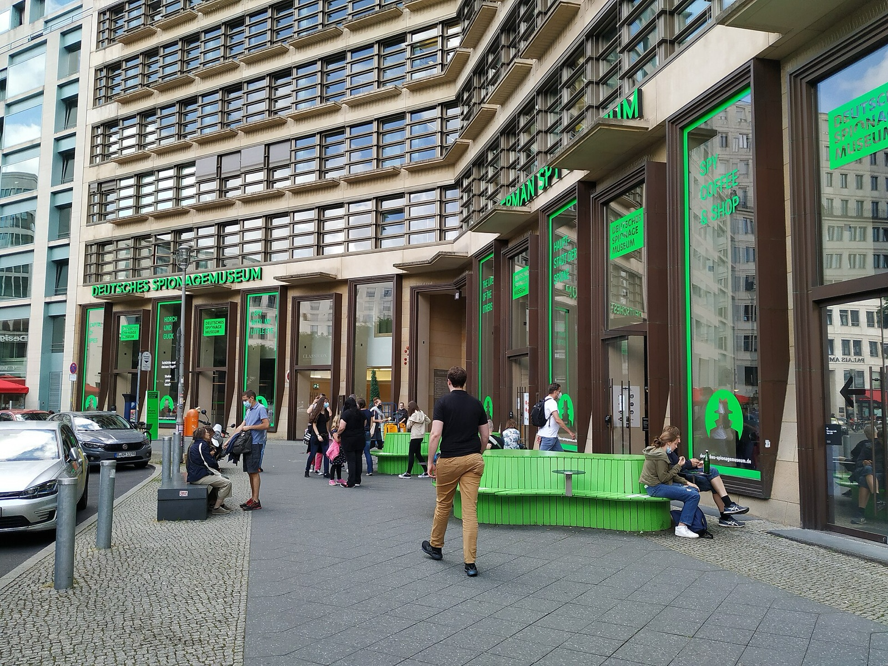
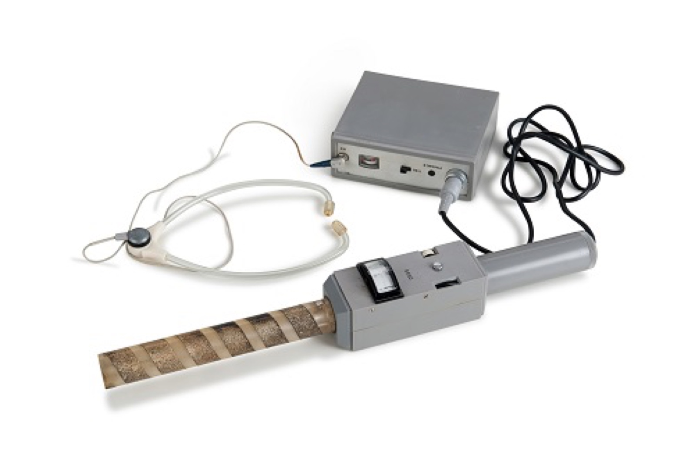
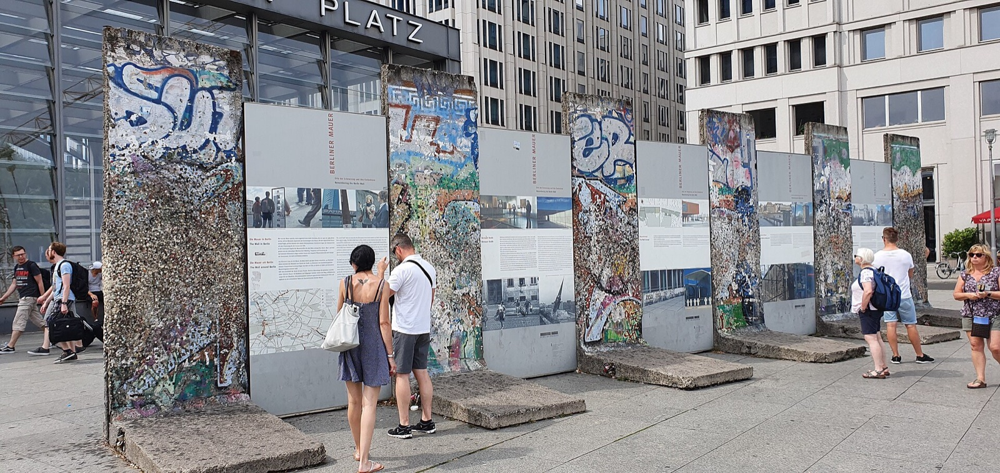

{{quick-summary}}

Berlin gets confusing around Potsdamer Platz because the square can look like a place to pass through, then suddenly there is a museum asking for the next part of your day. The German Spy Museum is at Leipziger Platz, close enough that it can become an easy indoor decision. My advice: decide what you want from the next two hours before you buy the ticket.

_The German Spy Museum is at Leipziger Platz, beside the Potsdamer Platz area._

## What the Berlin Spy Museum is actually good at

This is not the quiet kind of museum where you move slowly from label to label. Its strength is the hands-on side: codes, listening devices, a laser maze and other activities that turn the subject into something you can test rather than only read about. That can make it a very good call on a rainy afternoon, with teenagers, or after a morning of outdoor landmarks.

It is less convincing if you are looking for a calm, site-specific account of Berlin history. Spy stories can be fascinating, but they are not a substitute for standing at a place where the history happened. If the Cold War is the reason you came to Berlin, pair the museum with a real place such as the [Berlin Wall Memorial at Bernauer Strasse](/post/berlin-wall-memorial-bernauer-strasse), not another generic attraction.

_A device from the German Spy Museum collection. The museum’s appeal is practical interaction as much as display cases._

## Give it a real time boundary

The museum itself recommends it from age eight and suggests allowing 1.5–2 hours for children. That is useful planning information, not a rule for every visitor. If your group likes the challenges, let the visit have that time. If you mainly want a quick history stop before dinner, do not buy the ticket just because you are already at Potsdamer Platz.

Before you go in, check the museum’s own [current visitor information](https://www.deutsches-spionagemuseum.de/en). I would do that even on a loose day in Berlin: ticket details, entry conditions and opening hours belong to the official source, not a memory from a travel blog.

## Put it in Potsdamer Platz, not in a vague “Cold War day”

Potsdamer Platz works well as an indoor anchor because the area gives you a change of scene before and after. Walk through the square, look at how quickly the buildings change, then decide whether you want an active museum visit or a real outdoor history stop. Do not try to turn the museum into a complete explanation of divided Berlin.

_Potsdamer Platz is a useful decision point: an indoor museum, an outdoor history stop or simply the next neighbourhood move._

{{widget:berlin-spy-museum-mission-match}}

## When I would skip it

I would skip the Berlin Spy Museum when the group wants silence, slow looking or a place with emotional weight. The laser maze and interactive design are the point, so they can feel wrong when your real aim is to understand the damage of division or dictatorship in a more grounded way.

Instead, choose one actual location and give it attention. The remaining Wall fragments at Potsdamer Platz are not a full Wall route, but they are a useful reminder that a playful spy experience and Berlin’s difficult twentieth-century history are not the same kind of visit. For a broader choice between guided and independent context, see my [guided vs self-guided Berlin walking tour comparison](/post/guided-vs-self-guided-berlin-walking-tour).

_Wall segments at Potsdamer Platz give a different kind of encounter with Berlin’s divided-city history._

## A separate outdoor history option

If you decide you want streets and locations rather than another indoor ticket, my [Third Reich Berlin Audio Tour](https://www.berlinwalk.com/products/third-reich-berlin-audio-tour) is a separate self-guided outdoor history walk. It is not part of the Spy Museum and it does not start from its door. Choose it when location-led history is what you want from the next stretch of the day.

The simple move is this: choose the Spy Museum for active, hands-on curiosity; choose a real historic site or an outdoor walk when you want the city itself to carry more of the story.

{{faq}}

{{article-image-credits}}
