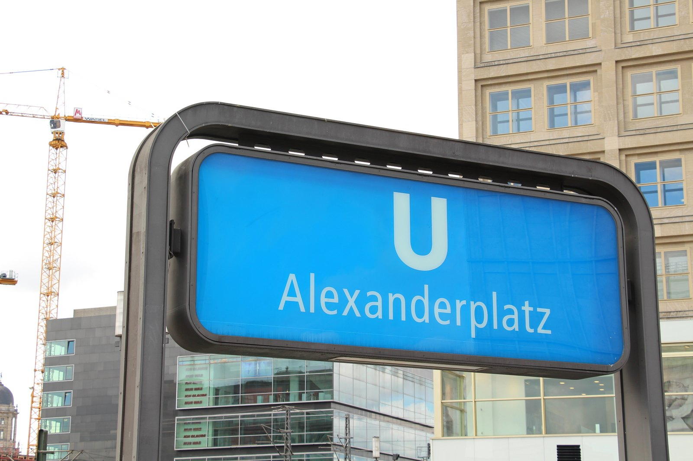
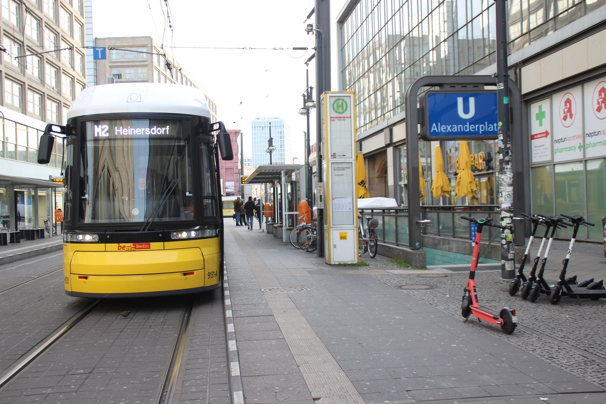
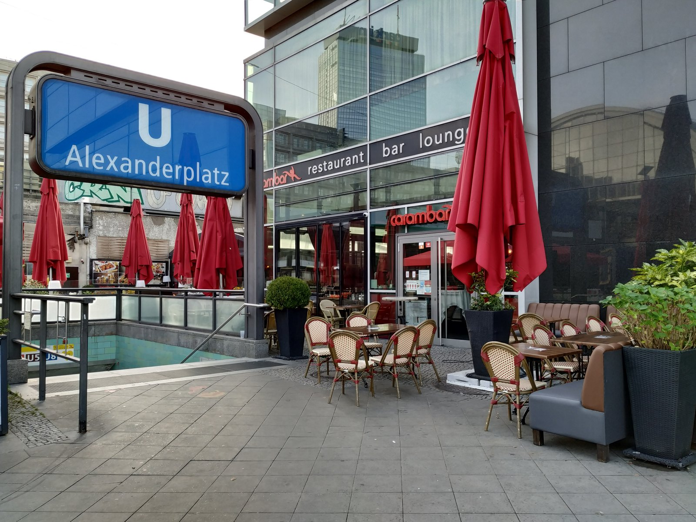
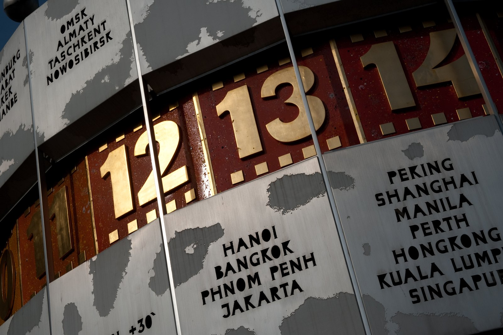
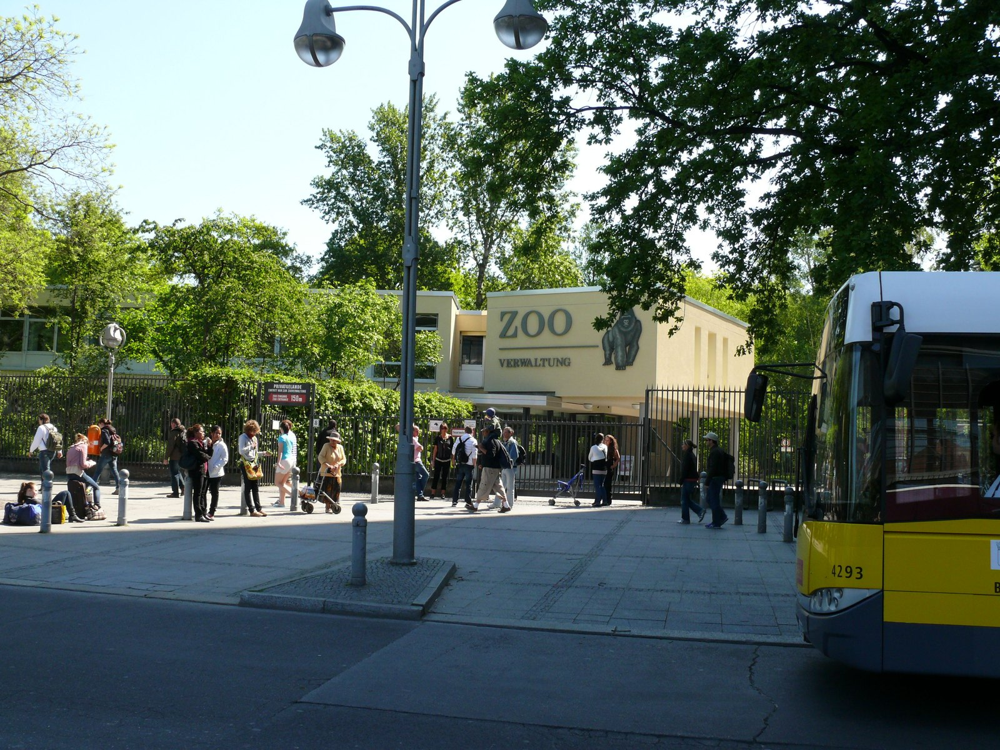
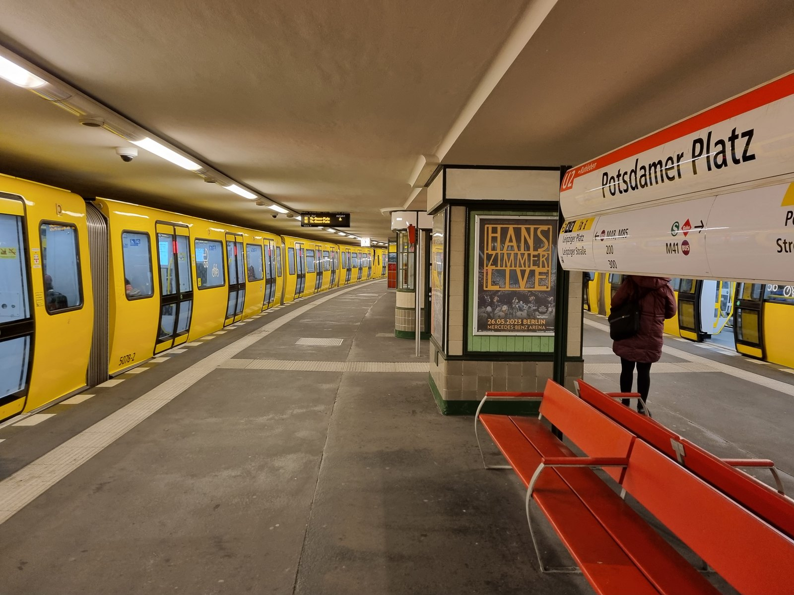

You come up the stairs at Alexanderplatz expecting the TV Tower, and instead you are standing on Grunerstraße with four lanes of traffic between you and everything you came to see. Nothing went wrong. You just followed the wrong word on a sign.

Berlin exit signs are named after streets. Not after landmarks, not after numbered exits, not after the thing you searched for on your phone. The sign says **Ausgang Dircksenstraße** or **Ausgang Rathausstraße**, and if those words mean nothing to you, you pick one at random and hope.

My advice: before you climb the stairs, learn the one street name that matters at that station. I have made that mistake before at Zoologischer Garten, walked out on Hardenbergplatz, and then walked 250 metres back around the block to reach a church I could already see. Thirty seconds of reading underground saves five minutes above it.

{{quick-summary}}

_The sign above ground tells you the station. The signs below ground tell you the street, and that is the one you have to choose._

## Why Berlin station exits are named after streets

Most metro systems label exits with a number or a landmark. Berlin labels them with the street they open onto, sometimes with a letter stencilled next to it for staff and for lift routing.

The logic is local, and once you see it, it is sensible. A Berlin exit does not lead to an attraction. It leads to a corner of a road, and Berliners navigate by road. The sign is written for the person who lives here and already knows that Dircksenstraße runs under the railway arches while Rathausstraße runs toward the town hall.

For a visitor it is a translation problem in two directions at once. You know where you want to go. The sign knows which street it opens onto. Nothing on the wall connects the two.

Three things follow from that:

- **Exits at big Berlin stations can be hundreds of metres apart.** At Zoologischer Garten the furthest two are 307 metres apart. Alexanderplatz is 260 metres, Potsdamer Platz 270 metres.
- **The letter is not the useful part.** Letters get boarded over during building work, and Berlin always has building work. The street name is the stable label.
- **At most stations it genuinely does not matter.** A quiet U-Bahn stop with two staircases on the same pavement gives you nothing to get wrong. The problem is concentrated in about a dozen interchanges.

One thing worth knowing before you start hunting: the [BVG station overview](https://www.bvg.de/en/connections/station-overview) will give you departures and lifts for any stop, but it does not publish an exit map. The letters and street names exist on the walls and almost nowhere online, which is why this catches so many people.

If you want the system behind all of this first, my [Berlin public transport guide](https://www.berlinwalk.com/post/berlin-public-transport-explained-for-tourists-u-bahn-s-bahn-tram-bus) covers tickets, zones and how the layers fit together. For the vocabulary on the wall, [German signs in Berlin](https://www.berlinwalk.com/post/german-signs-in-berlin) is the short version.

## Check your station before you climb the stairs

This tool holds the four central stations where the choice actually costs you something. Pick where you are heading and it shows which street-named exit surfaces closest, and how many extra metres every other exit adds.

{{widget:berlin-station-exit-map}}

The distances are straight-line metres from the exit door, measured from OpenStreetMap station entrance data. Real walking is always a little longer, because Berlin likes to put a tram line or a rail viaduct between you and the thing you can already see.

## Alexanderplatz: four exits, four different Berlins

Alexanderplatz is three stations wearing one name. The U-Bahn levels, the S-Bahn hall and the regional platforms all sit under the same word, and their exits fan out across 260 metres of concrete.

Four street names cover everything:

- **Dircksenstraße** puts you 46 metres from the World Clock, under the railway arches on the Hackescher Markt side.
- **Alexanderplatz** brings you out on the open square by the department store and the bus stops.
- **Rathausstraße** is the one you want for the TV Tower and the Rotes Rathaus. It is 183 metres to the tower entrance from there, against 358 metres from Grunerstraße.
- **Grunerstraße** is the traffic side, useful only if you are going to the Alexa shopping centre.

_The Dircksenstraße side, under the arches. This is the exit that puts you next to the World Clock._

My advice: at Alexanderplatz, decide between two words and ignore the rest. **Dircksenstraße** if you are meeting someone on the square, **Rathausstraße** if you are walking to the tower and the old centre. Those two cover almost every reason a visitor is here.

_The Rathausstraße entrance. Come up here and the TV Tower is already in front of you._

### The exit that matters if you are joining my tour

My walking tour starts at the World Clock on Alexanderplatz. That is the single most common reason a visitor stands underground at this station reading signs.

The answer is **Ausgang Dircksenstraße**. It surfaces 46 metres from the clock, close enough that you see the ring of city names as you come up the last few steps. Rathausstraße is the furthest of the four from the meeting point at 115 metres, which is not a disaster, but on a busy square with a group already forming it is the difference between arriving and searching.

_The Urania World Clock. Read the city names on the drum and you are in the right place._

If you have ever wondered why the tour begins on a socialist-era square instead of at the Brandenburg Gate, I wrote about that in [why my tour starts at Alexanderplatz](https://www.berlinwalk.com/post/why-our-tour-starts-at-alexanderplatz-and-not-at-brandenburg-gate). The short version is that the walk makes more sense in that direction. The tour runs about 2 hours and it is tip-based, so you can [check the next dates](https://www.berlinwalk.com/book-berlin-walking-tour/berlin-free-walking-tour-tip-based) whenever your plans firm up.

## Zoologischer Garten: the widest spread in central Berlin

Thirteen exits over 307 metres. This is the station where the wrong choice costs the most, and it catches people constantly because the two ends feel like different neighbourhoods.

- **Kantstraße** is 55 metres from the Kaiser Wilhelm Memorial Church. From Hardenbergplatz the same church is 256 metres away, and you have a bus station and a wide road in between.
- **Hardenbergplatz** is the bus and tram side, and the right choice for the zoo's Löwentor gate.
- **Budapester Straße** is the one for Bikini Berlin and for the zoo's other gate, the Elefantentor.
- **Hardenbergstraße** points you into the university quarter.

_Hardenbergplatz, the bus side of Bahnhof Zoo. Good for the Löwentor gate, wrong for the Memorial Church._

The zoo detail is worth spelling out because two gates exist and they are 400 metres apart. **Löwentor** is on the Hardenbergplatz side. **Elefantentor**, the ornate one from 1899 on Budapester Straße, is the one on the postcards. Both sell tickets, so check which gate [Zoo Berlin](https://www.zoo-berlin.de/en) points you to for your visit and let that decide your exit, not the other way round.

## Potsdamer Platz: the square is not one place

Nine exits over 270 metres, split between the Leipziger Platz side and the Ebertstraße side toward Tiergarten. The square you see in photographs is only one corner of what the station covers.

- **Hans-von-Bülow-Straße** is the closest exit to the Holocaust Memorial at 386 metres, and to the complex now called Das Center am Potsdamer Platz, which most visitors still know as the Sony Center.
- **Leipziger Platz** is the shortest walk to the Topography of Terror.
- **Potsdamer Platz** itself gets you closest to the Kulturforum museums, though that is a genuine walk at 800 metres whichever exit you take.

_The U2 platform at Potsdamer Platz. The signs at the end of this hall are where the decision gets made._

My advice: at Potsdamer Platz the penalties are smaller than the walk itself. Everything here is 300 to 800 metres from the platform, so pick the exit that starts you facing the right way and accept that you are walking either way.

## Friedrichstraße: three sides of one station

Six exits over 231 metres, and the three street names do very different jobs.

- **Friedrichstraße** is the main street, and the closest exit to the Tränenpalast at 89 metres.
- **Georgenstraße** is the arches side, and the one to take if you are walking east toward Museum Island.
- **Dorothea-Schlegel-Platz** is the quiet back square, useful mainly if your hotel is on that side.

The Tränenpalast is the glass hall where East Berliners said goodbye to Western visitors, and it is close enough to the station that people walk past it without noticing. Coming out on Friedrichstraße puts it almost in front of you.

## What to do when you get it wrong

You will get it wrong sometimes. Signs get covered, staircases close, and Berlin reroutes pedestrians without much ceremony.

- **Do not go back underground to try another exit.** Above ground you can see where you are. Below ground you are guessing again.
- Find the nearest street sign, which in Berlin is mounted on the corner of a building rather than on a post, and match it to your map.
- If you are within a few hundred metres of the centre, walking across is almost always faster than any correction involving a train.

The one exception is a station where a main road or a rail viaduct genuinely separates the two sides, which is exactly the case at Alexanderplatz between Grunerstraße and the square, and at Zoologischer Garten between Kantstraße and Hardenbergplatz. There, crossing back means finding a signalled crossing, and going back down to the concourse can be the shorter option.

## The three words worth memorising

If you remember nothing else from this, remember these:

- **Ausgang** means exit. Follow it.
- The street name after it is the decision, not the letter next to it.
- At Alexanderplatz, **Dircksenstraße** puts you at the World Clock.

Berlin is a walkable city once you are on the surface facing the right way. Almost all of the confusion happens in the last thirty seconds underground, and that part is fixable with one word.

If you want to know how far apart the rest of the centre actually is before you plan a day around it, [Berlin sights within walking distance of Alexanderplatz](https://www.berlinwalk.com/post/berlin-sights-near-alexanderplatz-walking-distance) has the real distances, and [U-Bahn vs S-Bahn in Berlin](https://www.berlinwalk.com/post/u-bahn-vs-s-bahn-berlin) explains why some of these stations have two separate halls in the first place.

{{article-image-credits}}

{{faq}}
