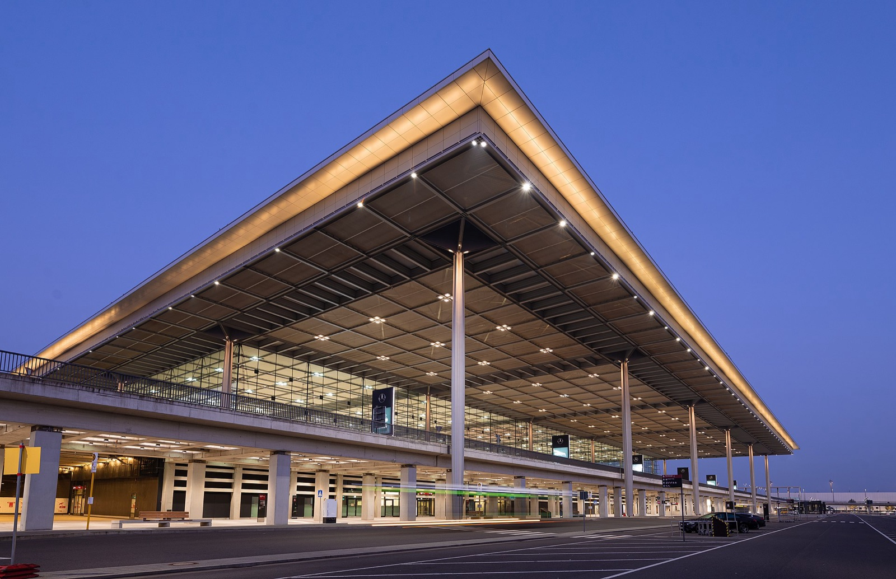
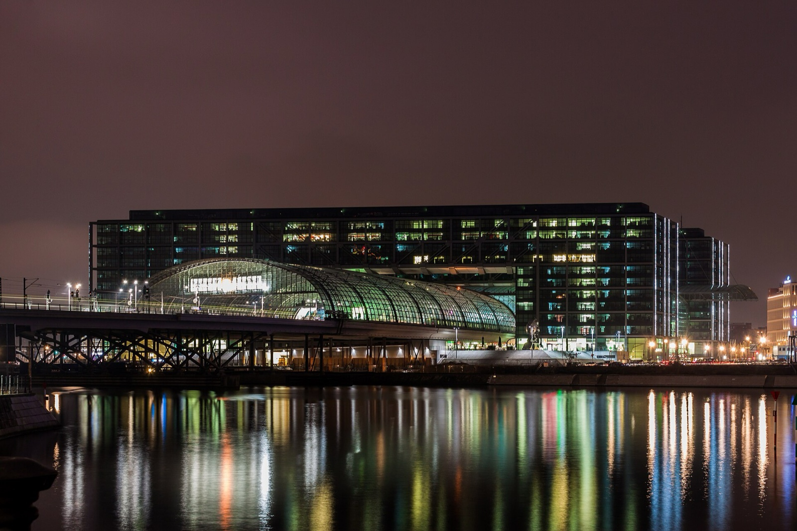
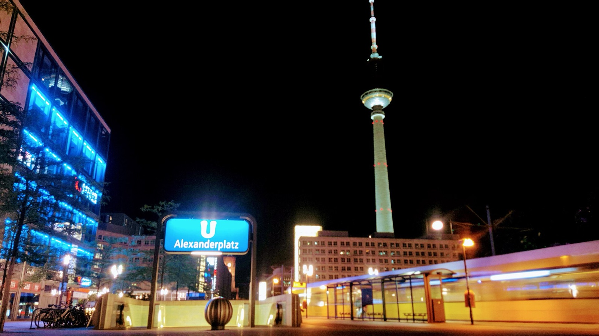
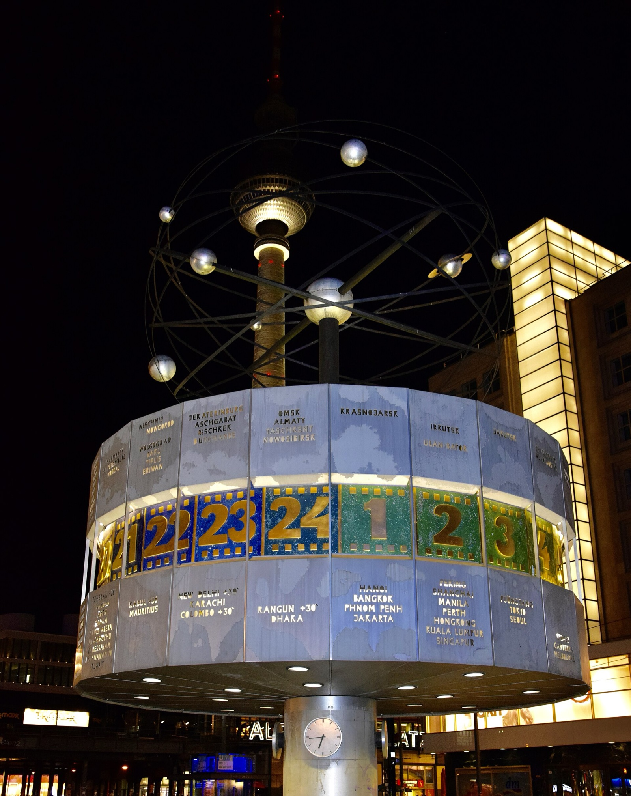

Landing in Berlin on a Friday night can make a two-day break feel as if it has already started badly. Your bag is still with you, the station or airport has taken longer than expected, and the city seems to be having a more interesting evening without you. I would not try to catch up. The useful first-night plan is smaller: make one clean transfer, eat close to where you sleep, and leave Saturday with enough energy to use it.

{{quick-summary}}

## A Berlin weekend with a Friday night arrival starts in a smaller radius

The first decision is not whether you can squeeze in a landmark. It is whether you can arrive at your bed without turning the evening into a second journey. If you land at BER, the station for Terminals 1 and 2 is directly below Terminal 1; the [official airport rail guide](https://sbahn.berlin/en/plan-a-journey/information-for-berlin-visitors/berlins-berlin-brandenburg-ber-airport/) is the place to check the current FEX, S-Bahn and night options before you leave the terminal. For a trip into central Berlin, that same guide confirms the ABC fare zone is the relevant one.

From Hauptbahnhof, the temptation is different: the station is already central, so it can feel as if the evening should become sightseeing. It does not need to. Pick the hotel transfer or the first meal, not both plus a cross-city detour. Berlin looks better on Saturday when you are not carrying Friday's delay around with you.

_At BER, decide on the live train or S-Bahn connection before the city starts asking for more decisions._

## Give yourself one transfer, then stop moving

I use a simple rule for a Friday arrival: one substantial transfer is enough. Airport to hotel is one. Hauptbahnhof to hotel is one. Hotel to a restaurant across the city is a second trip, even if it looks short on a map.

Before 20:30, you may still have room for a short walk after checking in, but make it local to the hotel. Between about 20:30 and 22:30, I would choose food and a small outside moment only if both are close. After that, the strongest plan is usually the quiet one: get in, put the phone on charge, check the Saturday weather and leave Berlin itself until the morning.

The [BVG visitor guide](https://www.bvg.de/en/tourists/transportation-tariff-zones) is useful for the fare-zone picture and points to its live connection search. On Friday night into Saturday, the U-Bahn follows its continuous weekend pattern, but service changes and disruption still belong to the live planner, not to a fixed itinerary. If you arrive by train rather than plane, my [Berlin train stations guide](https://www.berlinwalk.com/post/berlin-train-stations) helps you decide what the station is actually useful for before you leave it.

_Hauptbahnhof is a good arrival point; it is not a reason to make the first night cross the whole city._

{{widget:berlin-weekend-first-night}}

## Save the city-shaped decision for Saturday morning

Saturday needs one opening move, not a rescue mission. If you are staying near Alexanderplatz, let the square, the World Clock and the walk toward Museum Island set the first pace. If your hotel is closer to Hauptbahnhof or the government quarter, start with the river and the Brandenburg Gate side instead. You can use the [Berlin Night Transport Timeline](https://www.berlinwalk.com/tools/berlin-night-transport-checker) later if your evening plans stretch, but do not let Friday's transport question decide Saturday's whole geography.

If a guided first look is what you want, the [free walking tour](https://www.berlinwalk.com/book-berlin-walking-tour/berlin-free-walking-tour-tip-based) starts at the World Clock on Alexanderplatz and lasts 2 hours through the historic centre of former East Berlin. Check the live calendar for the current date and time rather than assuming a slot from an old itinerary.

_Alexanderplatz is useful on Saturday because it gives the morning a real starting point, not because Friday night has to end there._

## Do not use Friday to make up for the flight

The most common first-night mistake is trying to prove that the weekend has begun. A late drink, a river walk or a view can be good if it happens naturally near you. It becomes a bad trade when it costs the first clear hour of Saturday.

Make a small note before you sleep: the one place you want to begin, the one thing that needs a current booking or opening check, and the transport move that gets you there. Then leave the rest unsolved. Berlin rewards a visitor who arrives with enough energy to notice a square, a station or a street rather than simply passing through it.

_The World Clock works best as a Saturday meeting point after a Friday night that stayed deliberately small._

For a wider weekend that has to account for arrival time, hotel area and one real priority, use the [Berlin Trip Planner](https://www.berlinwalk.com/berlin-trip-planner). It is the practical next step when a rough first night needs to become an honest Saturday-and-Sunday shape.

{{faq}}

{{article-image-credits}}
