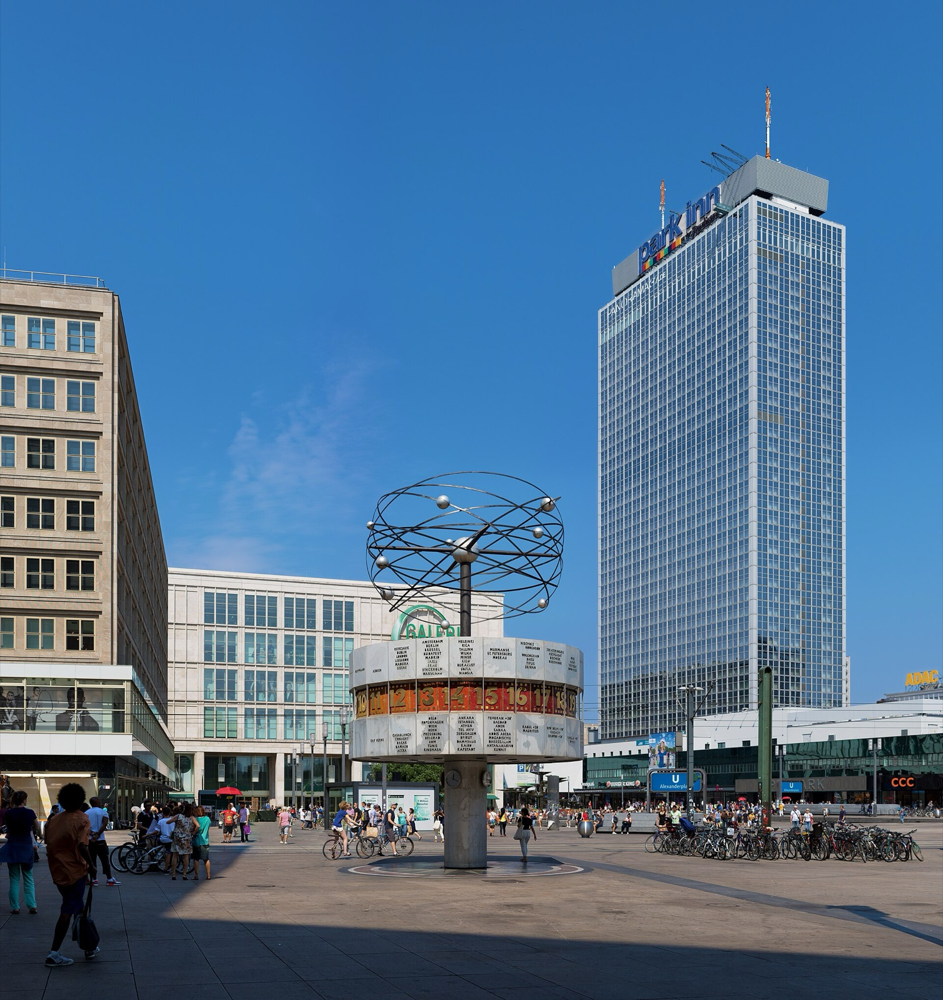
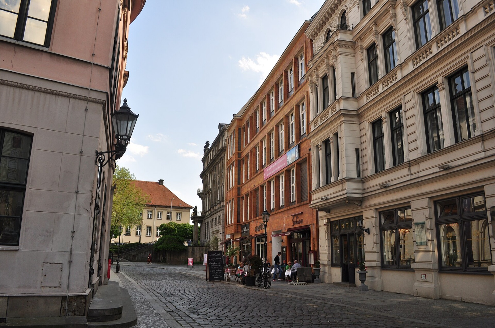
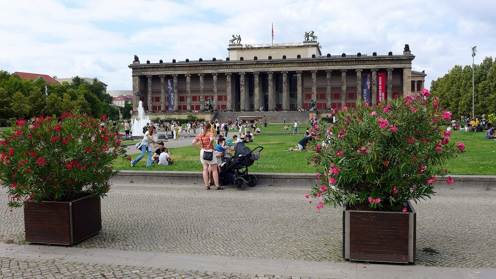
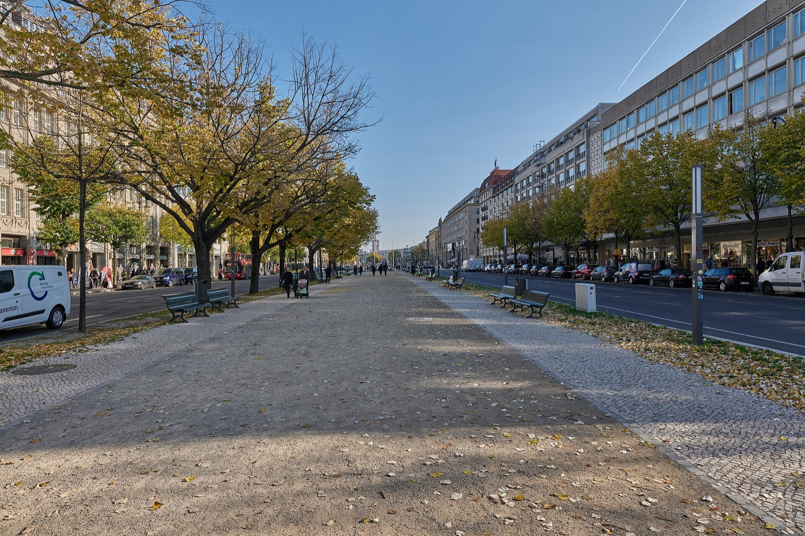

Travelling in Berlin with parents does not mean treating the city as fragile. It means choosing the part of the day that deserves their energy before Alexanderplatz, Museum Island and the Brandenburg Gate turn into a points race. I have made that mistake before: the group reaches a famous place, but nobody has the attention left to enjoy it. A calmer historic-centre day has one beginning, one meaningful stop and a clear point at which it is allowed to be finished.

{{quick-summary}}

## Start with the day you want to protect

Before choosing a landmark, ask a more useful question: what would make everyone feel that Berlin was worth the effort today? For some families, that is a slow coffee and a street with a real story. For others, it is one interior they have wanted to see for years. The answer is not the same for every parent, so do not plan around an assumption about age or fitness. Plan around the pace people actually want.

My rule is one fixed start, one main decision and one easy way to stop. That gives the day shape without making every bench, museum queue or change of weather feel like a failure. It also makes the historic centre more legible: you can notice what is around you instead of checking whether the next sight is still possible.

_Alexanderplatz gives a group a concrete meeting point before the city starts asking it to choose everything at once._

## Use Alexanderplatz as a beginning, not a test

The World Time Clock at Alexanderplatz is a practical place to meet because nobody needs to hunt for a hidden entrance or understand a complicated map first. From there, take the day toward Nikolaiviertel or the Spree at an unhurried pace. The point is not to collect distance. It is to give the first hour a real Berlin scene: the square, the television tower, the older street pattern beyond it and the river nearby.

Nikolaiviertel works well when the group wants a short, contained walk with cafés and places to sit. It is not an untouched medieval district, and it does not need to be sold as one. It is a rebuilt historic quarter where you can slow down, look at the scale of the streets and decide whether the next move should be Museum Island or simply a longer pause.

_Nikolaiviertel is useful for its small scale: it gives a group a real place to pause before another major decision._

{{widget:berlin-pace-passport}}

## Let Monday change the plan early

Museum Island is a strong choice when one interior matters more than a long list of exterior views, but it should be a decision made with the calendar open. Several Staatliche Museen zu Berlin museums normally close on Mondays, so use the [official opening-hours page](https://www.smb.museum/en/plan-your-visit/opening-hours/?lang=en) before you promise the group a particular collection. On a Monday, keep the island for its outdoor setting, Lustgarten and the river, then save the museum visit for another day.

The same applies to Berliner Dom. Its visitor service says a detailed visit takes about 1.5 hours and its daily opening hours can change, so it earns the day only when the group actually wants that interior and has checked the [official visitor information](https://www.berlinerdom.de/en/visiting/service/visitors-service/). Do not stack it with a museum simply because both are close together. One of them is enough.

_Lustgarten is already a worthwhile pause; an interior should be added because the group wants it, not because it is nearby._

## Draw a pause boundary before Brandenburg Gate appears

From Museum Island, Unter den Linden makes Brandenburg Gate feel close enough to add without thought. That is exactly when a group benefits from a boundary. If everyone is still curious after the first main stop, continue. If the attention has gone, call the day complete near Lustgarten, Bebelplatz or a café on the way back. Berlin will still be there tomorrow, and a day that ends comfortably is more useful than one that ends with the last person negotiating every step.

For a Monday-specific version of the same idea, read [Berlin on a Monday](https://www.berlinwalk.com/post/berlin-on-a-monday). If you arrive with bags before your room is ready, [this first-hours guide](https://www.berlinwalk.com/post/berlin-before-hotel-check-in) helps you keep that practical problem separate from the sightseeing day.

_Unter den Linden can be a pleasant continuation, but it should not quietly turn one good stop into a compulsory march to the Gate._

## When a private pace is the point

If your group would rather explore the historic centre around its own interests, pauses and one priority, you can [enquire about a private Berlin tour](https://www.berlinwalk.com/private-tour?utm_source=blog&utm_medium=article&utm_campaign=berlin-with-parents). Tell me what matters to your parents and what you would rather skip. I can then suggest whether a private format is a sensible fit before you build the day around it.

{{faq}}

{{article-image-credits}}
