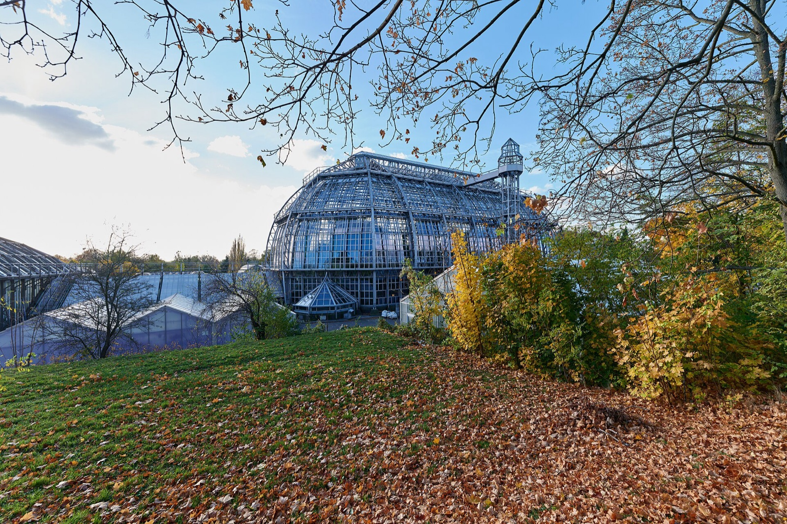
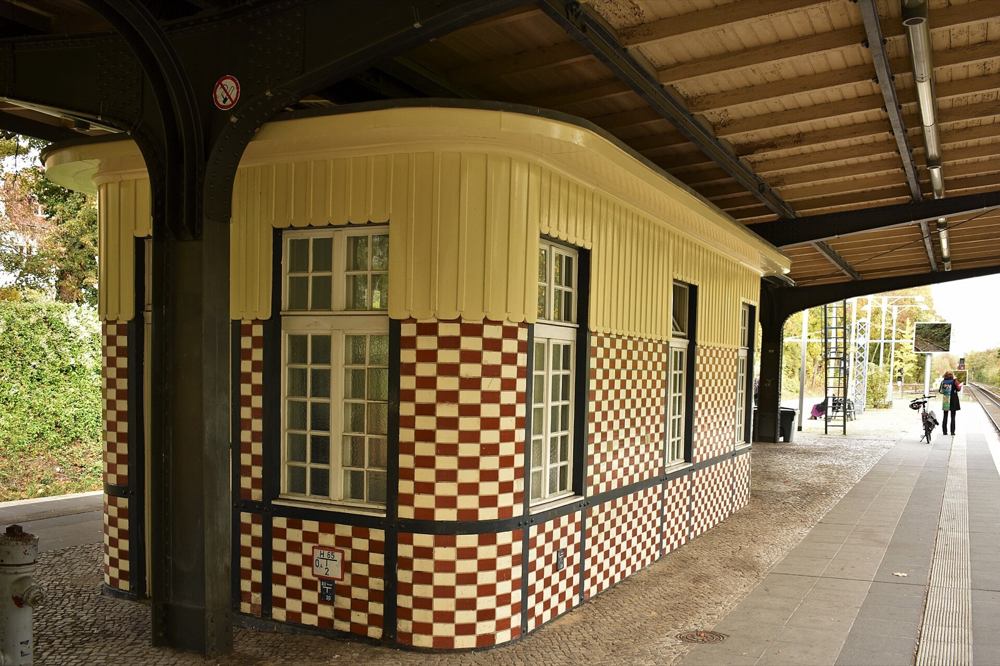
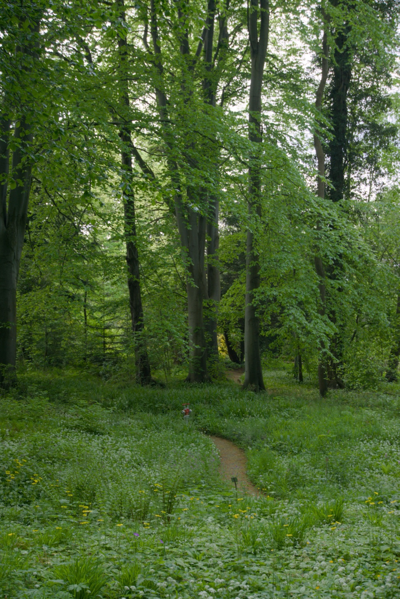

Christmas Garden looks simple from the centre of Berlin: buy a ticket, take a train, walk through lights. The part that catches people out is the ticket time. The Botanical Garden is not a place to reach whenever the evening happens to be free. It is a timed outdoor visit at the edge of Steglitz, and the right decision starts with the entry window on the ticket.

My advice: choose the ticket first, then build the journey backwards from the entrance you will actually use. A calm 17:20 arrival and a rushed 19:20 arrival are two completely different Christmas Garden evenings.

_Tropenhaus at Christmas Garden Berlin in 2024; historic event context only, not a 2026 programme image._

{{quick-summary}}

## Christmas Garden Berlin 2026: dates, closed nights and last entry

**Treat the ticket window as fixed.** The official [Christmas Garden Berlin planning page](https://www.christmas-garden.de/berlin/besuch/) says the 2026-27 season at the Botanical Garden runs from **18 November 2026 to 10 January 2027**.

For Monday to Thursday and Sunday, the grounds are listed as open from 16:20 to 21:00. The normal last entry to the grounds is **19:20**, and the normal last start on the circular route is **19:45**. On Friday and Saturday from **18 December to 2 January**, the listed hours extend to 22:00, with last entry at **20:20** and last route start at **20:45**.

- **Normal nights:** 16:20 to 21:00, last grounds entry 19:20, last route start 19:45.
- **Friday and Saturday, 18 December to 2 January:** 16:20 to 22:00, last grounds entry 20:20, last route start 20:45.

The organiser lists these closed nights for the season:

- **November:** 23, 24 and 30.
- **December:** 7, 24 and 31.
- **January:** 4 and 5.

Check the official page again before paying. A current ticket page is the decision source for availability, price and entry terms.

_The Great Tropical House at Berlin Botanic Garden; venue context only, not a Christmas Garden light-trail image._

## Your ticket gives you a 20-minute arrival window

**Arrive in the window printed on the ticket.** Christmas Garden says entry is limited in 20-minute blocks. A ticket marked 17:20, for example, permits entry from 17:20 to 17:40. That is a useful rule to plan around, especially after a late afternoon museum, a train arrival or a winter hotel check-in.

Before buying, settle these three things:

- the **date**, including the closed-night list above;
- the **entry window** that you can realistically reach in winter traffic and darkness;
- the **entrance** that matches your route, not a map pin selected in a hurry.

I would not tell you to leave Mitte at one fixed time. A hotel near Zoo, an afternoon at Museum Island and a train arriving at Hauptbahnhof create different journeys. Put the actual entry time into your plan and leave enough room for the last connection, the walk to the gate and a cold evening outside.

_S-Bahn station Botanischer Garten; arrival context only, not event-day service proof._

## Choose the entrance that fits your journey

**Use the entrance confirmed for your visit.** The organiser currently names two Botanical Garden entrances:

- **Königin-Luise-Straße 6-8:** bus 101 or X83 to Königin-Luise-Platz / Botanischer Garten.
- **Unter den Eichen 5-10:** S1 to Botanischer Garten, or M48 to Unter den Eichen / Botanischer Garten.

Those details are useful directions, not a promise that a particular connection will run unchanged on your date. Use the [VBB journey planner](https://www.vbb.de/en/driving-information/apps/vbb-app-bus-bahn/) on the day and check the entrance shown in the current organiser instructions.

If Berlin's transport system is new to you, start with my [public transport guide](https://www.berlinwalk.com/post/berlin-public-transport-explained-for-tourists-u-bahn-s-bahn-tram-bus). It explains the U-Bahn, S-Bahn, tram and bus system before you need to make a time-sensitive connection.

## Let the garden be the evening's fixed point

**Make Christmas Garden the one timed thing that night.** The best plan is usually modest: an earlier dinner where you already are, a clear route to the Botanical Garden, then a flexible return journey after the walk. Do not squeeze a hard museum closing time, a distant restaurant reservation and a narrow entry window into the same evening.

Two good shapes are enough:

- **Early entry:** use a daytime Berlin plan, eat before the journey, then arrive with time to spare for the ticket window.
- **Later entry:** keep the afternoon close to the hotel or in one area, confirm the live route shortly before leaving, and allow the light walk to be the main evening plan.

For an outdoor visit, bring the layer you will actually wear when standing at a gate. My [Berlin in December guide](https://www.berlinwalk.com/post/berlin-in-december-2026) is useful for the wider winter rhythm, while my [Berlin Botanic Garden guide](https://www.berlinwalk.com/post/berlin-botanic-garden) gives the location more context in daylight.

## If the journey starts to look tight

**Change the plan before the entry window closes.** If the live route becomes uncertain, check the organiser's current ticket guidance and your journey planner immediately. Do not turn the last twenty minutes into a race across Berlin.

Your useful checks are small and specific:

- confirm the ticket date, entry window and named entrance;
- check the current VBB route from your actual starting point;
- choose one backup connection or taxi option only if it meaningfully protects the entry window;
- keep the return route flexible because weather, energy and the end time can change the evening.

The [Berlin Trip Planner](https://www.berlinwalk.com/berlin-trip-planner) can help shape the wider day. It cannot replace the organiser's entry conditions or a live transport check.

## Use the Christmas Garden leave-by ladder

**Work backwards from entry, not forwards from the hotel.** The tool below keeps the closed dates as reference only. After you choose a valid entry time and departure area, it works backwards to show a sensible leave-by ladder. It does not claim live ticket availability or a fixed city-centre departure time.

{{widget:christmas-garden-closed-night-calendar}}

Use it to compare:

- an earlier entry with a relaxed journey;
- a late entry on an extended Friday or Saturday night;
- a date that must be crossed off because the garden is closed.

_Historic architecture at Berlin’s Botanical Garden, venue context only and not a Christmas Garden light-trail image._

## The better Christmas Garden plan

**Protect the entry window, then enjoy the walk.** Pick a night that is open, choose a ticket time that fits the day you truly have, travel to the right Botanical Garden entrance and check the live route once before leaving. That is enough planning for an evening that should feel unhurried.

{{article-image-credits}}

{{faq}}
