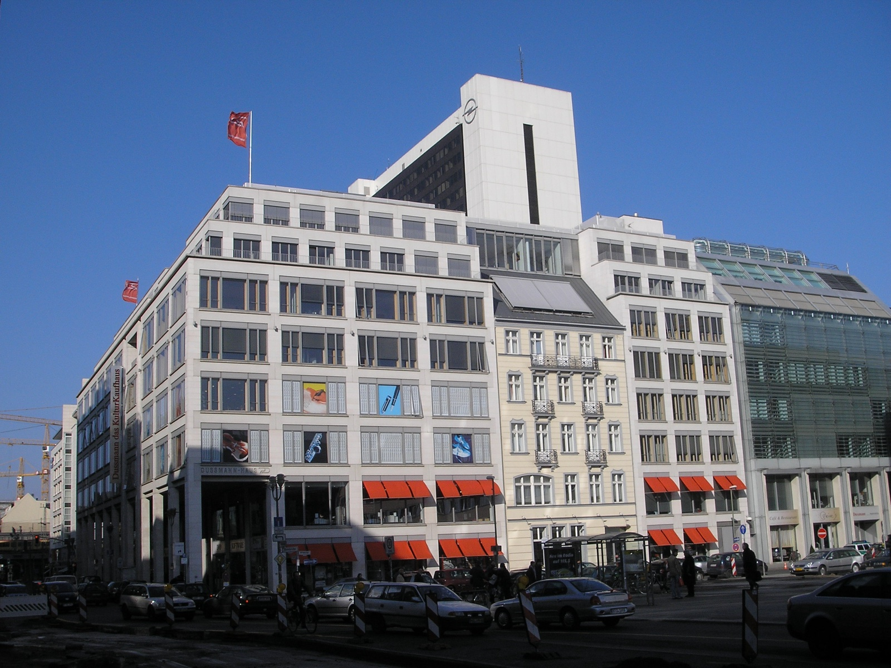
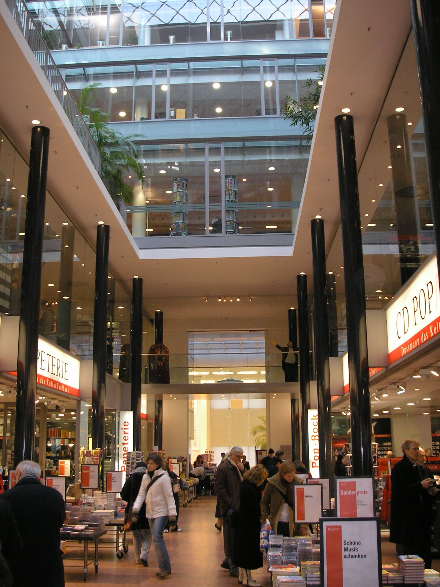
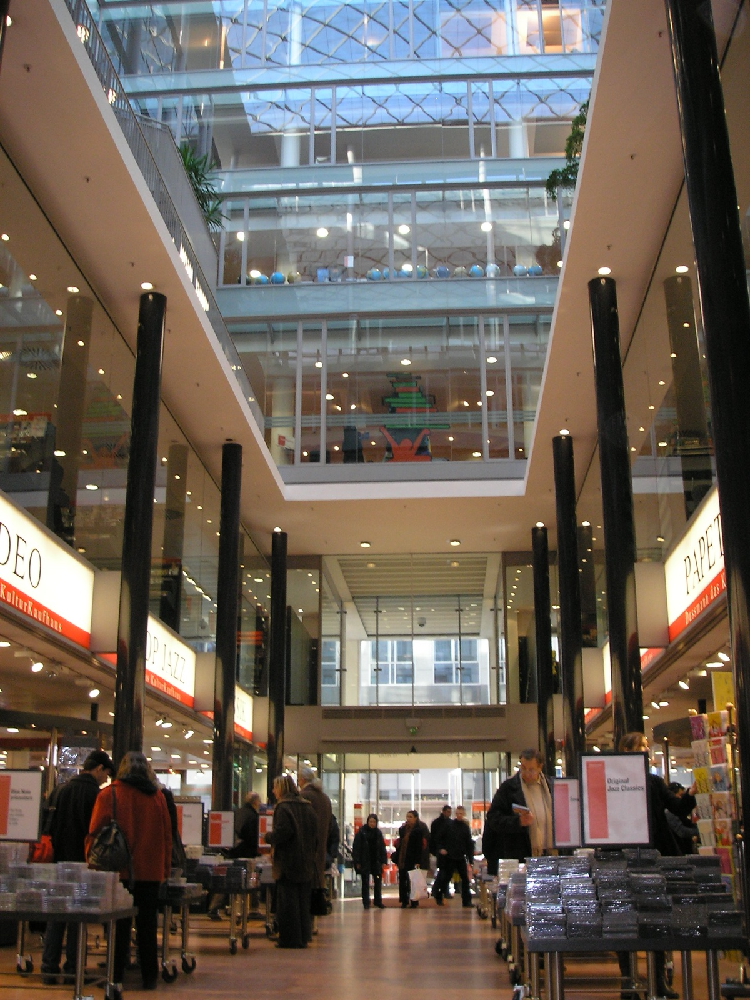
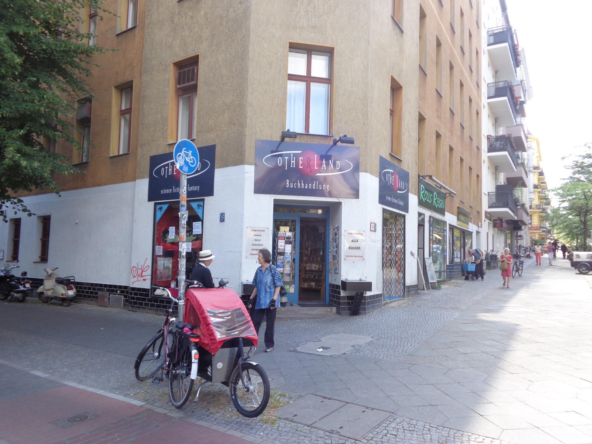

Berlin has the kind of bookshop problem that sounds pleasant until you are standing outside at 4pm with one hour left, a wet tote bag and no idea whether you need a huge English shelf, a quiet café table or one specific novel. Treating every bookshop pin as interchangeable is how that useful hour disappears into transport.

This is not a list of every place that sells a book in English. It is a three-stop way to give a bookshop a job in your day. Start in Mitte if you want range, move east if a browse needs coffee with it, or make Kreuzberg the point of the afternoon if you prefer an independent shelf to a department-store scale. Check each shop's own page before you travel; stock, events and opening hours change.

_Dussmann KulturKaufhaus on Friedrichstraße: make this the large-stock stop, not a vague all-day destination._

{{quick-summary}}

## Start with the question, not the neighbourhood

There is no prize for visiting three bookshops if one good browse would have been enough. Before choosing a stop, decide what you need to leave with.

- **A specific title or a wide English-language choice:** begin at Dussmann in Mitte.
- **A book plus a slower coffee break:** build the east-side stop around Shakespeare and Sons.
- **A small independent browse in Kreuzberg:** make Curious Fox the reason to be around Lausitzer Platz, rather than adding it to an already overloaded museum day.

That small decision matters because the distances are real. Mitte, Friedrichshain and Kreuzberg are not three adjacent blocks on a visitor map. If you need help reading the network before committing to a cross-city detour, keep the [Berlin public transport guide](https://www.berlinwalk.com/post/berlin-public-transport-explained-for-tourists-u-bahn-s-bahn-tram-bus) open beside your map.

## 1. Dussmann in Mitte when range is the point

Dussmann KulturKaufhaus is the useful choice when the book itself is the task. Its [English Bookshop page](https://www.kulturkaufhaus.de/en/kulturkaufhaus/blick-ins-kulturkaufhaus) describes an English-language selection across two floors, alongside international books in several languages. That is a better fit for someone looking for a particular author, a travel title or the pleasure of comparing several shelves before deciding.

It is on Friedrichstraße, so use it when you are already near Unter den Linden, Museum Island, Bebelplatz or the river. Do not turn it into a forced detour from the east just because it is the biggest option. I would give it a clear slot after a central morning, then leave enough time to carry the book somewhere calmer.

_Inside Dussmann, the scale is the feature: go in with one category or author in mind, then let the browse stay contained._

The practical move is simple: choose one department before you enter. If you only have 25 minutes, do not start by trying to understand the whole building. Ask staff for the exact section, make the title decision, then return to the street. If you have longer, the building can carry the browse without needing a second shop that day.

## 2. Shakespeare and Sons when the browse needs a pause

Shakespeare and Sons on Warschauer Straße is the right kind of east-side stop for a visitor who wants books and a place to sit in the same small plan. The shop's [own introduction](https://www.shakespeareandsons.com/pages/about-shakespeare-sons) places it at Warschauer Straße 74 and describes the bookshop and café together.

This is not the place I would use for a rushed, exact-title errand. It makes more sense after the East Side Gallery, a Friedrichshain walk or a slow afternoon around Boxhagener Platz. Pick one book, order something, and let the rest of the hour be a pause rather than another item to tick off. Check the shop's current page on the day for live hours and any event change before you make the trip.

_A different view inside Dussmann: big shops reward a plan, while a smaller café-bookshop works best when you give it time._

The city move here is to resist combining Shakespeare and Sons with a full Mitte day. You can do it, but the connection often turns a quiet browse into a timetable problem. Pair it with Friedrichshain instead, then decide whether the book is your souvenir or your evening plan.

## 3. Curious Fox when Kreuzberg is already your day

Curious Fox is the independent option to choose deliberately. Its [about page](https://www.curiousfoxbooks.com/about) lists the shop at Lausitzer Platz 17 in Kreuzberg and explains its English-language bookshop background. That location gives you a useful reason to make a south-east Kreuzberg afternoon more specific.

Use it with a walk around Görlitzer Park, a food stop in Kreuzberg or a slower evening plan. Do not approach it as a substitute for Dussmann's size. The value is the opposite: a narrower, more personal browse where the shop itself is the destination.

If you are building dinner around the bookshop, choose the neighbourhood first, not a random restaurant on the other side of town. The [Berlin neighbourhood food guide](https://www.berlinwalk.com/post/where-to-eat-berlin-by-neighbourhood) can help you keep that decision local.

_Kreuzberg has room for specialist shelves too. Let the actual shop type decide the detour, rather than treating every independent bookshop as the same._

### A useful fourth thought: follow a genre, not a checklist

The three stops above cover a broad English-language browse, a book-and-café pause and an independent Kreuzberg shelf. They are not a complete map of Berlin reading. If science fiction or fantasy is your actual reason to browse, a specialist shop such as [Otherland](https://www.otherland-berlin.de/en/home.html) can be more useful than a larger general bookshop. That is the pattern to take away: name the kind of shelf you want first, then choose the part of Berlin that makes it easy.

## Use the reading line before you cross town

{{widget:berlin-reading-stop-line}}

Berlin Reading Stop Line is a small map-led decision tool, not a live navigation service. Open one real stop on the line, read what it is good for, and use the official shop page as the final check. It does not store a preference, calculate live travel times or promise a particular book will be in stock.

## How I would fit one bookshop into a first visit

If this is your first day in Berlin, I would not build the whole day around books. Put the bookshop after the part of the city you already came to see. Dussmann fits after a central history day. Shakespeare and Sons fits after an east-side afternoon. Curious Fox fits when Kreuzberg is already the neighbourhood you want to spend time in.

Then let the book create one honest next move. Read it in a nearby café, take it back to your hotel, or use it as the reason not to squeeze in one more attraction. If you want the historic centre explained before you choose a separate afternoon like this, see the current [BerlinWalk Free Walking Tour details](https://www.berlinwalk.com/book-berlin-walking-tour/berlin-free-walking-tour-tip-based). Availability belongs on that live page, not in this article.

## FAQ: English bookshops in Berlin

{{faq}}

{{article-image-credits}}
