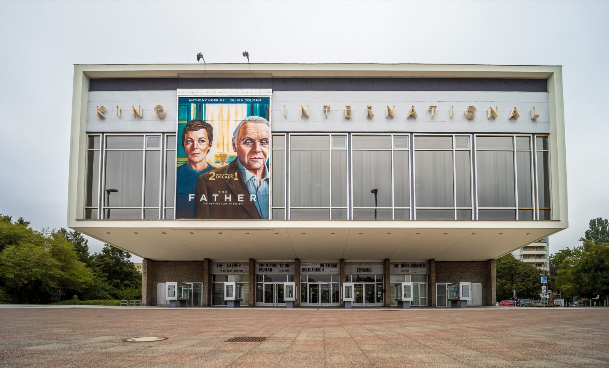
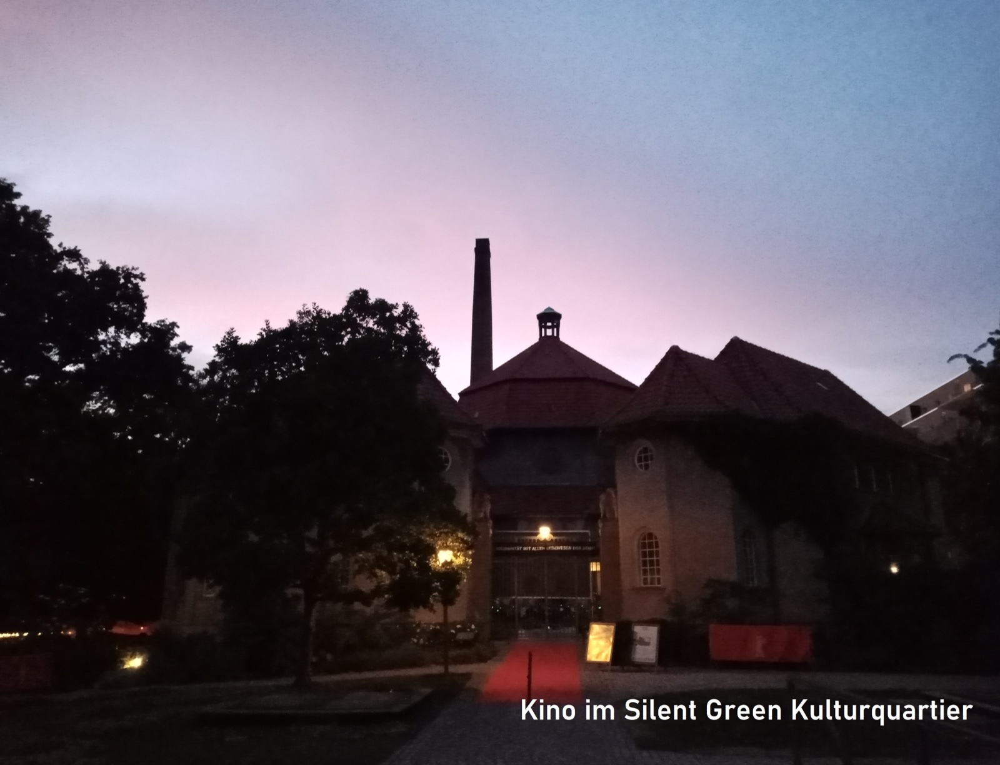
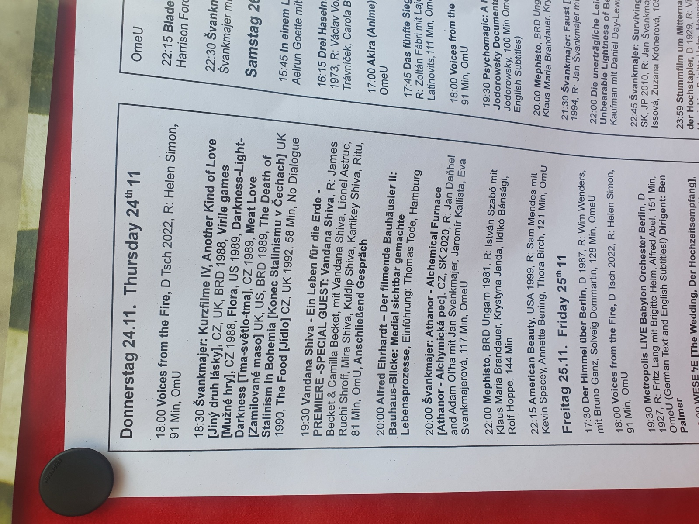

Berlin has enough cinemas and festival names to make an autumn evening look easy on a search page. The harder part is choosing one night that fits your trip, your language needs and a real part of the city.

My advice: put one festival date in your calendar, then wait for the exact screening listing before you buy. A good cinema night gives a Berlin day a finish. A vague festival promise can leave you crossing town for a film that does not work for you.

_Kino International is a Berlin cinema landmark; venue context only, not proof of any 2026 festival screening._

{{quick-summary}}

## Six film-festival dates to put in your calendar

**Choose by the dates you are actually in Berlin.** This is a selected six-date planning list for autumn 2026, not a claim to list every film event in the city.

- **2 to 9 September: Fantasy Filmfest.** Use the individual programme page to see which Berlin screenings fit your dates.
- **8 to 11 October: Festival of Animation Berlin.** The festival identifies silent green Kulturquartier and City Kino Wedding as its 2026 festival locations.
- **14 to 18 October: Ukrainian Film Festival Berlin.** The organiser has confirmed the dates and says the full programme will follow separately.
- **10 to 15 November: INTERFILM International Short Film Festival Berlin.** The short-film festival has published its 2026 dates.
- **10 to 15 November: Italian Film Festival Berlin.** Check the edition's own listings before you decide on a particular evening.
- **3 to 6 December: Punkfilmfest.** Treat the exact screening page as the source for venue, time and language details.

Those dates are enough to make a sensible choice before an itinerary is fixed. They are not enough to choose a particular film, ticket, subtitle language or post-screening conversation.

_City Kino Wedding during Berlinale Goes Kiez in 2017; historic cinema context, not a 2026 programme image._

## Choose the kind of night before you choose a title

**Keep one clear reason for going.** Festival names can sound interchangeable on a phone screen, but the experience can be completely different.

- Pick **Fantasy Filmfest** if a genre-focused programme is the reason you want a cinema night.
- Pick **Festival of Animation Berlin** if you want animation to be the main event, not a side programme.
- Pick the **Ukrainian Film Festival** if the published edition and its programme speak to you once individual listings appear.
- Pick **INTERFILM** if a shorter-format programme feels better than committing to one feature.
- Pick the **Italian Film Festival** or **Punkfilmfest** when a published title, venue and session time fit your trip better than a broad festival label.

Make the choice from the individual listing, including the running time, venue, exact start time and language information. My guide to [watching films in English in Berlin](https://www.berlinwalk.com/post/watch-films-in-english-in-berlin) is useful for the normal cinema question, but every festival screening still needs its own check.

_A 2021 cinema event at Silent Green Kulturquartier; venue context only, not a 2026 programme claim._

## English-friendly is a screening-level decision

**Treat the individual listing as the only language answer.** A festival can show films from many countries without offering one consistent spoken or subtitle language. A director's nationality, a festival's international profile or a venue's reputation does not settle it.

Before buying, check the exact listing for:

- the spoken language or original-language information;
- the subtitle language;
- any label such as OV or OmU attached to that particular screening;
- the language of an introduction, discussion or Q&A, if one is advertised;
- whether a venue or start time has changed since you first saved the event.

The letters beside a screening are useful only for the performance they describe. Do not turn one listing into a festival-wide language promise. If an organiser has not published the information you need, wait, choose another screening or contact the venue before paying.

## Compare the festival dates, then return to the screening

**Use the autumn film board to narrow the calendar.** It puts the six confirmed festival windows beside the one check that still belongs to the individual listing: the specific film, cinema, time and language information.

{{widget:berlin-autumn-film-language-board}}

_A 2022 Kino Babylon programme notice; screening-language context only, not a 2026 festival listing._

## Let one cinema decide the shape of the evening

**Let the venue set the geography.** A 19:00 screening near Alexanderplatz can fit a central walk, while a cinema in Wedding, Neukölln or another district deserves its own nearby meal or short walk. Do not build an artificial route that asks you to see three distant neighbourhoods before the credits roll.

Use this small pre-booking routine:

- Save the event page and its exact venue address in your phone.
- Check a live route on the day, then use my [Berlin public transport guide](https://www.berlinwalk.com/post/berlin-public-transport-explained-for-tourists-u-bahn-s-bahn-tram-bus) only for the ticket and network basics.
- Leave one flexible hour before the screening for a delayed lunch, a wrong turn or a place that is worth staying in.
- Keep the later part of the night optional. A good film can be the whole plan.

That is the autumn cinema move I would make: choose the date, wait for the exact details, and give one real Berlin cinema enough room to be memorable.

{{article-image-credits}}

{{faq}}
