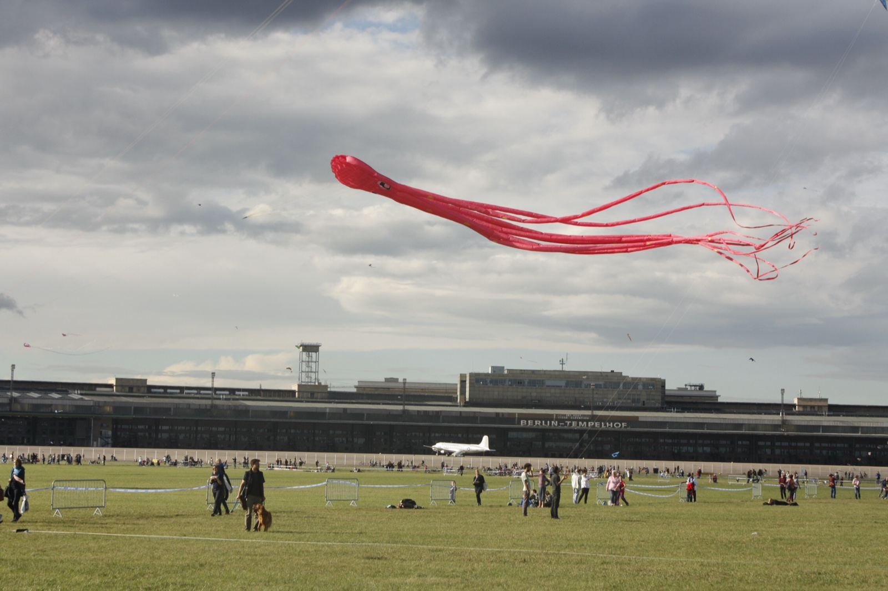
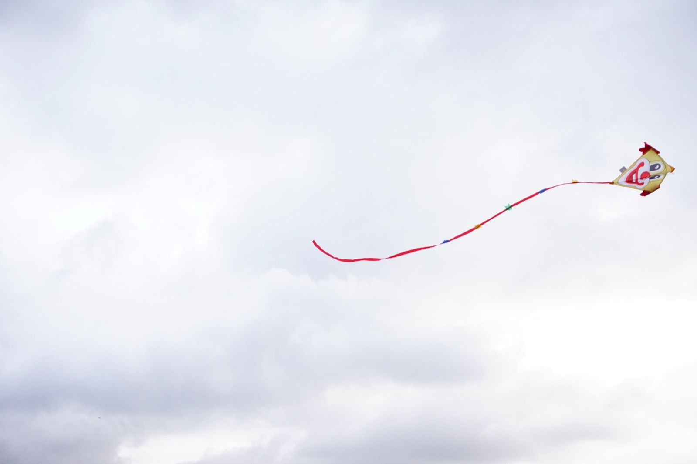
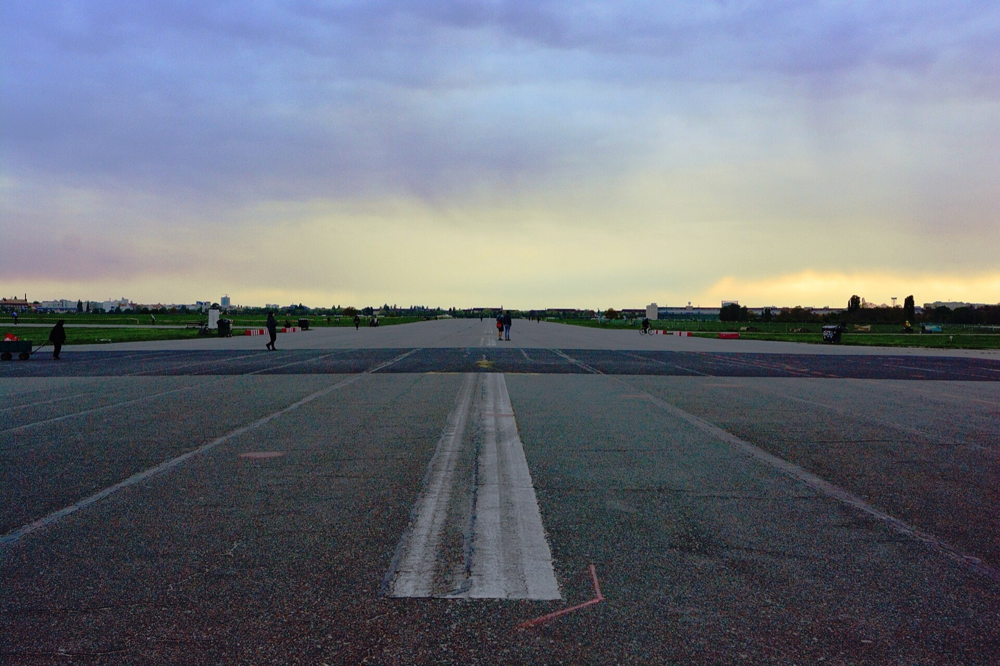
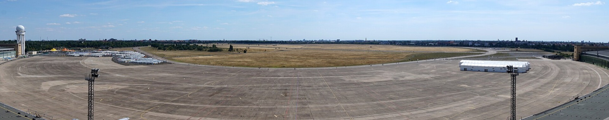

Tempelhofer Feld normally gives you space to make your own plan. On Saturday 12 September, it gives you a reason to stop planning and look up. The Giant Kite Festival turns the old airfield into a one-day sky show, and the practical question is not whether it is worth seeing. It is how to arrive without betting your day on a gate that is not the right one for you.

My advice: make the festival the centre of the afternoon, and use the organiser's event-day access guidance when you leave your hotel.

_A past Tempelhofer Feld kite festival; historic event context, not the 2026 programme._

{{quick-summary}}

## What is confirmed for the Giant Kite Festival

**Make Saturday 12 September your anchor.** The organiser has confirmed a free, one-day event on Tempelhofer Feld from 11:00 to 20:00.

- It is the **13th STADT UND LAND Giant Kite Festival**.
- Admission is **free**.
- International kite pilots are scheduled to bring giant kites measuring up to **50 metres**.
- Visitors are also invited to bring and fly their own kites, alongside the organised programme.

This is a real open-field afternoon, not a short stop between two central attractions. The place matters as much as the programme: there is enough sky here for the kites to feel enormous, and enough ground for a visitor to lose time without noticing.

_Kites over Tempelhofer Feld; open-field context, not a named 2026 event._

## Pick your entrance by direction, not by a guessed meeting point

**Use the organiser's event-day access list as the authority.** Several entrances serve the festival area. The published guidance names approaches from Columbiadamm, Herrfurthstraße, Oderstraße and the south-east side of the field. On the Paradestraße side, it names Gate 10 by U-Bahnhof Paradestraße and an additional ramp between Gates 9 and 10.

One temporary change matters more than a standard park map:

- The organiser says S+U Tempelhof, Tempelhofer Damm and the motorway exits there are expected to be closed roughly from 12:00 to 19:00.
- Do not set S+U Tempelhof as the default meeting point for this event day.
- Choose the access point from your actual direction of travel, then check a live route shortly before you leave.
- If you arrive by bicycle, the organiser says bicycle parking is available at the entrances.

The field has several ways in. That is useful, but it means a static pin is not enough. My [Berlin public transport guide](https://www.berlinwalk.com/post/berlin-public-transport-explained-for-tourists-u-bahn-s-bahn-tram-bus) explains the network and tickets; the final event-day route belongs to the live planner and the organiser's update.

_A former runway at Tempelhofer Feld; field-scale context only, not event-day access guidance._

## Choose the approach that matches your direction

**Start from where you are, then check the organiser's latest route guidance.** The access helper keeps the published approaches and temporary warning together, without pretending that one gate or walking time works for every visitor.

{{widget:tempelhof-kite-day-approach}}

## Give the field enough time to work

**Keep the middle of the day loose.** A kite festival is better when there is no next appointment trying to pull you away just as the wind improves or a new group of giant kites goes up.

For an easier afternoon:

- Arrive with a charged phone and a saved copy of the organiser's current access page.
- Bring a layer for an exposed former airfield, even if the morning feels warm.
- If you bring a kite, leave enough time for the field and the surrounding activity, not only a quick photograph.
- Choose one nearby food or rest stop after the festival, then keep the rest of the evening unbooked.

This is also a good day for children, but it does not need a complicated child-focused itinerary. The big visual event is already there. Let it do the work.

_A panoramic Tempelhofer Feld view; open-field context only, not a route map._

## Keep the Berlin around it close

**Pair Tempelhofer Feld with one nearby Berlin area.** A long trip across the city before or after the festival usually steals the unhurried part that makes the day good. Start with the former-airport context in my [Tempelhof Airport guide](https://www.berlinwalk.com/post/tempelhof-airport-berlin), then keep the festival and one nearby neighbourhood as the entire plan.

Use these simple choices:

- If the day starts in the historic centre, travel to the field early and stop adding sights after you arrive.
- If you are staying in Neukölln, Kreuzberg or Tempelhof, treat the festival as the outdoor part of your local day.
- If rain, wind or transit details change, check the organiser's page again before you set off.

The honest Giant Kite Festival plan is very simple: one date, one enormous field, several access options and no invented shortcut across the city.

{{article-image-credits}}

{{faq}}
