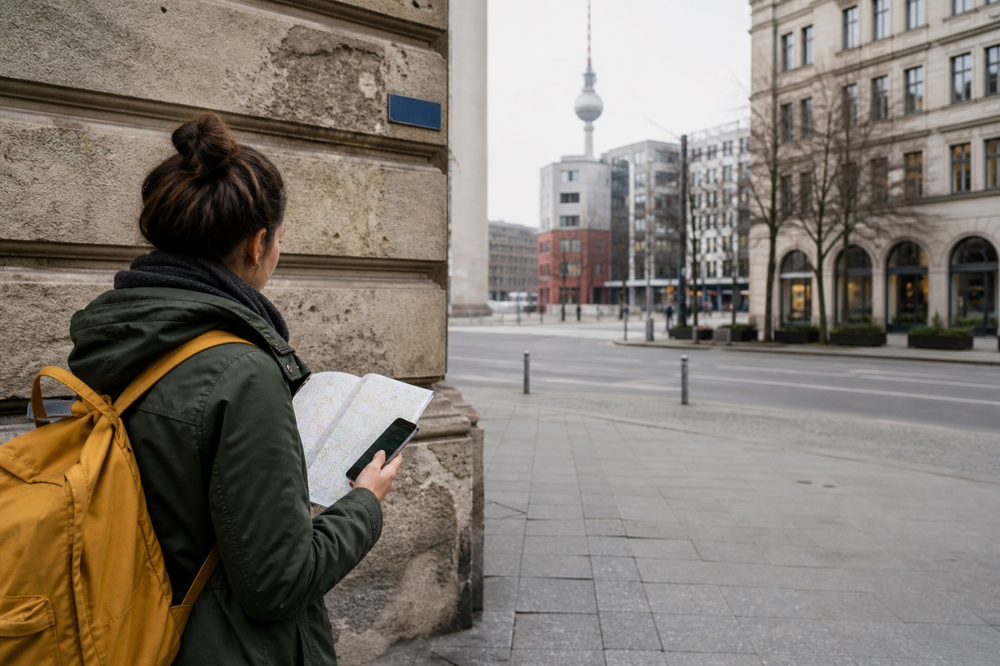
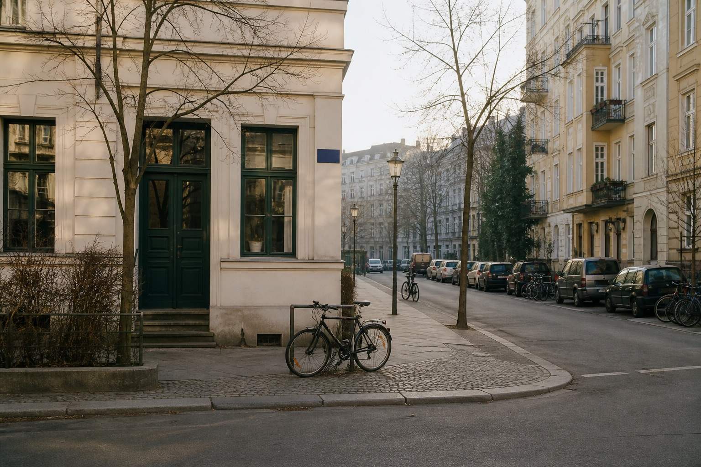
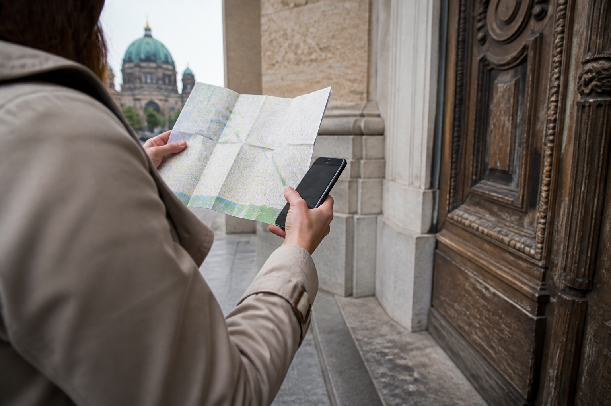
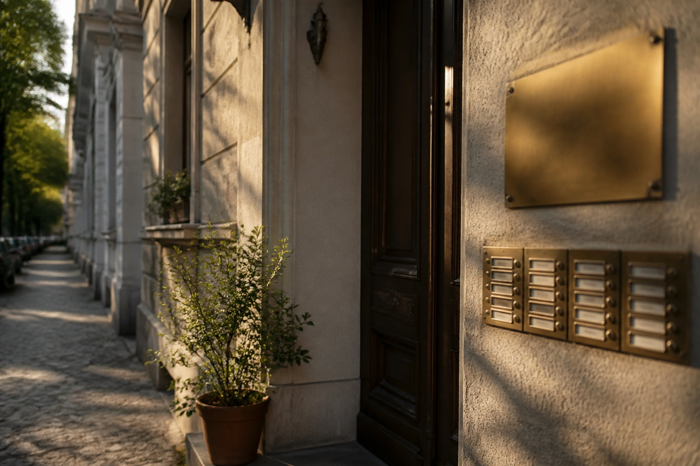

A Berlin address often arrives at the least convenient moment: in a hotel message, on a restaurant booking, or while you are halfway across Alexanderplatz with a phone in one hand and a suitcase in the other. It can look like one long string, but it is really a few small clues that need to stay together.

Do not copy only the street name and hope the map fills in the rest. Keep the street, number, postcode and any entrance note as one address. A small letter after the house number is easy to dismiss, but it can be the detail that gets you to the right door.

{{quick-summary}}

_When an address arrives on your phone, keep its small parts together before you start walking._

## Read the street name and house number as one clue

The first line is usually the part you recognise: a street name followed by a house number. Deutsche Post's address guidance uses exactly that pairing before the postcode and city: street first, then the number. A Berlin listing written as “Torstraße 48” is not asking you to choose between Torstraße and 48. It is one destination.

Keep the street type, too. “Straße”, “Str.”, “Platz”, “Allee”, “Ufer” and “Brücke” are part of what you are searching for, not decorative extras. If someone sends a shortened version, copy the full original into your map before you leave the hotel.

_The street type belongs to the name. A square, avenue and street are different places even when the first word looks familiar._

## Do not lose the letter after the number

“12” and “12a” are not interchangeable. The same goes for ranges such as “12–14” or a number written with a slash. Preserve every character exactly as it appears in your booking or message. If a taxi, delivery, tour meeting point or restaurant confirmation gives you a number with a letter, say or paste the letter as well.

Berlin's official house-number guidance treats numbering as an orientation system, not a rough neighbourhood hint. The number should help you find the property, but it only works when you use the complete version you were given.

## Let the postcode confirm the Berlin you mean

The next useful line is the five-digit postcode followed by “Berlin”. It looks boring, which is why visitors often drop it. Keep it when a street name is common, when you are searching from outside Germany, or when an app offers several similar results.

Use the postcode as a confirmation rather than a challenge to memorise districts. You do not need to know whether 10178 is Mitte before you set off. You only need to check that your map, booking and address card all describe the same place.

_A postcode is a quiet cross-check: compare the complete address before the walk becomes a detour._

## Keep the entrance note with the address

An address can get you to the right pavement but still leave you facing several doors. If your booking mentions a courtyard, stairway, entrance, floor, bell name or code, keep that information attached to the address until you are inside. Do not put it in a separate note that disappears when you switch apps.

At the door, pause long enough to compare the physical number with the one on your screen. Berlin's numbering history is not perfectly uniform: the city changed to the familiar odd/even zig-zag system in 1927, while older horseshoe numbering survives on some streets. That is why “the odd numbers should be on this side” is not a reliable last-minute navigation method. Use the exact number in your map and at the building instead.

_The exterior number gets you to the building; the entrance note gets you through the right door._

{{widget:berlin-address-compass}}

## A 20-second address check before you move

Before you leave a station, café or hotel lobby, run this short check:

- Street name and street type are both present.
- The house number includes every letter, range or slash.
- A five-digit postcode and Berlin appear together.
- Any courtyard, entrance, floor or bell note is still attached.

That is more useful than trying to learn a new street system from memory. If you are arriving by train, pair this with my [Berlin Hauptbahnhof guide](https://www.berlinwalk.com/post/berlin-hauptbahnhof-guide). If the address is near the historic centre, my guide to [sights within walking distance of Alexanderplatz](https://www.berlinwalk.com/post/berlin-sights-near-alexanderplatz-walking-distance) can help you put the area in scale. And if the station name itself is the part that keeps tripping you up, use my [simple pronunciation guide](https://www.berlinwalk.com/post/how-to-pronounce-berlin-station-names) before you are on the platform.

## Use one clear meeting point on your first day

For a first historic-centre walk, Alexanderplatz is a practical anchor because it gives you one recognisable meeting point before the city starts branching in every direction. My [Free Walking Tour](https://www.berlinwalk.com/book-berlin-walking-tour/berlin-free-walking-tour-tip-based) starts there and explores the historic centre of former East Berlin in about 2 hours. Check the live booking page for the date and meeting details, then keep the full address of your next stop saved for after the tour.

This is not about making Berlin feel like a form to complete. Give one address enough attention that you arrive calmly, ring the right bell and still have attention left for the city around you.

{{faq}}
