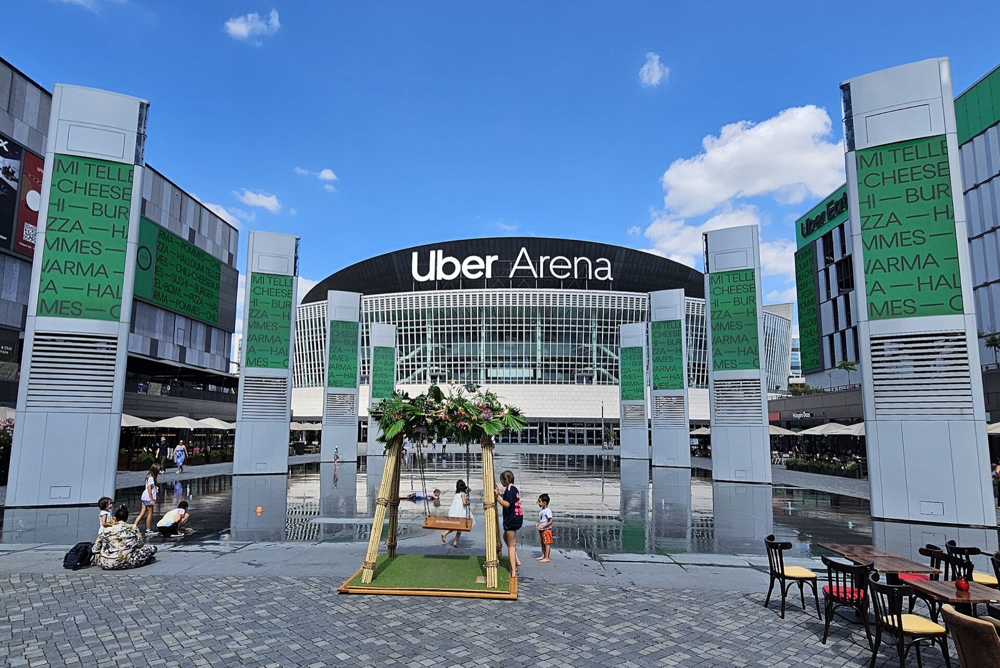
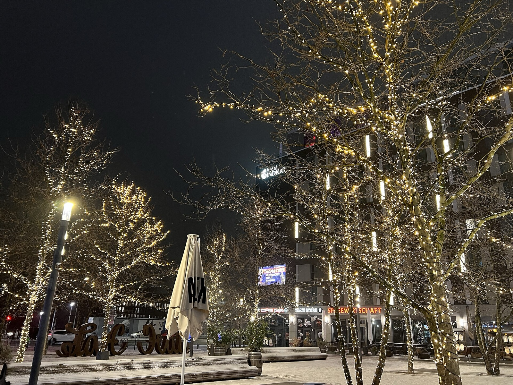
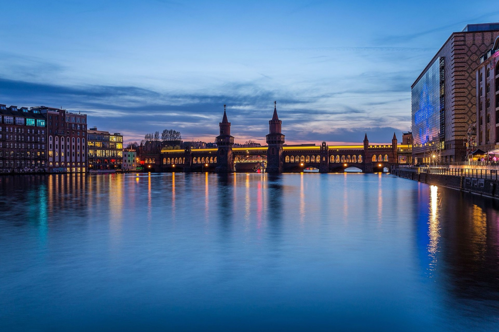
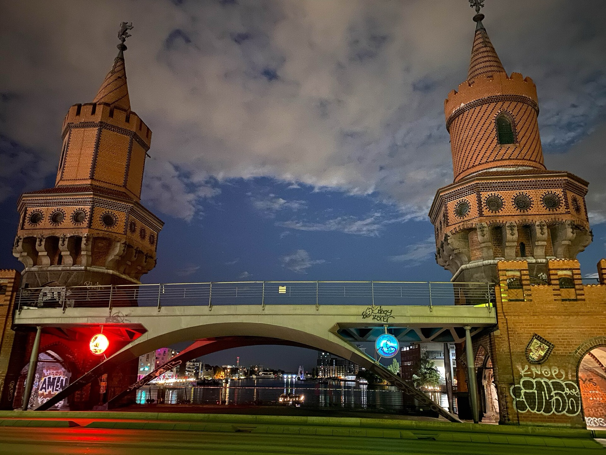

Uber Arena at Uber Platz gives a Berlin visitor two very different live-sport evenings on consecutive nights. The sound of an ice-hockey puck and the pace of a basketball game are not interchangeable, so this is not a hunt for one universal bargain. It is a choice between two specific fixtures.

My advice: choose the sport you genuinely want to watch, then use the current ticket page as the only price and availability check.

_Uber Arena in 2024; venue context only, not a match-night image._

{{quick-summary}}

## Two confirmed games at Uber Arena

**Choose the game first, then make the ticket decision.**

- **Thursday 17 September, 19:30:** Eisbären Berlin v Straubing Tigers.
- **Friday 18 September, 20:00:** ALBA BERLIN v NINERS Chemnitz.

Both are useful dates if you want a proper Berlin arena experience, but they are different nights: the first fixture is hockey and the second is basketball. Ticket prices vary by category, availability and seller terms.

_Uber Platz at night; Friedrichshain place context only, not match-night reporting._

## Treat ticket prices as a changing line

**Read any official seller price as a snapshot, not a finished evening budget.** It does not settle the seat, booking path, fee, food, transport or availability.

Keep these checks separate:

- Read the exact ticket category and any fee shown by the official seller before paying.
- Check whether the specific ticket says anything about transport inclusion. Do not assume it.
- Decide on food and drinks once you know your seat and arrival plan, not from a generic sports-night total.
- Reopen the official fixture page on the day in case the time, ticket status or entry instructions have changed.

The useful comparison is simple: hockey and basketball each have live ticket prices and their own current terms. Calling either one the cheapest good night out would hide the decisions that still matter.

## Put the game into a realistic Berlin evening

**Use the arena night clock for a cautious arrival and return check.** Pick the confirmed fixture and your starting area, then use the result as a planning window before you check the live journey and ticket details.

{{widget:uber-arena-night-cost-clock}}

_Oberbaumbrücke and the U-Bahn beside Friedrichshain; evening-transport context only, not match-night reporting or travel-time proof._

## Go for the sport, not for a language promise

**Make the booking for the live action itself.** The official fixture listings do not promise English-language announcements, screen content, service or commentary. If that matters to you, do not treat a Berlin team or an international arena as a guarantee.

Before booking, ask yourself:

- Do you want the stop-start intensity and rink atmosphere of Eisbären hockey?
- Do you want the faster rhythm of an ALBA basketball game?
- Is your group comfortable following a game without relying on English explanation?
- Is the exact ticket category good enough for the experience you want?

Live sport can still be easy to enjoy without understanding every announcement. It is simply not honest to sell either fixture as a language-specific product when the event listing does not make that promise.

_Oberbaumbrücke in Friedrichshain after dark, neighbourhood context only and not an event or venue image._

## Let Friedrichshain hold the rest of the evening

**Keep the route and the end of night open.** Uber Arena sits at Uber Platz in Friedrichshain, so it can fit naturally with a short Spree-side walk, the [East Side Gallery](https://www.berlinwalk.com/post/east-side-gallery-berlin-guide) or a meal in the surrounding area. Do not turn it into a cross-city schedule that leaves no room for the arena.

Use this low-stress order:

- Choose one nearby stop before the game, then head toward the arena with time to find the correct entrance on your ticket.
- Use a live BVG or VBB route check on the day. My [Berlin public transport guide](https://www.berlinwalk.com/post/berlin-public-transport-explained-for-tourists-u-bahn-s-bahn-tram-bus) is the useful background for tickets and the network.
- Keep any after-game plan optional. The end time of a live game and the trip back can change, so leave both flexible.
- If a late meal matters, read my guide to [where to eat late in Berlin](https://www.berlinwalk.com/post/where-to-eat-late-at-night-in-berlin) before choosing a place.

The decision is not hockey against basketball in the abstract. It is one confirmed fixture, one ticket page, one real part of Friedrichshain and enough space in the evening for the game to be the point.

{{article-image-credits}}

{{faq}}
