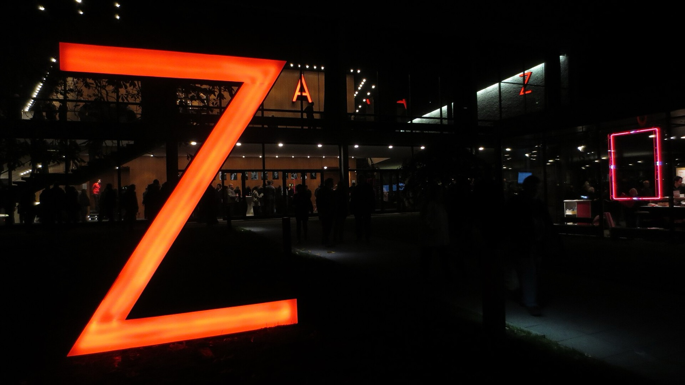
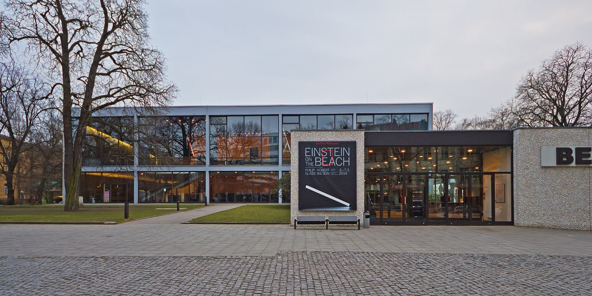
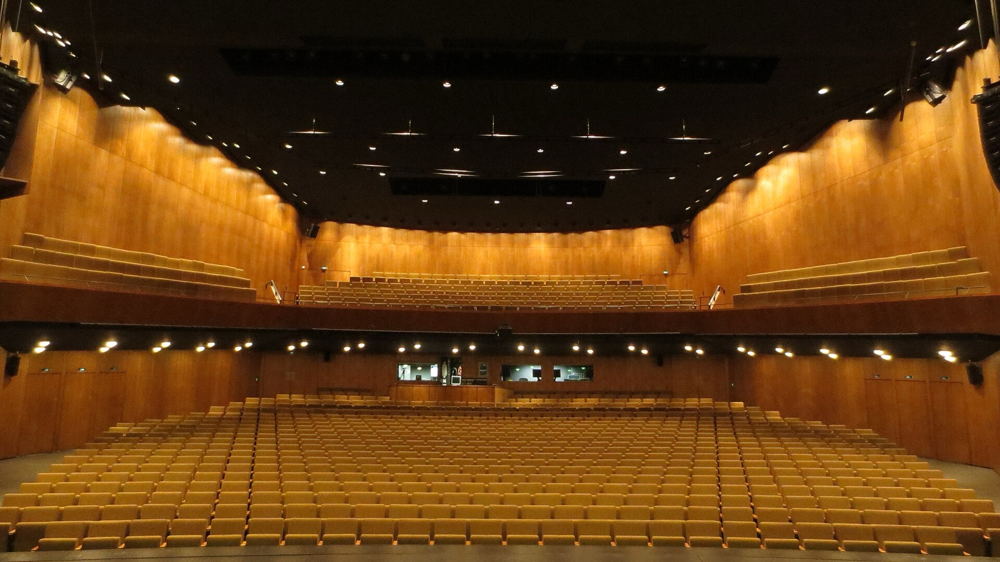
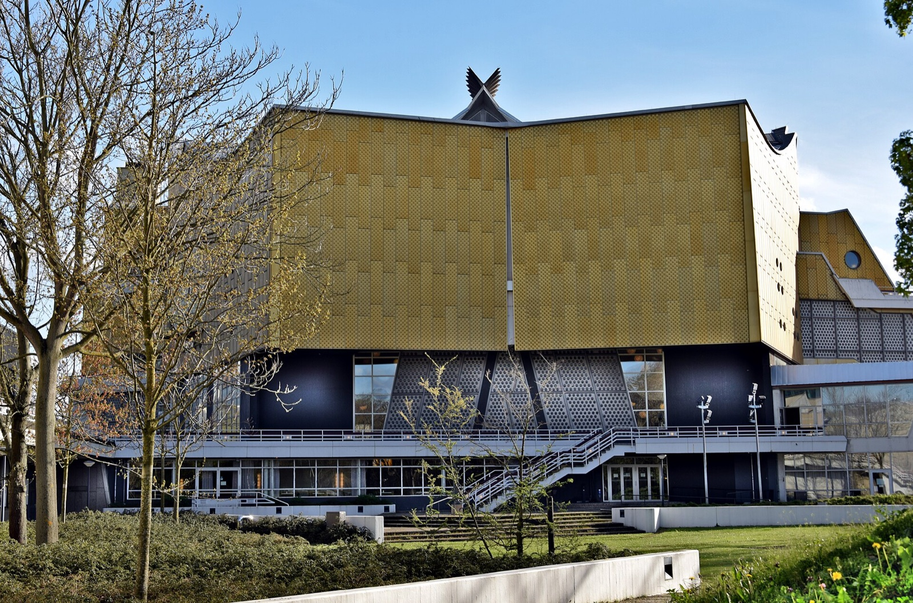

Late October is a good time to give one Berlin evening a clear purpose. The city is darker early, the weather can turn quickly, and a concert is much more enjoyable when the journey, dinner and return route all make sense. Jazzfest Berlin 2026 is worth planning for, but the useful plan begins with what is confirmed and stops before guesswork begins.

Jazzfest Berlin runs from 29 October to 1 November 2026. The official festival page names the Haus der Berliner Festspiele and other venues, while the full programme is due in September. That leaves plenty to know now, and plenty that should wait for the official listings.

_Jazzfest Berlin forecourt in 2013; historic festival context only, not a 2026 programme image._

{{quick-summary}}

## Start with the facts that are already solid

**Decision: hold the dates first, then wait for the individual event pages.**

The festival is a four-day window across the end of October and start of November. It has an identifiable home at the Haus der Berliner Festspiele, but the official information also says other venues will be used. A stay near a familiar Berlin landmark is not the same thing as a confirmed event venue.

Put these facts in your trip plan now:

- Jazzfest Berlin takes place from 29 October to 1 November 2026
- The festival's published setting is the Haus der Berliner Festspiele and other venues
- The full programme is expected in September
- The [official Jazzfest Berlin page](https://www.berlinerfestspiele.de/en/jazzfest-berlin) is the source for the live programme and ticket links

That is enough to protect the dates in a hotel or flight plan. It is not enough to choose an exact Berlin evening yet.

_Haus der Berliner Festspiele; venue context only, not a 2026 programme or artist claim._

## Do not build a route from an old festival map

**Decision: use the 2026 event page, not memory or a previous edition.**

Jazzfest Berlin changes with the programme. An artist, venue, format or ticket route from an earlier year is not a dependable instruction for 2026. When the programme appears, open the specific listing you want and make your plan from its current information.

For each candidate event, compare:

- The listed date, venue and current arrival information
- The official admission route and availability on that exact page
- Accessibility information and any stated entry conditions
- A live journey from your hotel and a realistic onward route after the performance

This is deliberately less glamorous than collecting a long wishlist, but it prevents the classic Berlin mistake of discovering too late that the night has become a cross-city dash.

## Use the programme status before choosing a concert

**Start with what has actually been published.** The room comparator will keep the choice cautious until the official 2026 listing identifies the relevant venue and format; it should never turn an older edition into a 2026 recommendation.

{{widget:jazzfest-room-comparator}}

_The empty Große Bühne at Haus der Berliner Festspiele; room-scale context only, not the 2026 line-up or seating plan._

## Give the confirmed venue one sensible surrounding plan

**Decision: choose food and a daytime stop only after the venue is confirmed.**

When a listing is live, build the few hours around it from the actual address. If that places you in City West, the Kaiser Wilhelm Memorial Church can be a meaningful daylight stop before dinner. My [guide to the Kaiser Wilhelm Memorial Church](https://www.berlinwalk.com/post/kaiser-wilhelm-memorial-church-berlin) explains why that damaged church still matters.

If the confirmed venue is elsewhere, let that neighbourhood lead. The best concert evening is often one meal, one short walk and one direct trip to the door. Do not try to make every major sight fit between a museum closing time and a performance.

For ticket zones and the shape of the network, my [Berlin public transport guide](https://www.berlinwalk.com/post/berlin-public-transport-explained-for-tourists-u-bahn-s-bahn-tram-bus) gives the basics. Use a live BVG or VBB route planner for the exact trip.

## Let the programme make the musical choice

**Decision: wait for the artist and format details before committing to a night.**

Jazzfest Berlin describes a programme that brings established artists and emerging voices into creative crossovers. That is a useful sense of the festival's character, not a substitute for the 2026 line-up. Once the official listings are live, choose the performance that genuinely interests you, then check its practical details.

Good reasons to choose one listing include:

- A performer or ensemble you already want to hear
- A format that makes sense for the person travelling with you
- A confirmed venue that fits naturally with the rest of the day
- Access conditions that match the way you want to spend the evening

No one needs to see the whole festival to have a good Jazzfest Berlin experience. One well-chosen performance is a much better memory than a rushed sequence of half-plans.

_The Berliner Philharmonie from Tiergartenstraße, Berlin concert-hall context only and not a Jazzfest 2026 venue, artist or programme claim._

## The Jazzfest Berlin booking rule

**Decision: only book when the date, listing and journey agree.**

Keep 29 October to 1 November in mind, subscribe to the festival's update channel if you want an alert, and return to the [official 2026 festival listing](https://www.berlinerfestspiele.de/en/jazzfest-berlin/programm/2026/jazzfest-berlin-2026) when the programme is published. Then choose one event, one nearby meal and one reliable route.

That is enough structure for Berlin to feel easy, while leaving the music itself room to be the evening's surprise.

{{article-image-credits}}

{{faq}}
