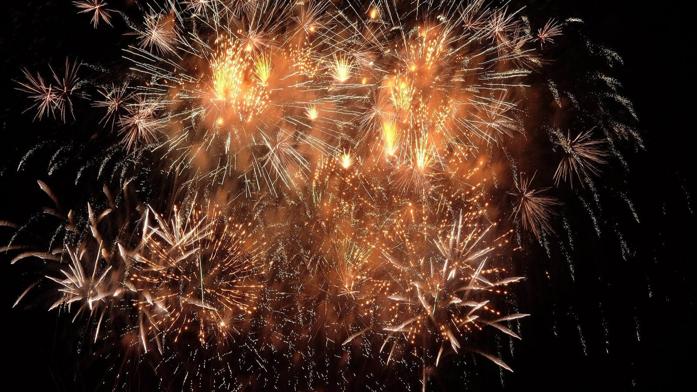
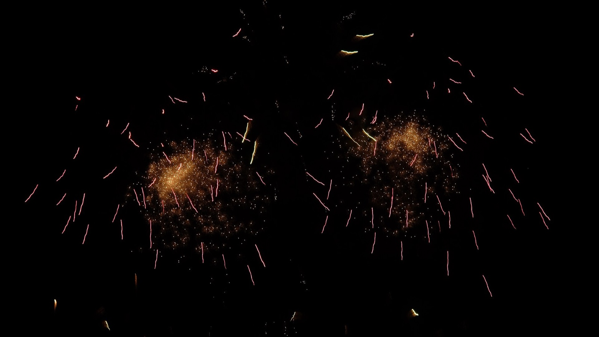
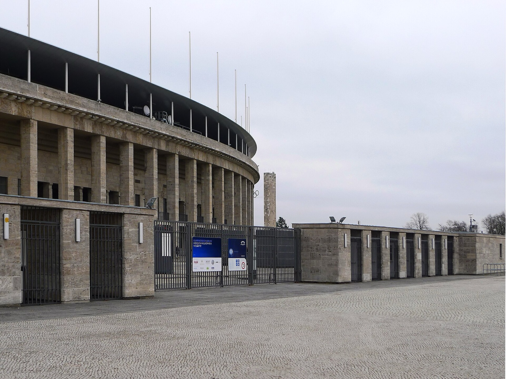
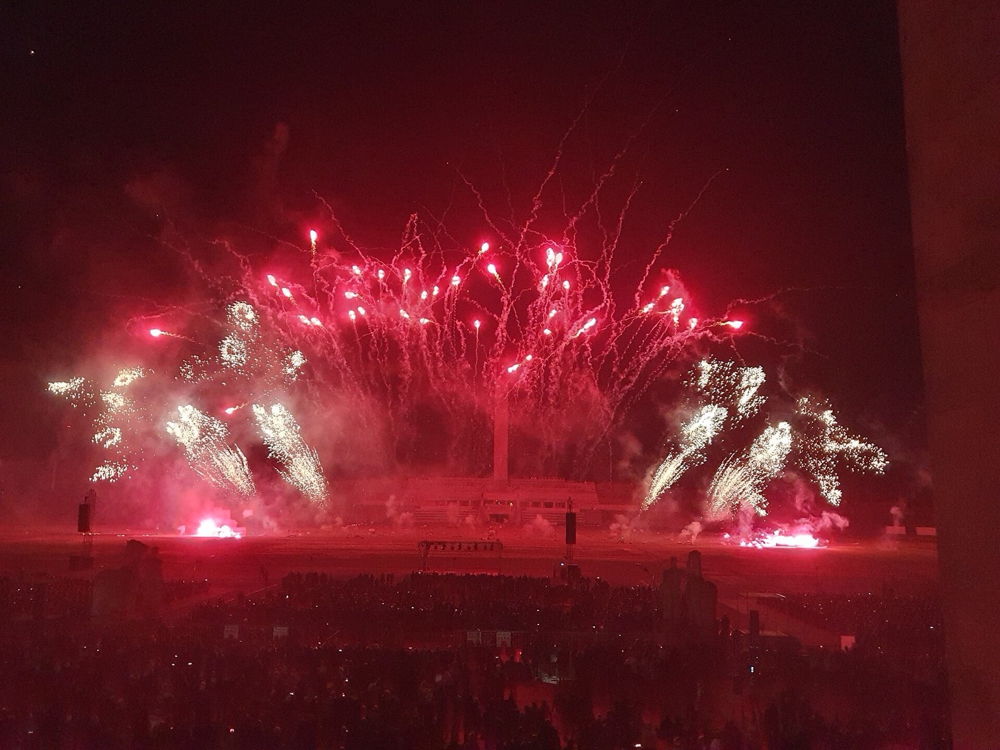

The Maifeld beside Berlin's Olympiastadion is not a casual city-centre fireworks viewpoint. On 25 and 26 September it becomes the event itself: a ticketed two-night competition with a fixed entry rule and enough moving parts that the best plan is a simple one.

My advice: choose one evening for the Pyronale, make the South Gate part of the plan from the start, and keep the following morning flexible.

_Fireworks during Pyronale 2017; historic event context only, not the 2026 programme._

{{quick-summary}}

## What is confirmed for Pyronale 2026

**Plan it as a two-night competition, not a generic fireworks stop.**

- Pyronale takes place on **Friday 25 September and Saturday 26 September 2026**.
- The venue is the **Maifeld at Olympiastadion Berlin**.
- It is the event's **20th edition**, with **six international teams** across the two evenings.
- The detailed programme schedules its first named team for **21:00**.
- General entry is **exclusively through the South Gate**. The organiser says the East Gate is not an entry point for this edition.

That last point changes the practical shape of the visit. A venue name alone is not enough on this night. Save the official ticket and entry information before you set out.

_A second Pyronale 2017 frame; historic event context only, not the 2026 programme._

## Choose Friday or Saturday with a real reason

**Pick the evening from the current programme, then leave the next day movable.** The organiser schedules three teams on each event day, followed by a final show. The programme, ticket category and personal energy matter more than a vague idea that one date is always better.

Use these decisions in order:

- Check the current programme for the three teams on your preferred evening.
- Buy for the exact date you want, not a date you hope will work after a packed day of sightseeing.
- If Sunday holds a train, a museum slot or another fixed plan, make that plan flexible enough to move if the evening runs later than expected.
- Keep the pre-event part of the day local to the Olympic Park area, or make it short enough to leave without stress.

My [Olympiastadion guide](https://www.berlinwalk.com/post/olympiastadion-berlin) is useful for the wider setting. It is not a substitute for the Pyronale ticket instructions, which control entry on these two dates.

## Check what the ticket changes in the rest of your weekend

**Keep the fireworks evening as the fixed part, then make the other commitments flexible.** The weekend board shows the trade-off between a Pyronale ticket, your accommodation area and a next-day plan without inventing an exact exit or travel time.

{{widget:berlin-double-closure-weekend}}

_Olympiastadion South Gate; place context only, not event-day wayfinding proof._

## The South Gate is a planning fact

**Build your approach around the South Gate.** The organiser states that entry for both nights is only through this gate. Do not use a generic stadium visit map as if it decides where a Pyronale ticket holder goes in.

Before leaving:

- Save the official Pyronale ticket page and your actual ticket.
- Recheck the organiser's visitor information on the day for the latest arrival guidance.
- Give yourself time to find the South Gate without turning the first programme start into a sprint.
- Use a live route check for the final journey. My [Berlin public transport guide](https://www.berlinwalk.com/post/berlin-public-transport-explained-for-tourists-u-bahn-s-bahn-tram-bus) covers the system and tickets, while event-night routing needs live information.

This is a small distinction that prevents a large mistake. The Maifeld is beside a famous stadium, but a Pyronale entry is its own event procedure.

_Fireworks during Pyronale 2024; historic event context only, not a 2026 team or programme claim._

## Protect the later part of the weekend

**Do not turn a stated programme time into a promise about the whole night.** The organiser can state a programme order and a scheduled start, but the exact moment you will leave, the journey home and how you will feel on Sunday morning can all change.

Keep the end practical:

- Avoid stacking another paid late-night plan after the fireworks.
- If you need an early Sunday, choose one flexible next-day activity instead of filling the morning with fixed commitments.
- Check your live route when you are ready to go, not hours before the final show.
- Let the Friday or Saturday ticket be the evening's one fixed commitment.

Pyronale works best when the scope stays clean: one night on the Maifeld, one official entry point, a 21:00 first-team start in the current programme and a Sunday that still has room to breathe.

{{article-image-credits}}

{{faq}}
