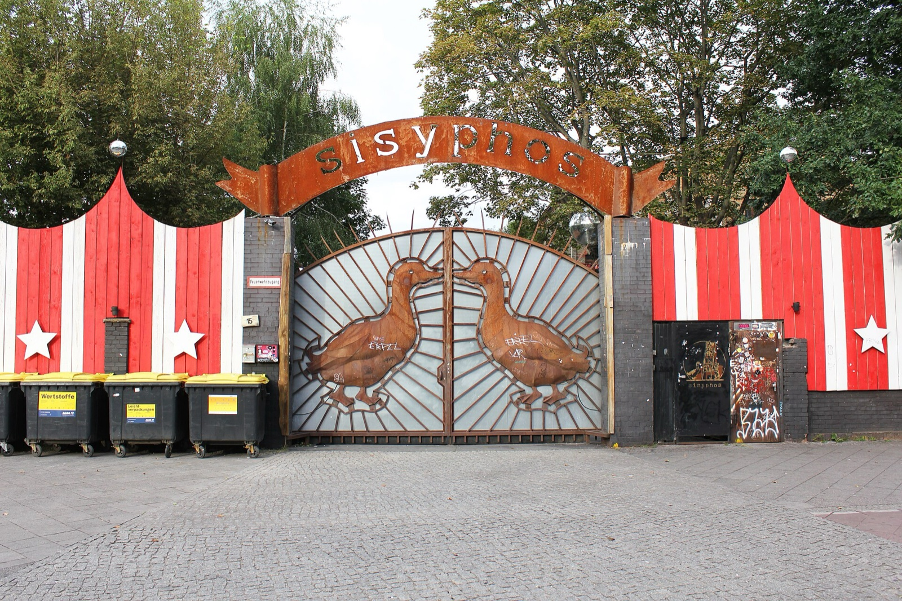
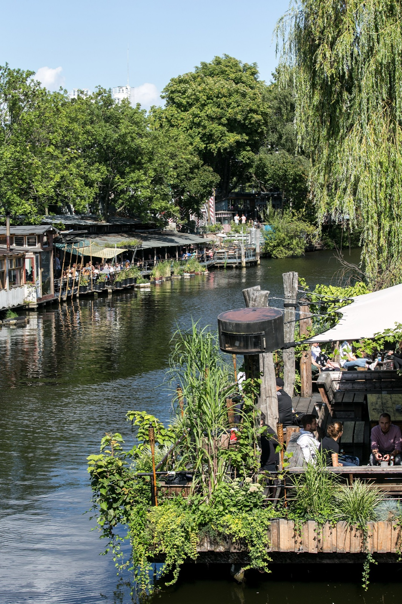
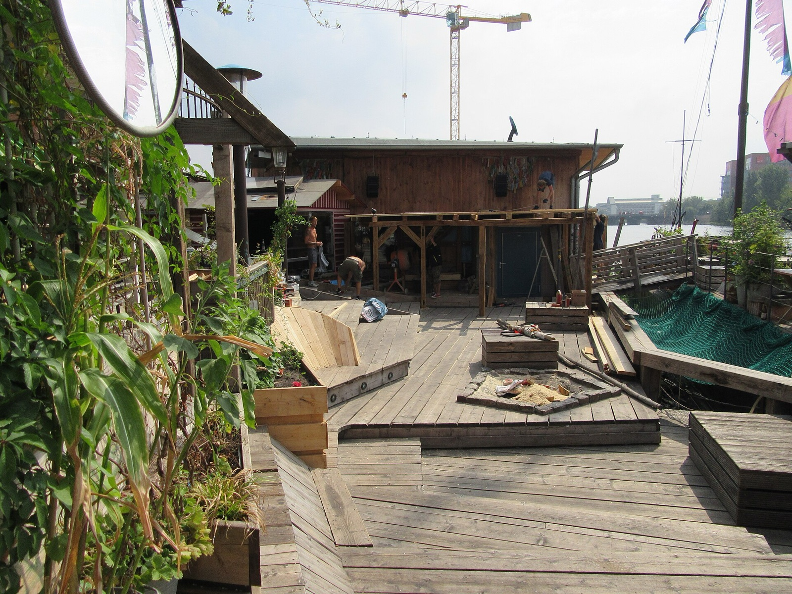
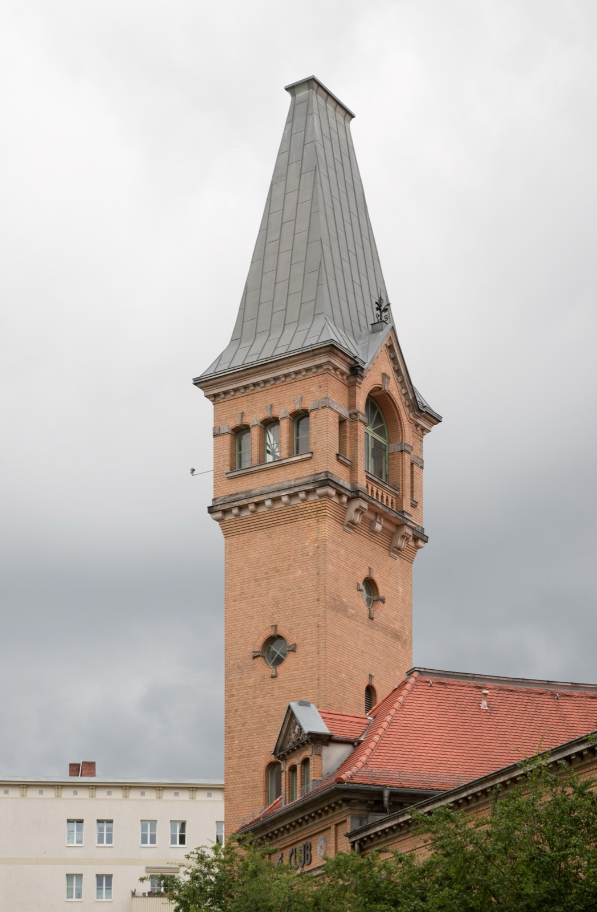

An October night in Berlin can look simple on a map: pick a club, catch a train, stay out late. TAG DER CLUBKULTUR is different. It is a citywide festival week with more than 100 listed events, so the useful question is not which place has the biggest name. It is which single event you can actually reach, enter and enjoy without turning the evening into a race across the city.

For 2026, TAG DER CLUBKULTUR begins on 3 October. It is the seventh edition, carries the theme **STAY CORE**, and includes a culture prize set to recognise 32 Berlin clubs and collectives. The official programme spans club nights, open-airs, concerts, performances, exhibitions, workshops, talks and film screenings. That breadth is the point, but it also makes a little preparation worthwhile.

_Sisyphos nightclub exterior; Berlin club-culture context only, with no 2026 programme association._

{{quick-summary}}

## Start with the kind of night you actually want

**Decision: choose one format before choosing a venue.**

A late club night, an early concert and a daytime workshop ask for different parts of Berlin, different energy and different practical checks. The programme is not a promise that every event suits every visitor. Use the filters and individual event page to identify one format that fits your trip.

Start by deciding whether you want:

- A club night or DJ set, with the venue's own door policy and ticket rules
- A concert, performance or live audiovisual set with a defined listed start
- A talk, workshop, film screening or exhibition that gives the evening a cultural focus
- A daytime or open-air format, only after checking the current access and weather details

My practical rule is simple: save one first-choice event and one nearby backup. A famous name is not a plan if the event is across town from dinner, a hotel or an early train the next morning.

_Club der Visionaere and Freischwimmer in 2017; Berlin club-culture context only, with no 2026 programme association._

## Treat the event page as the authority

**Decision: check the individual listing before committing your night.**

TAG DER CLUBKULTUR brings together independent organisers and venues. The festival listing is the right starting point, but each event can have its own entry conditions, age rules, ticketing, accessibility information and changes. Do not infer access from the festival name or from another Berlin night.

Before leaving the hotel, check these points on the [official 2026 programme](https://tagderclubkultur.berlin/en/programm/):

- The exact date, venue address and current start information
- Whether admission is ticketed, reserved, guest-list based or available at the door
- The venue's current entry, accessibility and bag-policy information
- The organiser's own update channel in case the listing changes

This is also why I would not promise a particular event here before it is independently checked. More than 100 listings make general advice useful, but only the live listing can confirm the details of the night you want.

## Sort the format before you chase a venue

**Use the festival filter to remove formats that do not fit your evening.** It does not recommend a club or promise entry. It helps you keep the relevant format, then sends you back to the official listing for the actual date, venue and access rules.

{{widget:clubkultur-week-door-free-finder}}

_Kater Blau outdoor area; Berlin club-culture context only, with no 2026 programme association._

## Keep your Berlin geography honest

**Decision: make one neighbourhood your evening, then add one event inside it.**

Berlin is large at night. A venue in Neukölln, Kreuzberg, Friedrichshain or City West can each be a good choice, but they are not interchangeable after midnight. Pick a place to eat, a station and a return journey that make sense for the venue on the confirmed listing.

If live music is your reason for going out, my guide to [where to hear live music in Berlin](https://www.berlinwalk.com/post/where-to-hear-live-music-in-berlin) can help you understand the wider scene. If a club night is your plan, read [what to wear to Berlin clubs](https://www.berlinwalk.com/post/what-to-wear-to-berlin-clubs) for the practical side. Neither guide replaces the festival page, because a one-off event may work differently from a normal night at the same address.

For the trip itself, put the exact venue into a live BVG or VBB route planner on the day. My [Berlin public transport guide](https://www.berlinwalk.com/post/berlin-public-transport-explained-for-tourists-u-bahn-s-bahn-tram-bus) explains tickets and the network, but live routing decides the actual journey.

## What not to assume about a festival week

**Decision: let the confirmed event shape the evening, not the other way round.**

TAG DER CLUBKULTUR celebrates club culture in a broad sense. That does not mean every listing is a conventional club night, or that any particular venue has a relaxed entry process. A thoughtful evening is much better than a long sequence of guesses.

Do not assume:

- That every event is walk-in or that tickets remain available on the night
- That an event is indoors, outdoors, seated or late just because another listing is
- That a festival listing gives you an exemption from a venue's normal rules
- That one programme version settles every final timing or access question

The right way to experience the week is very Berlin: choose one real place, one real event and one realistic journey home. Give the city room to surprise you after that.

_The Kulturbrauerei tower in Prenzlauer Berg, Berlin nightlife context only and not evidence of a 2026 festival venue._

## A good TAG DER CLUBKULTUR plan

**Decision: book only after the confirmed details fit the rest of your Berlin day.**

See the historic centre in daylight, keep the evening light until your chosen listing is confirmed, then travel directly to that venue. If an event changes or fills up, use your nearby backup instead of trying to force a cross-city rescue mission.

The [official programme](https://tagderclubkultur.berlin/en/programm/) is the source for the live calendar. This page is the planning layer: it helps you arrive with a better question than “Where should I go tonight?”

{{article-image-credits}}

{{faq}}
