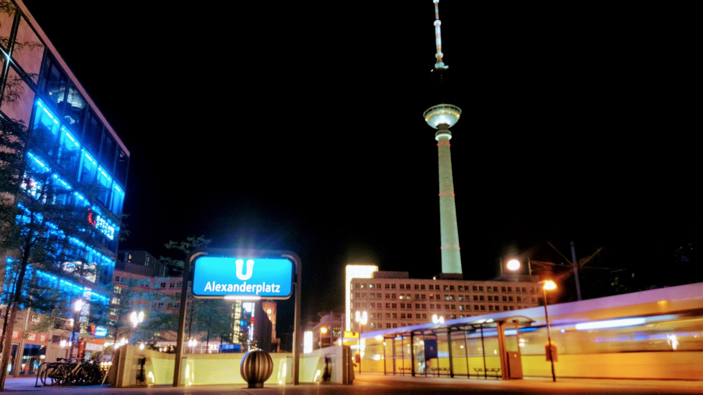
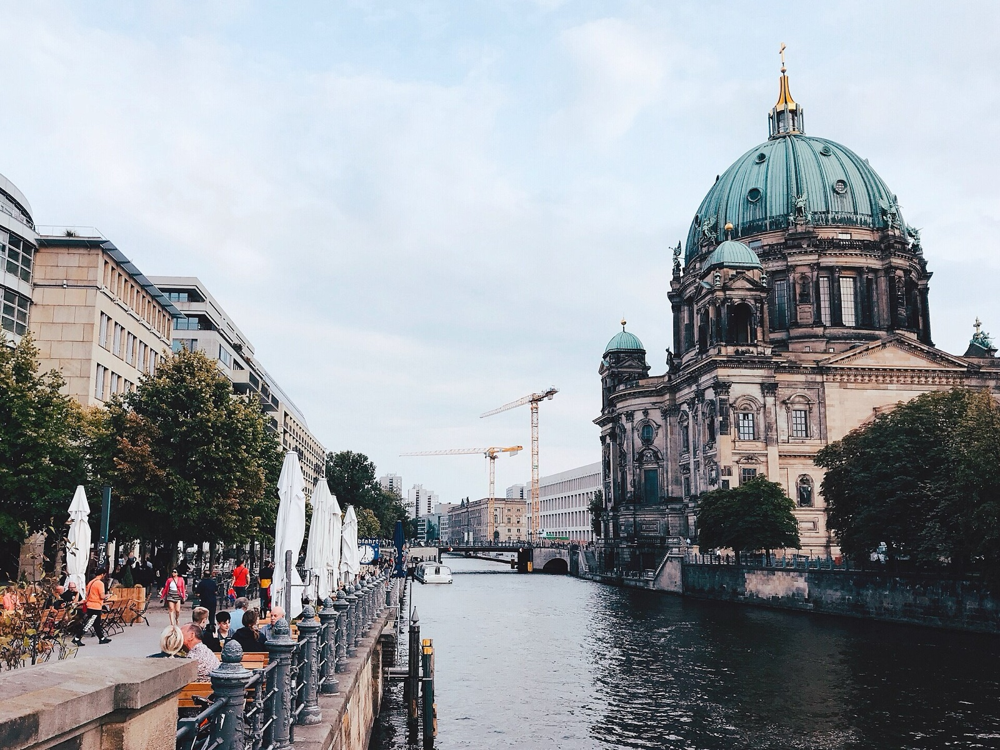
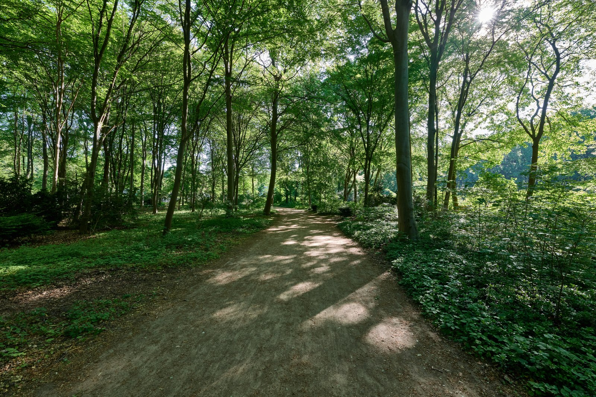
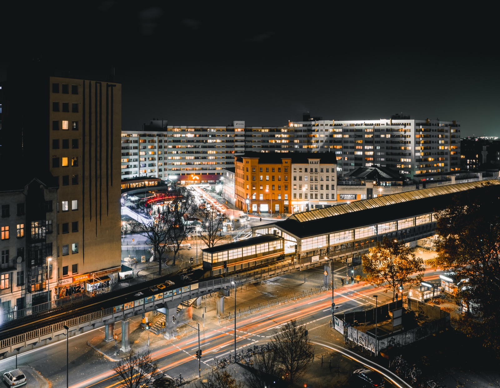
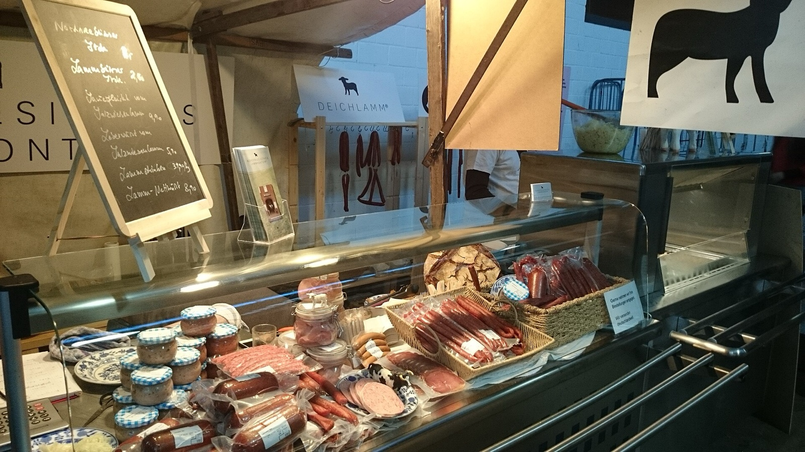

Berlin can make a solo visitor feel both free and slightly ridiculous. You leave your hotel with a phone full of saved places, then spend the first hour deciding which direction deserves the day.

I have made that mistake before. Berlin rewards wandering, but a day with no shape can turn into a lot of transport and very little memory. My practical answer is simple: choose one good anchor, add one nearby hinge, and let the last part of the day stay flexible.

{{quick-summary}}

## One anchor is better than ten pins

An anchor is the place that gives the day its mood. It is not necessarily the biggest sight. It is the place you would still be glad to have visited if the rest of the plan disappears.

For a first solo day, I would start with one of these three shapes:

- **History first:** begin at Alexanderplatz, continue towards Museum Island, and finish around Hackescher Markt. This keeps the central story compact and gives you people around you without forcing you into a group all day.
- **Quiet first:** use the Großer Tiergarten as the main pause, then connect it with the Brandenburg Gate or one museum you genuinely want to enter. This works when the city feels too loud and you need a slower middle.
- **Neighbourhood first:** start around Kottbusser Tor, follow Oranienstraße, and make Markthalle Neun the definite food hinge if its current opening hours fit your day. The point is not to collect Kreuzberg. It is to stay long enough to notice how the area changes from one street to the next.

The [Berlin Solo Day Path](/tools/berlin-solo-day-path) turns those three moods into a simple three-stop shape. It is a decision aid, not a promise about walking time, opening hours or the next train.

Alexanderplatz at night, where a clear landmark and several transport connections make a practical first anchor.

## Build the middle around a real place

Once you have an anchor, choose one hinge. A hinge is where you stop trying to see more and give yourself a reason to stay.

For the history shape, Museum Island is a strong hinge because the buildings, the Spree and the routes around Lustgarten give you something to look at even if you do not enter a museum. Berlin.de describes it as a central ensemble of five museums, and its visitor information lists S Hackescher Markt and U Museumsinsel among the nearby connections. Check the individual museum page before you commit to a ticket or time slot. [Read the official Museum Island guide](https://www.berlin.de/en/attractions-and-sights/3560564-3104052-museum-island.en.html).

Museum Island and the Berlin Cathedral, a place where the architecture gives a solo afternoon enough to do without constant phone checking.

For the quiet shape, the Großer Tiergarten is useful precisely because it does not demand a checklist. Berlin.de describes the park as a large green space between the Brandenburg Gate and the Zoo, and lists it as accessible at any time. Walk one path, sit down, and decide the next move after the pause. [Check the official Tiergarten information](https://www.berlin.de/tourismus/parks-und-gaerten/3560778-1740419-tiergarten.html).

A path through the Großer Tiergarten, for a solo day that needs fewer decisions and a proper pause.

For the neighbourhood shape, be honest about energy. Kottbusser Tor can be interesting, busy and visually intense. That is different from saying it is a calm place to drift through at midnight. Walk the area in daylight if you want to read it properly, then let the food stop decide whether the day continues.

Kottbusser Tor after dark, a reminder to choose the time of a neighbourhood visit instead of treating every hour as interchangeable.

## Make food a decision, not another search

Solo travellers often lose time to the question of where to eat. The answer is rarely another list of twenty restaurants. Pick one area and one kind of stop.

Markthalle Neun can work as a food hinge when its current programme and opening hours fit the day. It is a place to stop, look around, and decide whether Kreuzberg still has your attention. It is not a guarantee that every stall will be open or that a specific vendor will be there.

Markthalle Neun in Kreuzberg, a definite food hinge when the current opening information fits your day.

My rule is to stop searching once you have found a place that is good enough and in the area you already chose. A solo day becomes tiring when every meal turns into a new research project.

## Let transport connect the day, not control it

Berlin's S-Bahn, U-Bahn, trams and buses make a flexible solo day possible, but the network is not a static postcard. Construction, lift outages and service changes can alter the easy-looking connection.

Use the [BVG connection search](https://www.bvg.de/en/connections) shortly before you leave each anchor. BVG's tourist information also explains that S-Bahn and U-Bahn service patterns change at night, with night buses covering some weekday gaps. That is enough reason to check the return journey before the last drink, not after it.

Keep one simple rule: do not cross the city just because a saved pin is technically reachable. If Museum Island is giving you a good afternoon, stay central. If Tiergarten has reset your head, do not rush to the East Side Gallery to prove that you used the day well.

If you want a more detailed transport overview, I have written [a plain-language guide to Berlin public transport](/post/berlin-public-transport-explained-for-tourists-u-bahn-s-bahn-tram-bus). It explains the network without pretending that every live disruption can be predicted.

## The social option for a solo first day

Sometimes the best anchor is not a place. It is two hours with a guide and other visitors, followed by the freedom to choose the rest of the day alone.

My [Berlin free walking tour](/post/what-happens-on-a-berlin-free-walking-tour) starts at the World Clock on Alexanderplatz and runs for about 2 hours through the historic centre of former East Berlin, towards Hackescher Markt. It connects the divided-city story to the places around you. It does not follow the full Berlin Wall line, and I would not describe it that way.

If that sounds like the right first anchor, [check the live booking calendar](https://www.berlinwalk.com/book-berlin-walking-tour/berlin-free-walking-tour-tip-based) and then keep the rest of the day light. You do not need to book a tour and fill every remaining hour. Let the walk give you bearings, then choose one place to stay with.

## A solo day I would actually use

If I arrived alone with a free day, I would make the first choice based on how I felt after breakfast:

- **I want context:** BerlinWalk's free tour from Alexanderplatz, then Museum Island or Hackescher Markt, with one unplanned café stop.
- **I want quiet:** Tiergarten first, Brandenburg Gate if it still feels interesting, then one museum or a slow meal. Berlin.de's [museum overview](https://www.berlin.de/en/museums/) is a better last-minute reference than an old social post.
- **I want street life:** Kottbusser Tor and Oranienstraße in daylight, Markthalle Neun if the current schedule fits, then return from the area without adding a second neighbourhood just for the sake of it.

That is the whole method. One anchor, one hinge, one honest finish. The city stays open, but your day stops asking you to make twenty decisions before lunch.

{{widget:berlin-solo-day-path}}

## Frequently asked questions

{{faq}}

{{article-image-credits}}
