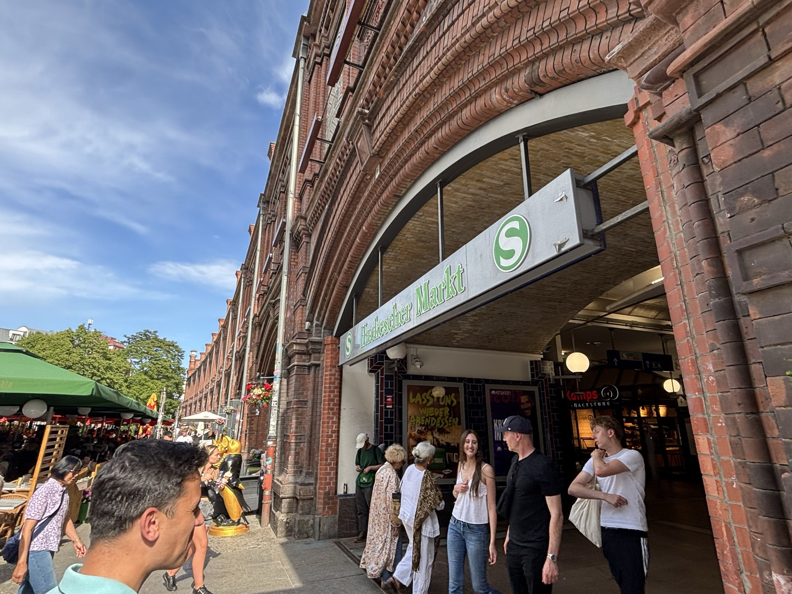
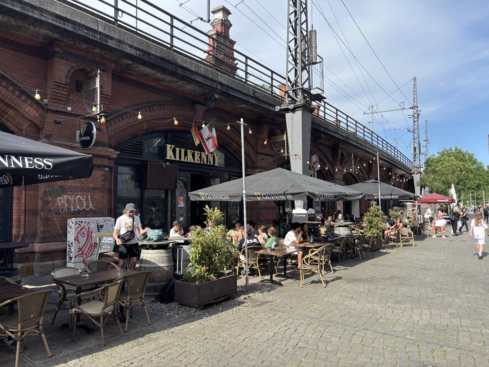
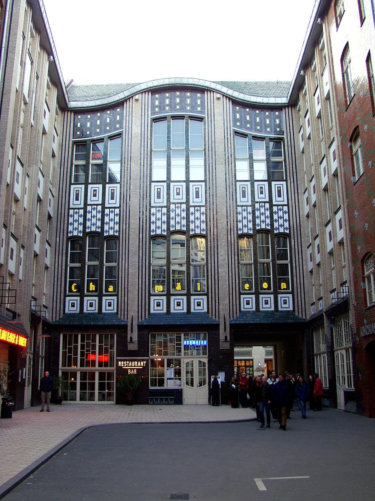
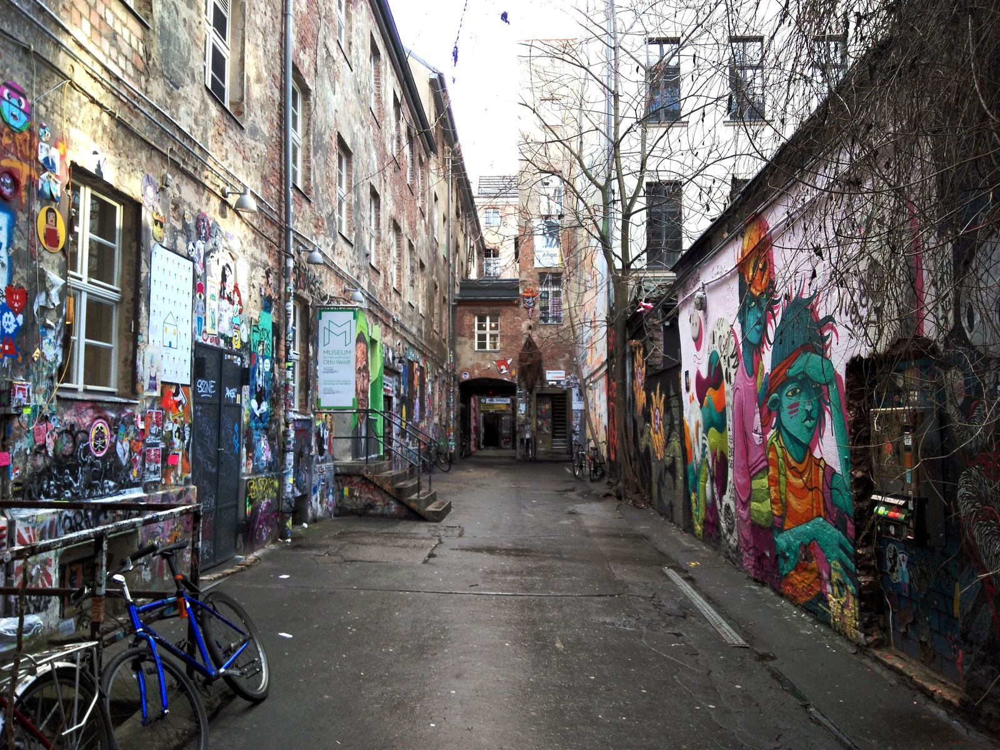
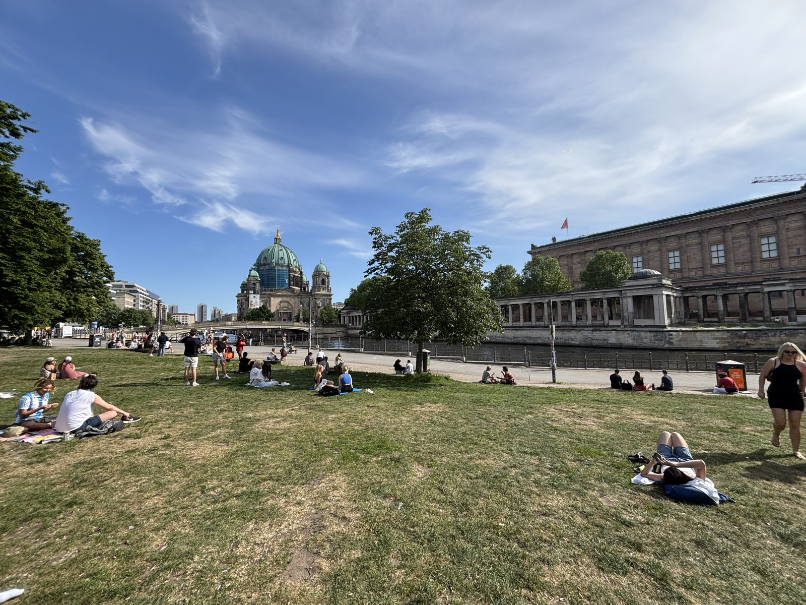
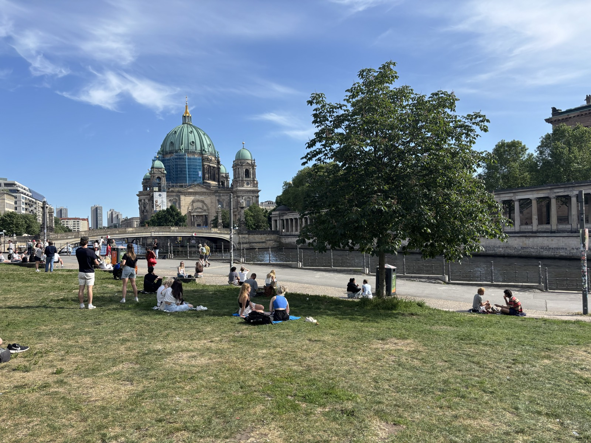
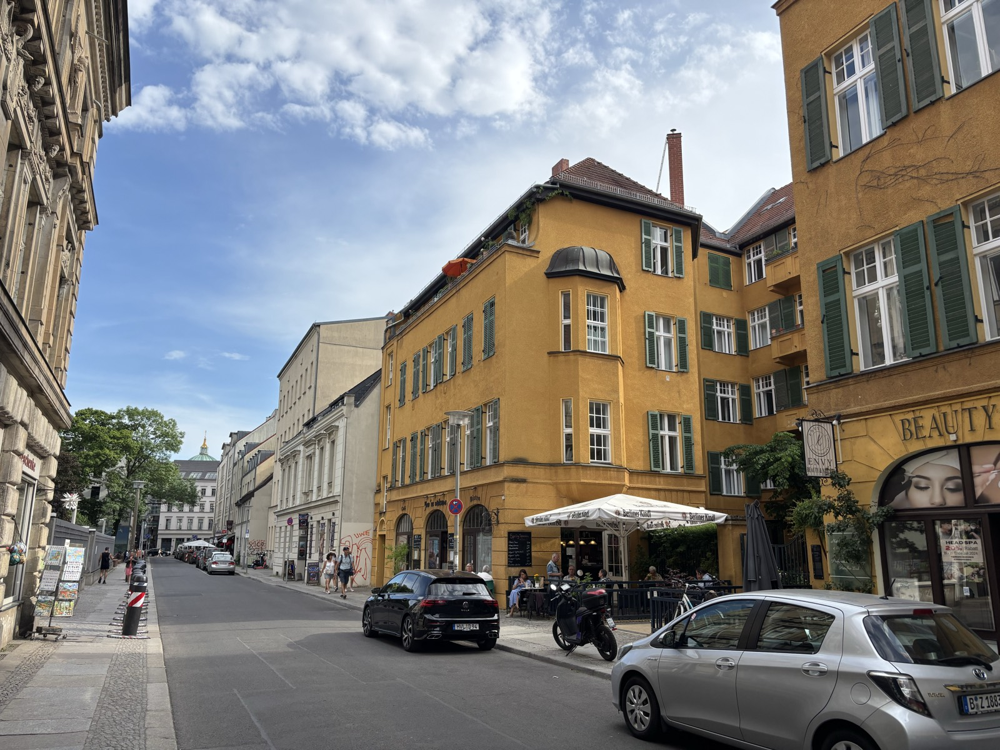

# What to Do Near Hackescher Markt After the Walking Tour

Slug idea: `what-to-do-near-hackescher-markt-after-walking-tour`

Wix draft status: created on 2026-05-30 as draft `3d4933e8-c479-4a4b-8dfb-2bec143721b8`

Meta title: What to Do Near Hackescher Markt After a Walking Tour

Meta description: A Berlin guide's practical after-tour plan for Hackescher Markt: quick lunch, coffee, Hackesche Höfe, Museum Island, riverside walks, rainy-day stops, and evening ideas.

Category: Tourist Tips

Primary keyword: things to do near Hackescher Markt

Secondary keywords: Hackescher Markt restaurants, after walking tour Berlin, Hackesche Höfe, Museum Island after tour, lunch near Hackescher Markt

Suggested CTA: My Berlin Free Walking Tour ends near Hackescher Markt on purpose: it is where lunch, courtyards, Museum Island, the Spree, and your next Berlin chapter all become easy.

## Widget Plan

Use these embeds when building the post in Wix:

1. Quick summary, near the top:
   `https://fenerszymanski.github.io/berlinwalk-widgets/quick-summary/?post=hackescher-after-tour`

2. After-tour planner, after "The Best Answer in 30 Seconds":
   `https://fenerszymanski.github.io/berlinwalk-widgets/hackescher-after-tour-planner/`

3. FAQ, near the bottom:
   `https://fenerszymanski.github.io/berlinwalk-widgets/faq/?post=hackescher-after-tour`

## Quick Summary

- Do not rush back to Alexanderplatz unless you need a train or your hotel is there. Hackescher Markt is a better place to eat, pause, and decide your next move after a 2-hour walking tour.
- If you are hungry, make it simple: Curry 61 for quick currywurst, Das Lemke for beer and German food, Monsieur Vuong for a fresh sit-down lunch, or a bakery/coffee stop if you only need a reset.
- If you want a free, low-effort walk, loop through Hackesche Höfe, Haus Schwarzenberg, Monbijoupark, the Spree riverbank, and the outside of Museum Island.
- If it rains, pick one indoor stop: DDR Museum, Museum Otto Weidt's Workshop for the Blind, Anne Frank Zentrum, KW Institute, Neue Synagoge - Centrum Judaicum, or one Museum Island museum.
- If you have two more hours, do one museum well. Do not try to "finish" Museum Island after already walking central Berlin.
- For the evening, stay in Mitte: check the program at Chamäleon or Clärchens Ballhaus, or keep it simple with dinner and a slow walk along the Spree.

## Draft

Most walking tours end with an awkward little moment. The guide says goodbye, people clap, everyone checks their phone, and then nobody is quite sure what to do next.

Hackescher Markt is one of the rare places in Berlin where that problem is actually useful.

My [Berlin Free Walking Tour](https://www.berlinwalk.com/book-berlin-walking-tour/berlin-free-walking-tour-tip-based) ends near Hackescher Markt on purpose. After about 2 hours of history, streets, squares, churches, ruins, rebuilding, and Berlin contradictions, this is the right place to stop. You are not trapped in a dead tourist zone. You are beside S-Bahn and tram connections, quick food, proper restaurants, hidden courtyards, the Spree, Museum Island, Jewish Berlin, contemporary art, and several good rainy-day backups.

The mistake is treating Hackescher Markt only as a station. It is better than that. Use it as your decision point.

*Hackescher Markt is more than the place where the tour ends. It is the easiest point to pause, eat, walk, or catch the S-Bahn and trams.*

## The Best Answer in 30 Seconds

If you have just finished a walking tour near Hackescher Markt, do this:

- **Hungry now:** eat near Hackescher Markt before going anywhere else.
- **Still have energy:** walk Hackesche Höfe and Haus Schwarzenberg, then continue to the Spree.
- **Want culture:** choose one museum, not five.
- **Raining:** go indoors at the DDR Museum, Anne Frank Zentrum, Museum Otto Weidt, KW Institute, Neue Synagoge, or a Museum Island museum.
- **Tired:** coffee first, then decide.
- **Evening:** check Chamäleon, Clärchens Ballhaus, or stay around Oranienburger Strasse and Monbijoupark.

The one thing I would not do is march straight back to Alexanderplatz just because you know where it is. Alexanderplatz is useful for transport. Hackescher Markt is better for the hour after a tour.

## First: Eat or Reset

After a walking tour, your judgment is usually worse than you think. You may feel like doing "one more museum" immediately, but most people first need food, water, or 20 quiet minutes.

For a fast Berlin bite, **Curry 61** on Oranienburger Strasse is the practical choice. It is close, quick, and works if you want currywurst without building half your afternoon around it. If you want more context before ordering, read my guide to the [best currywurst places in Berlin](https://www.berlinwalk.com/post/best-currywurst-places-in-berlin-2026).

For a sit-down German lunch or beer, **Das Lemke at Hackescher Markt** is the most convenient answer. It sits directly by the S-Bahn arches, serves Berlin and German classics, and is useful when someone in the group wants beer, someone wants proper food, and nobody wants to think too hard.

*The S-Bahn arches around Hackescher Markt make food the easiest first decision after the tour: quick, central, and close to your next route.*

For something lighter, **Monsieur Vuong** is a reliable Vietnamese lunch nearby. It is not hidden, and it is not trying to be. It is popular because it solves a common tourist problem: you want fresh food, fast service, and a real table after several hours outside.

For coffee, do not turn this post into a second coffee guide. I already wrote the focused version here: [5 Best Coffee Shops Near Hackescher Markt](https://www.berlinwalk.com/post/5-best-coffee-shops-near-hackescher-markt-a-local-s-guide). If you are tired, open that, pick the closest one, and do not over-optimise.

One small local bonus: if you finish near Hackescher Markt on a Thursday or Saturday and the weekly market is running, walk through it before choosing a restaurant. It is not the biggest market in Berlin, but it gives the square more life than it has on an ordinary weekday.

## The Free 45-Minute Walk

If the weather is decent and you still want to move, take this loop:

**Hackesche Höfe -> Haus Schwarzenberg -> Monbijoupark -> Spree riverbank -> Museum Island exterior**

Start with **Hackesche Höfe**, the famous courtyard complex entered from Rosenthaler Strasse. The official Hackesche Höfe site describes it as Germany's biggest courtyard complex, and visitBerlin notes the eight courtyards between Rosenthaler Strasse and Sophienstrasse, with shops, cafes, cultural venues, apartments, and offices packed into the restored site.

*Hackesche Höfe gives this loop its polished courtyard contrast: restored Art Nouveau architecture, shops, cafes, and a very easy no-ticket stop. Photo: Raimond Spekking, CC BY-SA 4.0, via Wikimedia Commons; resized.*

This is not a deep historical stop in the same way as the Berlin Wall or Museum Island. It is more useful as a Berlin atmosphere stop. You see the old courtyard logic of the city: the public street in front, the passageway, then a series of more private spaces inside. It is also easy. No ticket, no queue, no commitment.

After that, cross to **Haus Schwarzenberg** at Rosenthaler Strasse 39. This is the rougher courtyard people often mean when they say "street art courtyard near Hackescher Markt." The Anne Frank Zentrum and Museum Otto Weidt are inside the same cultural ensemble. Even if you do not go into the exhibitions, the courtyard gives a very different feeling from the polished Hackesche Höfe across the street.

*Haus Schwarzenberg feels deliberately rougher than Hackesche Höfe: street art, small museums, and a more improvised courtyard atmosphere. Photo: Singlespeedfahrer, CC0, via Wikimedia Commons; resized.*

From there, walk toward **Monbijoupark** and the Spree. Grün Berlin describes Monbijoupark as a four-hectare green area stretching from Oranienburger Strasse to the Spree riverbank promenade, right beside Museum Island. That makes it ideal after a tour: short, central, open, and not another checklist monument.

*Monbijoupark works because it asks almost nothing from you: grass, shade, the Spree nearby, and Museum Island in view.*

If you continue along the river, the outside of **Museum Island** is right there. You can admire the Bode Museum, cross toward the Lustgarten, look at Berliner Dom from the outside, and decide whether you actually want to go indoors.

*After a 2-hour tour, the outside of Museum Island is often the smarter win: beautiful, free, and easy to leave when you are done.*

This whole loop can be 45 minutes. It can also become 2 hours if you stop for coffee, photos, or a bench by the river. That flexibility is the point.

## If You Want a Museum, Choose One

Museum Island is close enough that people get overconfident. They look at the map and think: "Great, we will do all of it now."

Do not do that after a walking tour.

The Staatliche Museen zu Berlin lists separate opening hours for each Museum Island museum, and most of the major ones are closed on Mondays. Even on a normal open day, these are not quick background activities. They are large museums with serious collections. After already walking through Berlin for 2 hours, the smart move is to choose one.

Here is the simple version:

- **Neues Museum:** best if this is your first time on Museum Island and you want the strongest single-ticket choice.
- **Alte Nationalgalerie:** best if you want art, architecture, and a quieter pace.
- **Altes Museum:** best if you like classical antiquity and want a more contained visit.
- **Bode Museum:** best if you want sculpture, Byzantine art, and a calmer northern edge of the island.
- **Pergamon Museum:** check the current situation before planning around it. The main building has been closed for long-term renovation, which I explain in my [Museum Island tickets and what to skip](https://www.berlinwalk.com/post/is-museum-island-free-tickets-prices-and-what-to-actually-skip) guide.

If you are with children, tired adults, or anyone who says "I do not really like museums," the **DDR Museum** may work better. It is close to Museum Island, open daily according to its official site, and built around interactive displays of everyday life in East Germany. It can be crowded, but it is easier to understand when your brain is already full.

## The Better Rainy-Day Plan

Rain changes Hackescher Markt in a useful way. It pushes you toward smaller, focused stops instead of long outdoor wandering.

My first rainy-day choices near Hackescher Markt would be:

**Museum Otto Weidt's Workshop for the Blind.** This is one of the best small museums near Hackescher Markt, and official visitor information lists free admission. It tells the story of Otto Weidt, who employed and protected mainly blind and deaf Jewish workers during the Nazi period. It is close, serious, and much more powerful than many tourists expect.

**Anne Frank Zentrum.** Also at Rosenthaler Strasse 39, this is better if you want a focused exhibition connected to Anne Frank, memory, antisemitism, and young people's historical education. The official visitor page places it close to Hackescher Markt and lists regular opening from Tuesday to Sunday.

**Neue Synagoge - Centrum Judaicum.** A short walk along Oranienburger Strasse brings you to one of the most striking facades in Berlin. The exhibition is about the history of the synagogue and Jewish life in Berlin. Check current visitor information before going, especially because the dome access and seasonal hours can change.

**KW Institute for Contemporary Art.** This is the right choice if you want contemporary art rather than another history museum. KW's own visitor information lists it on Auguststrasse, walking distance from Hackescher Markt, with Tuesday as the regular closing day.

**DDR Museum.** This is the easy family or bad-weather option close to Museum Island. It is interactive, central, and simple to explain to a mixed group.

The key is not to collect museums. Pick the one that matches your mood.

## If You Have Kids With You

After a walking tour with kids, I would not make Museum Island the automatic next step. Some children can handle it. Many cannot, and they have already been very patient.

Better options:

- Food first, then a short walk through Hackesche Höfe.
- Haus Schwarzenberg courtyard if they like street art and hidden spaces.
- DDR Museum if you need an indoor activity with buttons, objects, and movement.
- Monbijoupark and the Spree if the weather is good.
- A bakery or ice cream stop before any serious cultural plan.

The best family plan is usually not the most ambitious plan. It is the plan where nobody collapses at 16:00.

## If You Want to Keep Walking

If you still have legs, Hackescher Markt gives you several good walking directions.

**Toward Museum Island and Unter den Linden:** best for first-time visitors who want the classic central axis. You can walk past the Bode Museum, Berliner Dom, Lustgarten, Humboldt Forum, and continue toward Bebelplatz and Brandenburg Gate if you still have energy.

**Toward Oranienburger Strasse and Auguststrasse:** best for courtyards, galleries, Jewish Berlin, KW, Clärchens Ballhaus, and a more evening-friendly Mitte mood.

**Toward Nikolaiviertel:** best if you want Berlin's strange rebuilt old town. It pairs well with the historic center, but read my guide to [Nikolaiviertel](https://www.berlinwalk.com/post/nikolaiviertel-rebuilt-old-town) first so you do not mistake it for untouched medieval Berlin.

**Toward Alexanderplatz:** best only if you need transport, your hotel, shopping, or the TV Tower. Otherwise, I would stay west and north of Hackescher Markt for a while.

*The best after-tour move is often not another landmark. It is choosing the right direction and letting Mitte open up slowly.*

## Evening Near Hackescher Markt

If your walking tour ends in the afternoon and you are still in the area at night, this part of Mitte becomes useful again.

**Chamäleon Berlin** is inside the Hackesche Höfe and focuses on contemporary circus and stage shows. It is a good evening idea when you want something Berlin-specific but not a club.

**Clärchens Ballhaus** on Auguststrasse is another strong option. Its official site describes a historic ballroom with restaurant, dance, and program events. Check the current program rather than just showing up, because what happens there depends on the night.

**Das Lemke** remains useful in the evening if you want the simplest possible dinner and beer near the station.

**Monbijoupark and the Spree** are better in warm months than in winter, but the riverside walk is still one of the easiest ways to let the day slow down.

Oranienburger Strasse can be lively, and parts of it are touristy. That does not make it bad. It just means you should choose intentionally rather than letting the loudest sign choose for you.

## How to Leave When You Are Done

Hackescher Markt is easy to leave from, which is another reason I like ending tours there.

The S-Bahn station sits on the east-west Stadtbahn line. Alexanderplatz is one stop away in one direction; Friedrichstrasse and Hauptbahnhof are easy in the other direction. Trams also connect the square with Prenzlauer Berg, Rosenthaler Platz, and the eastern side of the city.

If your hotel is near Alexanderplatz, you can go back in minutes. If your evening plan is in Prenzlauer Berg or Mitte, you may not need to leave at all.

## What I Would Avoid

A few common mistakes:

**Trying to do all of Museum Island after the tour.** You will remember almost nothing. Choose one museum or walk the outside for free.

**Going back to Alexanderplatz for food by default.** Some places there are fine, but Hackescher Markt and the surrounding streets are usually a better lunch decision.

**Choosing a restaurant only because it has a huge tourist menu.** Around here, that is rarely a good sign.

**Forcing everyone into one more serious history stop.** If the group is tired, food and a courtyard are smarter than another exhibition.

**Ignoring closing days.** Museum Island, KW, Anne Frank Zentrum, and Centrum Judaicum all have specific weekly patterns. Check the official page before walking over.

## My Own After-Tour Plan

If I had just finished the tour as a visitor, I would do this:

First, I would eat near Hackescher Markt. Then I would walk Hackesche Höfe and Haus Schwarzenberg. If the weather was good, I would continue to Monbijoupark and the Spree. If it rained, I would choose either Museum Otto Weidt or the DDR Museum. If I still had energy later, I would check what is on at Chamäleon or Clärchens.

That is the best thing about ending here. You do not need a complicated plan. You need a good first decision.

If you want the history to make sense before you start choosing courtyards, museums, and evening plans, join my [Berlin Free Walking Tour](https://www.berlinwalk.com/book-berlin-walking-tour/berlin-free-walking-tour-tip-based) first. We begin at the World Clock on Alexanderplatz and end near Hackescher Markt, exactly where this article begins.

## FAQ

### Where does the BerlinWalk tour end?

The BerlinWalk tour ends near Hackescher Markt in central Berlin. From there you are close to the S-Bahn station, trams, Hackesche Höfe, Museum Island, the Spree, and plenty of food options.

### What is the best thing to do immediately after the walking tour?

Eat or take a short break first. Then choose between Hackesche Höfe, Haus Schwarzenberg, the Spree riverbank, one museum, or an evening plan. Most people make better decisions after food or coffee.

### Is Hackescher Markt good for lunch?

Yes. It is one of the easiest lunch areas after a central Berlin walking tour. Curry 61, Das Lemke, Monsieur Vuong, nearby bakeries, cafes, and the weekly market on some days make it more useful than returning to Alexanderplatz by default.

### Can I walk from Hackescher Markt to Museum Island?

Yes. Museum Island is a short walk from Hackescher Markt. The better question is how much energy you have left. After a 2-hour walking tour, choose one museum or walk the outside of Museum Island for free.

### What can I do near Hackescher Markt when it rains?

Good rainy-day options include the DDR Museum, Museum Otto Weidt's Workshop for the Blind, Anne Frank Zentrum, KW Institute for Contemporary Art, Neue Synagoge - Centrum Judaicum, Chamäleon Berlin, and the Museum Island museums.

### Is Hackescher Markt safe at night?

Hackescher Markt is a busy central area and is generally fine at night with normal city awareness. Watch your phone and wallet around crowds, stations, and terraces. If you are tired, use the S-Bahn, tram, or a taxi rather than wandering aimlessly.

### Should I go back to Alexanderplatz after the tour?

Only if you need transport, shopping, your hotel, or the TV Tower. For food, courtyards, Museum Island, the Spree, and evening plans, staying around Hackescher Markt is usually the better move.

## Research Notes and Source Checks

Checked on 2026-05-26:

- Hackesche Höfe official site and visitBerlin: courtyard complex, shops, dining, eight courtyards, mixed use.
- Staatliche Museen zu Berlin: Museum Island opening-hour patterns and Monday closures.
- Pergamonmuseum / Staatliche Museen zu Berlin: current renovation and reopening timeline.
- DDR Museum official site: daily opening and interactive exhibition positioning.
- Anne Frank Zentrum official visitor page: address, proximity to Hackescher Markt, opening pattern.
- Museum Otto Weidt's Workshop for the Blind official site: address, opening pattern, free admission.
- Neue Synagoge Berlin - Centrum Judaicum official site: exhibition and seasonal visitor information, including the current dome note.
- KW Institute for Contemporary Art official visitor information: location and opening pattern.
- Grün Berlin: Monbijoupark location and Spree/Museum Island context.
- Das Lemke, Monsieur Vuong, Chamäleon, and Clärchens official sites: current positioning, location, and visitor information.
- Berlin.de / market listings: weekly market context at Hackescher Markt.
- Wikimedia Commons: Hackesche Höfe photo by Raimond Spekking, CC BY-SA 4.0; Haus Schwarzenberg photo by Singlespeedfahrer, CC0. Both resized for blog use.
