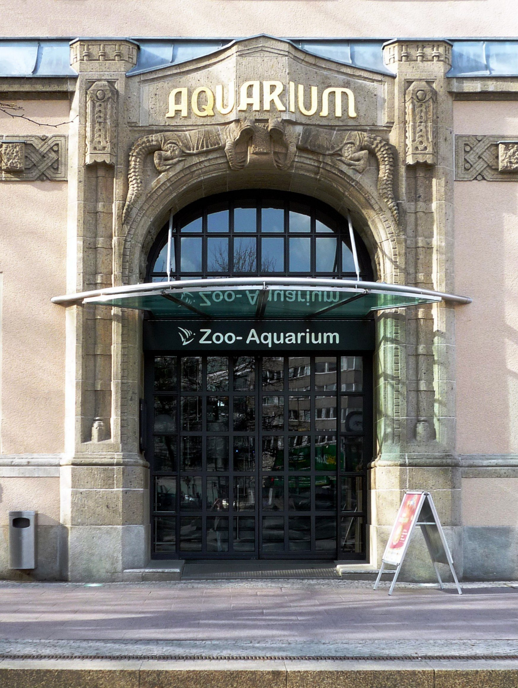

# Zoo Berlin vs Tierpark Berlin: The Ultimate Guide to Choosing Your Wild Day Out

## Metadata

- Focus keyword: Zoo Berlin vs Tierpark Berlin
- Search intent: tourist choosing which Berlin animal park is worth the time, money, and travel effort
- Slug: zoo-berlin-vs-tierpark-berlin
- Category: Tourist Tips
- Secondary keywords: Zoo Berlin or Tierpark Berlin, Berlin Zoo vs Tierpark, Tierpark Berlin with kids, Zoo Berlin Aquarium, Berlin animal park
- Tags: Zoo Berlin, Tierpark Berlin, Berlin With Kids, Berlin Attractions, Berlin Travel Tips
- SEO title: Zoo Berlin vs Tierpark Berlin: Ultimate Guide
- Meta description: Compare Zoo Berlin and Tierpark Berlin for tourists: history, pandas, Aquarium, size, kids, transport, tickets, and which park fits your day.
- Excerpt: Zoo Berlin and Tierpark Berlin are not two versions of the same day. This guide compares history, size, animals, kids, transport, tickets, and the feeling of each park so you can choose the right wild day out.
- Social title: Zoo Berlin vs Tierpark Berlin: Choosing Your Wild Day Out
- Social description: A practical comparison of Berlin's compact historic zoo and its vast landscape Tierpark, with a scorecard to help you choose.
- Widget ideas considered:
  - Zoo vs Tierpark Wild Day Picker: helps the reader turn time, walking energy, weather, kids, Aquarium interest, and start area into one clear choice. Selected because it answers the main tourist decision directly.
  - Berlin Animal Park Budget Estimator: compares ticket cost by adults, children, and Aquarium choice. Rejected because prices are dynamic and official ticket pages should stay the source of truth.
  - Half-Day vs Full-Day Animal Park Route Builder: helps pair the chosen park with nearby food and sightseeing. Rejected because the article already gives sample rhythms and the tool would become too itinerary-heavy.

## Body

Zoo Berlin vs Tierpark Berlin is not a simple "which zoo is better?" question. Berlin has two major animal parks because the city once had two political realities. The result is not duplication. It is two completely different days.

**Zoo Berlin** is the classic West Berlin choice: compact, historic, central, and packed with famous animal houses. It is the one I would choose if your Berlin trip is short, your hotel is central or west, or you want the Aquarium as an indoor backup.

**Tierpark Berlin** is the former East Berlin choice: vast, green, slower, and built around Schloss Friedrichsfelde in Lichtenberg. It is the one I would choose if you want a full outdoor day, more space, a picnic rhythm, or a family visit where children need room to move.

{{quick-summary}}

## The tale of two zoos: a city divided

Berlin is a city where history often left pairs behind: opera houses, university traditions, transport hubs, and cultural institutions shaped by the Cold War. For animal lovers, the clearest example is Zoo Berlin and Tierpark Berlin.

[Zoo Berlin](https://www.zoo-berlin.de/en/about-the-zoo/history) opened in 1844, making it Germany's oldest zoo. After the Second World War, it sat in the British sector of West Berlin. When the city hardened into East and West, East Berliners no longer had easy access to the old zoo.

The East German government answered by creating its own animal park. It chose the grounds of Friedrichsfelde manor house in Lichtenberg, a huge landscape far from the dense centre of West Berlin. In 1955, [Tierpark Berlin](https://www.tierpark-berlin.de/en/about-the-tierpark/history) opened.

That origin story still explains the visitor experience today. Zoo Berlin feels like a historic city zoo where something appears every few steps. Tierpark Berlin feels like a large landscaped park where animals, lawns, tree-lined paths, and palace views are part of the same day.

Caption: Zoo Berlin's Elephant Gate gives the west-side zoo its most recognizable first impression.

## Zoo Berlin: the classic urban jungle

Zoo Berlin sits beside Zoologischer Garten station, right in City West. That location matters. You can step off the S-Bahn, U-Bahn, regional train, or bus and be near the entrances within minutes. For visitors, this removes a lot of planning friction.

The zoo itself is compact by Berlin standards, at roughly 35 hectares. But it is dense. The official Zoo Berlin pages describe it as Germany's oldest zoo and one of the most species-rich zoos in the world, with around 20,000 animals when Zoo and Aquarium are counted together.

The feeling is very different from Tierpark. At Zoo Berlin, the rhythm is quick: elephants, birds, primates, big cats, historic animal houses, and the famous Elephant Gate all sit close to each other. This is good if you want a classic animal-park day without turning the visit into a long hike.

### What makes Zoo Berlin stand out

The biggest single draw is the giant pandas. Zoo Berlin says it is home to Germany's only giant pandas, which makes the Panda Garden a real decision-maker for many visitors.

The architecture also matters. The Elephant Gate, the Antelope House, the Hippo House, and other historic or rebuilt animal houses make the zoo feel like part of old West Berlin, not just a collection of enclosures.

Then there is [Aquarium Berlin](https://www.zoo-berlin.de/en/tickets-service/tickets-pricing), next door and available through a combined ticket. I would not add it automatically for every visitor. Zoo plus Aquarium can become a long day, especially with tired children. But in rain, wind, heat, or winter, the Aquarium gives Zoo Berlin an advantage Tierpark cannot really match. If the forecast is the main problem, my [Berlin rainy day guide](https://www.berlinwalk.com/post/what-to-do-in-berlin-when-it-rains-12-indoor-activities-worth-your-time) is the wider planning companion.

Caption: The Aquarium is the main reason Zoo Berlin can be the stronger bad-weather choice.

### The Zoo Berlin vibe

Zoo Berlin feels busy, urban, and efficient. You see more in less time. You also feel the crowds more quickly, especially around pandas, narrow paths, entrances, and popular indoor houses.

That tradeoff is exactly the point. If your Berlin visit is three days, if your children have limited walking energy, or if you want to combine the animal park with Kaiser Wilhelm Memorial Church, Ku'damm, Bikini Berlin, or dinner in Charlottenburg, Zoo Berlin is usually the better fit.

## Tierpark Berlin: the sprawling landscape zoo

Tierpark Berlin is not the same idea on the other side of town. It is a different philosophy.

The official Tierpark site describes it as [Europe's largest animal park](https://www.tierpark-berlin.de/en/), set in 160 hectares around Schloss Friedrichsfelde. That is almost five times the physical size of Zoo Berlin. The old inventory numbers are also useful for the comparison: Zoo Berlin and Aquarium counted 18,887 animals across 1,015 species in the 2023 headcount, while Tierpark counted 7,797 animals across 632 species.

The simple interpretation is this: Zoo Berlin concentrates the animal experience. Tierpark spreads it out.

Caption: Tierpark Berlin is not only an animal visit; the park landscape and Schloss Friedrichsfelde shape the day.

### What makes Tierpark Berlin stand out

Tierpark's centrepiece is not an entrance gate or a single superstar animal. It is the landscape itself. Schloss Friedrichsfelde, open lawns, long paths, mature trees, and wide animal areas make the park feel calmer even when many people are inside.

The highlights are spread out. The [Rainforest House](https://www.tierpark-berlin.de/en/tickets-service/tierpark-map) in the Alfred Brehm building focuses on Southeast Asian habitats. The same official map points visitors toward Himalaya, Lemur Woods, the Giraffe Trail, polar bears, and the flight show area. Families also have the [Day by the Sea](https://www.tierpark-berlin.de/en/animals/a-day-by-the-sea) water playground, a 4,000 sqm play area that can save a hot afternoon.

Tierpark is also more forgiving for some practical groups. Dogs are welcome at Tierpark if kept on a short lead, while Zoo Berlin does not allow dogs. The official Tierpark ticket page also lists handcart hire, which can be useful when a family brings picnic supplies or a child gets tired halfway through the day.

### The Tierpark Berlin vibe

Tierpark requires stamina. You should not go there thinking, "I will just pop in for two hours." You can do a short visit, but you will miss the reason Tierpark exists.

It works best when you accept the slower pace: walk, pause, cross a wide green area, let children run, choose a few zones instead of trying to see everything, and leave with enough energy for a quiet evening.

Caption: Tierpark works best when you have enough time and walking energy for the full park setting.

## Zoo Berlin vs Tierpark Berlin: head-to-head comparison

Here is the practical tourist comparison.

**Size:** Zoo Berlin is about 35 hectares. Tierpark Berlin is 160 hectares.

**Location:** Zoo Berlin is in Charlottenburg, beside Zoologischer Garten station. Tierpark Berlin is in Lichtenberg, directly on the U5 at Tierpark station.

**Animals and species:** Zoo Berlin and Aquarium together had 18,887 animals across 1,015 species in the 2023 inventory. Tierpark Berlin had 7,797 animals across 632 species in the same count. Numbers change, but the pattern is stable: Zoo Berlin is denser; Tierpark is roomier.

**Time needed:** Zoo Berlin can work as a strong half-day or relaxed day. Tierpark Berlin is best treated as the main event of the day.

**Bad weather:** Zoo Berlin has the Aquarium advantage. Tierpark is mostly an outdoor park day.

**With kids:** Zoo Berlin is easier for toddlers and short attention spans. Tierpark is better when children need space, playground time, carts, and a slower family rhythm.

**My quick verdict:** Zoo Berlin is the safer first-time tourist choice. Tierpark Berlin is the better full-day park choice.

## Use the Zoo Berlin vs Tierpark Berlin Picker

If you are still split, use this tool before buying dated tickets. The default **Priority score** tab shows a match chart, a metric table, and sliders for the things that usually decide the choice: species density, walking distance, open space, and quiet paths. Switch to **Quick pick** if you want a faster recommendation from your day shape.

{{widget:berlin-zoo-tierpark-picker}}

## Which one is better for families?

For families, the decision is less about animals and more about energy.

### For toddlers, strollers, and short days: Zoo Berlin

Zoo Berlin is usually easier with small children because the distances are shorter. You can move from one animal area to the next without turning every transition into a long walk.

That does not mean Zoo Berlin is always calmer. On a busy summer weekend, the compact layout can feel crowded, especially near pandas and popular houses. But if your child is tired, if the day may turn rainy, or if you only want a half-day plan, the compactness is still useful.

### For older children and full-day energy: Tierpark Berlin

Tierpark Berlin is better for children who need space. The paths are wider, the day can include a picnic, and the water playground gives families a second rhythm beyond animal viewing.

The catch is distance. Tierpark can become tiring if you try to cover the whole park with no plan. Pick the highlights that matter most, rent a handcart if that fits your family, and leave some parts unseen. That is not failure. That is how Tierpark works.

For the wider family trip, use my [Berlin with kids guide](https://www.berlinwalk.com/post/berlin-with-kids) before you decide whether the zoo day should be the main event or just one easier half-day.

## Transport, tickets, and food

Zoo Berlin is the easiest transport choice for many tourists. Zoologischer Garten is a major public transport hub, with S-Bahn, U-Bahn, regional trains, buses, and taxis close by.

Tierpark Berlin is farther east, but not difficult. The U5 stops at Tierpark station and connects directly across the city through Alexanderplatz, Unter den Linden, Brandenburg Gate, and Hauptbahnhof. From Mitte, the journey is usually straightforward; it just feels more like a dedicated outing.

Ticket prices change by date and purchase channel, so always check the official pages before buying. On 20 June 2026, the [Zoo Berlin ticket page](https://www.zoo-berlin.de/en/tickets-service/tickets-pricing) listed adult Zoo day tickets online from EUR 16 and Zoo plus Aquarium online from EUR 24, with higher till prices. The [Tierpark Berlin ticket page](https://www.tierpark-berlin.de/en/tickets-service/tickets-pricing) listed adult Tierpark day tickets online from EUR 14.50, also with a higher till price.

For food, think in the same split. Zoo Berlin is surrounded by City West options, so you can snack inside and eat properly after. Tierpark is more of an on-site or picnic day. If you choose Tierpark, bring water, check the food options in advance, and do not assume you will want to leave for lunch and come back.

## Two sample itineraries

Do not treat these as military schedules. Feeding times, talks, closures, weather, and animal visibility change. Use them as rhythms.

### A good half-day at Zoo Berlin

Start in the morning at the Elephant Gate or Lion Gate. If pandas are important to you, go early and check the official feeding and talk schedule that day.

Move through the classic animal houses and the central outdoor areas before lunch. If the weather is poor or you bought the combination ticket, shift into the Aquarium while everyone still has energy.

Afterwards, keep the rest of the day simple: Kaiser Wilhelm Memorial Church, Ku'damm, Bikini Berlin, or dinner nearby. Do not bolt a major museum day onto the end unless your group is unusually energetic.

### A good full day at Tierpark Berlin

Arrive through the U5 Tierpark side and accept that the day will involve walking. Choose a route around the Rainforest House, Himalaya or Lemur Woods, then build in a proper pause.

If you have children, leave time for the Day by the Sea playground in warm weather. If architecture interests you, include Schloss Friedrichsfelde instead of treating it as background scenery.

The best Tierpark day ends calmly. Plan a quiet dinner or an easy ride back, not another big attraction across town.

## Conservation and animal welfare

Both parks are part of the same wider Zoo and Tierpark Berlin organization, and both connect their public work to species conservation. The official pages refer to the Berlin World Wild conservation programme, and the ticket pages note a voluntary conservation contribution.

For a tourist decision, I would not choose between them based on vague claims like "more ethical" or "more important." That needs more than a quick visitor guide can responsibly prove. Choose based on the kind of day you want, then read the official conservation pages if that is central to your decision.

## Can you visit both on the same day?

Technically, yes. Practically, I would not.

Zoo Berlin and Tierpark Berlin sit on different sides of the city. A double-zoo day sounds efficient on paper and tiring in real life: two ticket checks, transit across Berlin, repeated walking, and no real time to enjoy either place.

Pick one. If you still have energy, use the surrounding area in a way that supports the choice:

- After Zoo Berlin: Memorial Church, Ku'damm, Bikini Berlin, or dinner in Charlottenburg.
- After Tierpark Berlin: a calm evening, not another large attraction.
- Before either one: check the official opening hours and use my [Berlin public transport guide](https://www.berlinwalk.com/post/berlin-public-transport-2026) if U-Bahn, S-Bahn, or ticket zones feel confusing.

## My final verdict

If this is your first Berlin trip and animals are only one part of your visit, choose **Zoo Berlin**. It is central, historic, easy to reach, and strong even when the weather is imperfect.

If you have a full day, want space, are staying east, or are travelling with children who need room rather than constant close-up viewing, choose **Tierpark Berlin**.

The wrong move is not choosing the "lesser" zoo. The wrong move is choosing the wrong rhythm. Zoo Berlin is a concentrated city classic. Tierpark Berlin is a spacious landscape day. Match the park to your actual Berlin day, and the decision becomes much easier.

If you want the city story before or after your animal-park day, my [2 hours BerlinWalk route from Alexanderplatz to Hackescher Markt](https://www.berlinwalk.com/berlin-walking-tour-route) gives you the historical centre first, then you can use a separate half-day or full day for the animal park that fits your pace.

## Image Credits

- Zoo Berlin Elephant Gate: Marek Slíwecki, CC BY-SA 4.0, via Wikimedia Commons.
- Zoo Berlin Aquarium entrance: Manfred Brückels, CC BY-SA 3.0, via Wikimedia Commons.
- Schloss Friedrichsfelde at Tierpark Berlin: A.Savin, Free Art License 1.3, via Wikimedia Commons.
- Siberian tigers at Tierpark Berlin: A.Savin, Free Art License 1.3, via Wikimedia Commons.

{{faq}}
